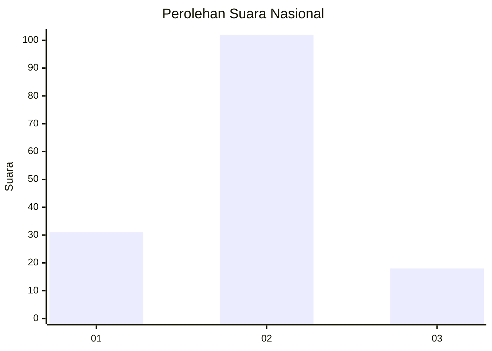
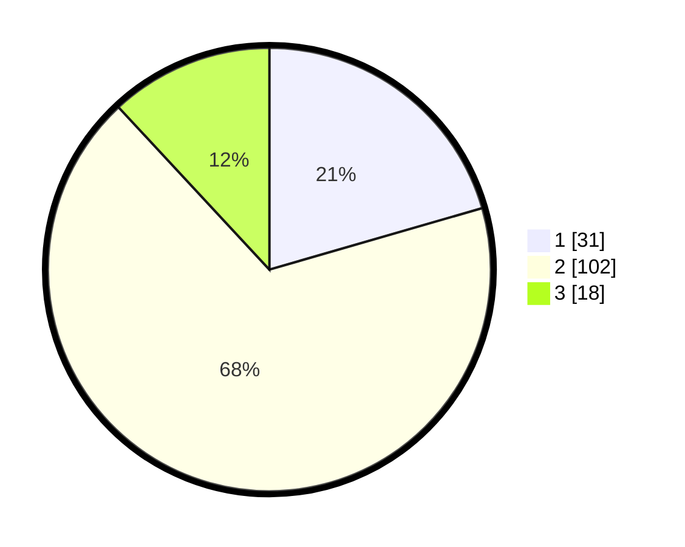

# Hasil

## Grafik

## Tabel

| No. | Nama Paslon    | Suara | Suara (raw) | Persentase |
|:--- |:-------------- | -----:| -----------:| ----------:|
| 1   | ANIES MUHAIMIN | 31    | [31][p-1]   | 20,53      |
| 2   | PRABOWO GIBRAN | 102   | [102][p-2]  | 67,55      |
| 3   | GANJAR MAHFUD  | 18    | [18][p-3]   | 11,92      |

[p-1]: https://github.com/gigit-pemilu/pemilu-2024/blob/main/pilpres/hitung-suara/sub/16-sumatera-selatan/sub/07-banyuasin/sub/10-talang-kelapa/sub/1022-tanah-mas/sub/014-tps/sub/paslon-1.txt
[p-2]: https://github.com/gigit-pemilu/pemilu-2024/blob/main/pilpres/hitung-suara/sub/16-sumatera-selatan/sub/07-banyuasin/sub/10-talang-kelapa/sub/1022-tanah-mas/sub/014-tps/sub/paslon-2.txt
[p-3]: https://github.com/gigit-pemilu/pemilu-2024/blob/main/pilpres/hitung-suara/sub/16-sumatera-selatan/sub/07-banyuasin/sub/10-talang-kelapa/sub/1022-tanah-mas/sub/014-tps/sub/paslon-3.txt

## Foto C Plano

https://sirekap-obj-formc.kpu.go.id/0c28/pemilu/ppwp/16/07/10/10/22/1607101022014-20240215-010234--6da9c532-ee08-4660-b455-1f1468c373c9.jpg

https://sirekap-obj-formc.kpu.go.id/0c28/pemilu/ppwp/16/07/10/10/22/1607101022014-20240215-005526--fd78ac70-dc7c-435e-a742-a9beb50cbdb2.jpg

https://sirekap-obj-formc.kpu.go.id/0c28/pemilu/ppwp/16/07/10/10/22/1607101022014-20240215-011107--d1fe4ac0-517b-486f-b0e7-d53e8c9e8f2f.jpg

## Metadata

| Key        | Value               |
| ---------- | ------------------- |
| Time Stamp | 2024-02-15 15:00:29 |

