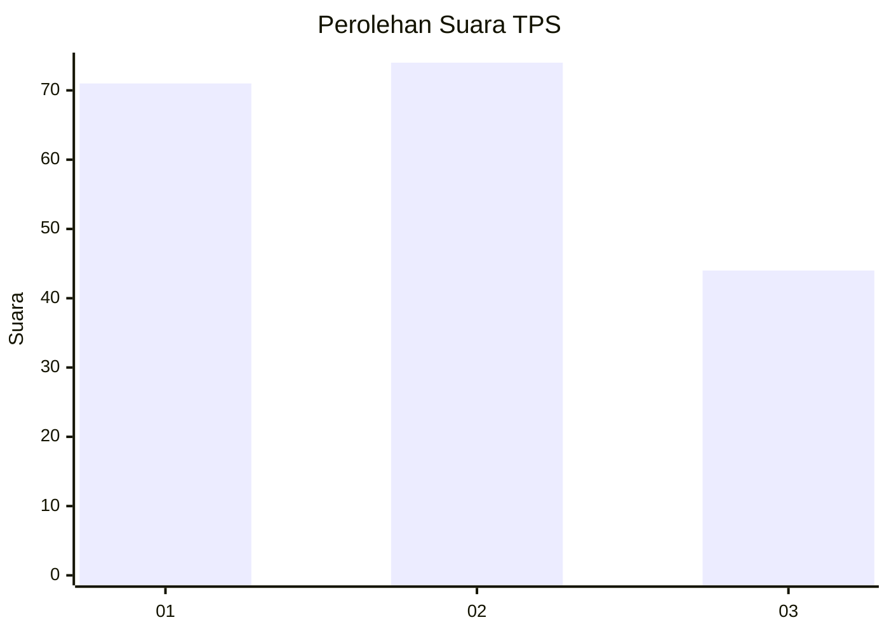
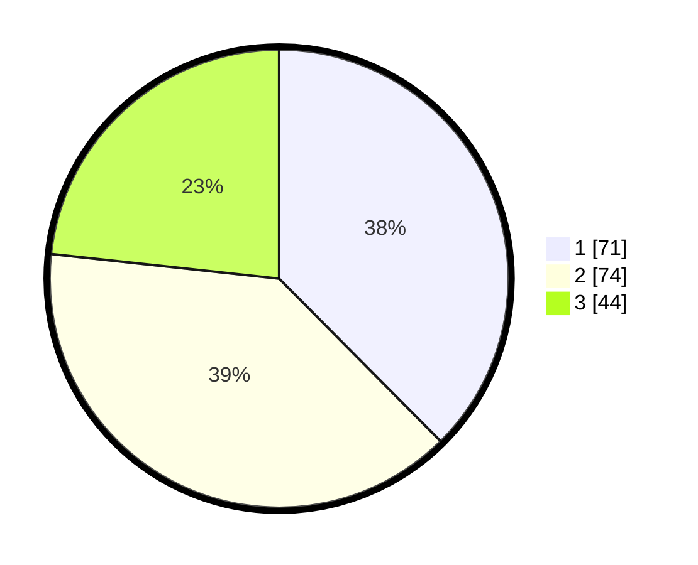

# Hasil

## Grafik

## Tabel

| No. | Nama Paslon    | Suara | Suara (raw) | Persentase |
|:--- |:-------------- | -----:| -----------:| ----------:|
| 1   | ANIES MUHAIMIN | 71    | [71][p-1]   | 37,57      |
| 2   | PRABOWO GIBRAN | 74    | [74][p-2]   | 39,15      |
| 3   | GANJAR MAHFUD  | 44    | [44][p-3]   | 23,28      |

[p-1]: https://github.com/gigit-pemilu/pemilu-2024-16-sumatera-selatan/blob/main/pilpres/hitung-suara/sub/16-sumatera-selatan/sub/07-banyuasin/sub/10-talang-kelapa/sub/1024-sukajadi-timur/sub/005-tps/sub/paslon-1.txt
[p-2]: https://github.com/gigit-pemilu/pemilu-2024-16-sumatera-selatan/blob/main/pilpres/hitung-suara/sub/16-sumatera-selatan/sub/07-banyuasin/sub/10-talang-kelapa/sub/1024-sukajadi-timur/sub/005-tps/sub/paslon-2.txt
[p-3]: https://github.com/gigit-pemilu/pemilu-2024-16-sumatera-selatan/blob/main/pilpres/hitung-suara/sub/16-sumatera-selatan/sub/07-banyuasin/sub/10-talang-kelapa/sub/1024-sukajadi-timur/sub/005-tps/sub/paslon-3.txt

## Foto C Plano

https://sirekap-obj-formc.kpu.go.id/0ae4/pemilu/ppwp/16/07/10/10/24/1607101024005-20240215-020106--58956402-c9b0-461c-9ad0-183d724f4985.jpg

https://sirekap-obj-formc.kpu.go.id/0ae4/pemilu/ppwp/16/07/10/10/24/1607101024005-20240215-020200--7d919ec4-5b03-4fb5-94a2-2560f65967d6.jpg

https://sirekap-obj-formc.kpu.go.id/0ae4/pemilu/ppwp/16/07/10/10/24/1607101024005-20240215-020236--04a06b66-d98f-451c-b09a-d7661e6cc3c5.jpg

## Metadata

| Key        | Value               |
| ---------- | ------------------- |
| Time Stamp | 2024-02-15 15:00:29 |

