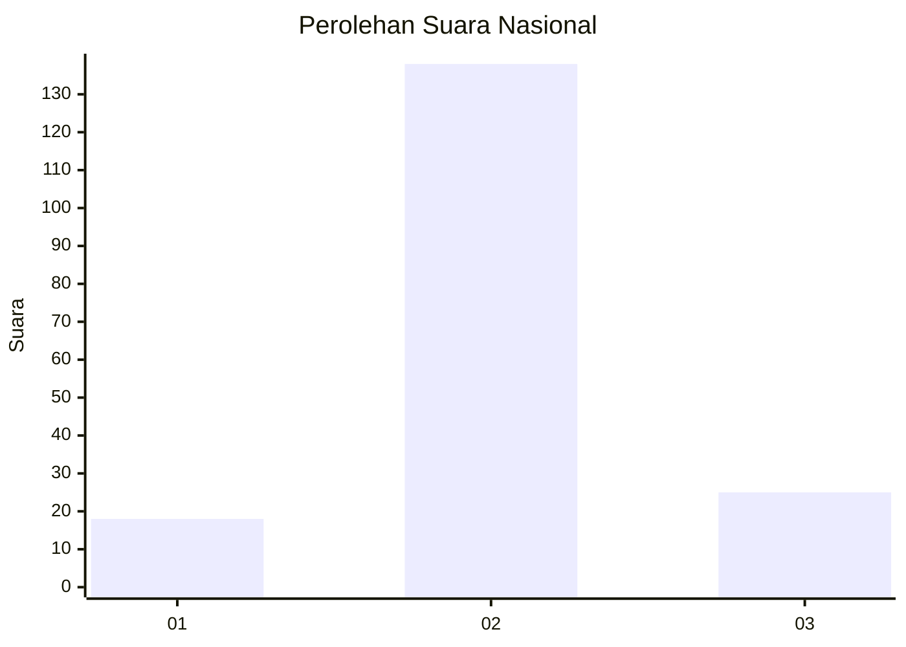
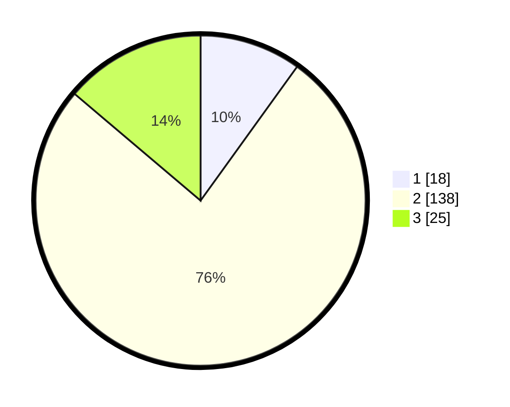

# Hasil

## Grafik

## Tabel

| No. | Nama Paslon    | Suara | Suara (raw) | Persentase |
|:--- |:-------------- | -----:| -----------:| ----------:|
| 1   | ANIES MUHAIMIN | 18    | [18][p-1]   | 9,94       |
| 2   | PRABOWO GIBRAN | 138   | [138][p-2]  | 76,24      |
| 3   | GANJAR MAHFUD  | 25    | [25][p-3]   | 13,81      |

[p-1]: https://github.com/gigit-pemilu/pemilu-2024/blob/main/pilpres/hitung-suara/sub/16-sumatera-selatan/sub/07-banyuasin/sub/10-talang-kelapa/sub/1024-sukajadi-timur/sub/009-tps/sub/paslon-1.txt
[p-2]: https://github.com/gigit-pemilu/pemilu-2024/blob/main/pilpres/hitung-suara/sub/16-sumatera-selatan/sub/07-banyuasin/sub/10-talang-kelapa/sub/1024-sukajadi-timur/sub/009-tps/sub/paslon-2.txt
[p-3]: https://github.com/gigit-pemilu/pemilu-2024/blob/main/pilpres/hitung-suara/sub/16-sumatera-selatan/sub/07-banyuasin/sub/10-talang-kelapa/sub/1024-sukajadi-timur/sub/009-tps/sub/paslon-3.txt

## Foto C Plano

https://sirekap-obj-formc.kpu.go.id/b6fa/pemilu/ppwp/16/07/10/10/24/1607101024009-20240215-004408--eb11c2ef-42b7-4451-8f59-4617b33ddbe3.jpg

https://sirekap-obj-formc.kpu.go.id/b6fa/pemilu/ppwp/16/07/10/10/24/1607101024009-20240215-004558--ad1e6e4c-07da-4aaa-982d-f23b565eb8c8.jpg

https://sirekap-obj-formc.kpu.go.id/b6fa/pemilu/ppwp/16/07/10/10/24/1607101024009-20240215-004704--7a4627b7-e16c-4f8c-bc3e-a745010d6655.jpg

## Metadata

| Key        | Value               |
| ---------- | ------------------- |
| Time Stamp | 2024-02-15 16:00:26 |

