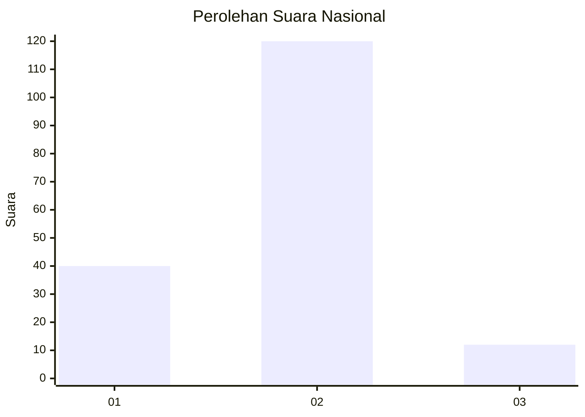
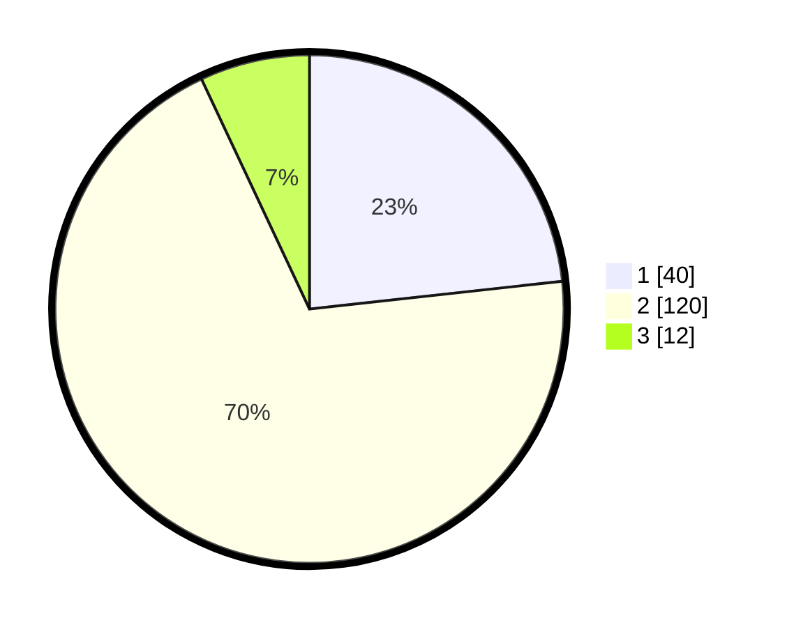

# Hasil

## Grafik

## Tabel

| No. | Nama Paslon    | Suara | Suara (raw) | Persentase |
|:--- |:-------------- | -----:| -----------:| ----------:|
| 1   | ANIES MUHAIMIN | 40    | [40][p-1]   | 23,26      |
| 2   | PRABOWO GIBRAN | 120   | [120][p-2]  | 69,77      |
| 3   | GANJAR MAHFUD  | 12    | [12][p-3]   | 6,98       |

[p-1]: https://github.com/gigit-pemilu/pemilu-2024/blob/main/pilpres/hitung-suara/sub/16-sumatera-selatan/sub/07-banyuasin/sub/10-talang-kelapa/sub/1028-sei-sedapat/sub/013-tps/sub/paslon-1.txt
[p-2]: https://github.com/gigit-pemilu/pemilu-2024/blob/main/pilpres/hitung-suara/sub/16-sumatera-selatan/sub/07-banyuasin/sub/10-talang-kelapa/sub/1028-sei-sedapat/sub/013-tps/sub/paslon-2.txt
[p-3]: https://github.com/gigit-pemilu/pemilu-2024/blob/main/pilpres/hitung-suara/sub/16-sumatera-selatan/sub/07-banyuasin/sub/10-talang-kelapa/sub/1028-sei-sedapat/sub/013-tps/sub/paslon-3.txt

## Foto C Plano

https://sirekap-obj-formc.kpu.go.id/a22f/pemilu/ppwp/16/07/10/10/28/1607101028013-20240226-202734--34f221b6-adc9-4a40-9e76-bf6ce37f3077.jpg

https://sirekap-obj-formc.kpu.go.id/a22f/pemilu/ppwp/16/07/10/10/28/1607101028013-20240226-202925--f88a3638-c3b0-41a5-bf38-968a1d970003.jpg

https://sirekap-obj-formc.kpu.go.id/a22f/pemilu/ppwp/16/07/10/10/28/1607101028013-20240226-232131--eec0b721-a04d-4029-8b59-f62fa0d7e130.jpg

## Metadata

| Key        | Value               |
| ---------- | ------------------- |
| Time Stamp | 2024-02-27 00:00:00 |

## DATA PEMILIH TETAP

Jumlah pemilih dalam DPT: **252**.
 * L: **109**.
 * P: **103**.

## DATA PENGGUNA HAK PILIH

Jumlah pengguna hak pilih dalam DPT: **550**.
 * L: **75**.
 * P: **75**.

Jumlah pengguna hak pilih dalam DPTb: **808**.
 * L: **280**.
 * P: **88**.

Jumlah pengguna hak pilih dalam DPK: **33**.
 * L: **66**.
 * P: **17**.

Jumlah pengguna hak pilih: **183**.
 * L: **95**.
 * P: **892**.

## JUMLAH SUARA SAH DAN TIDAK SAH

JUMLAH SELURUH SUARA SAH: **172**.

JUMLAH SUARA TIDAK SAH: **11**.

JUMLAH SELURUH SUARA SAH DAN SUARA TIDAK SAH: **183**.

