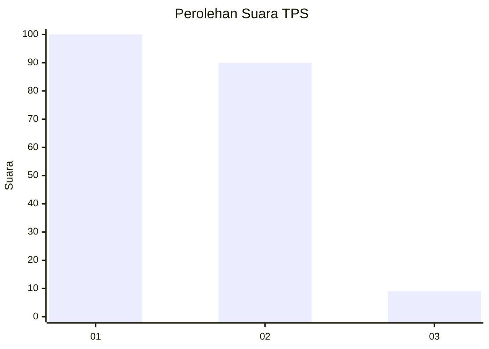
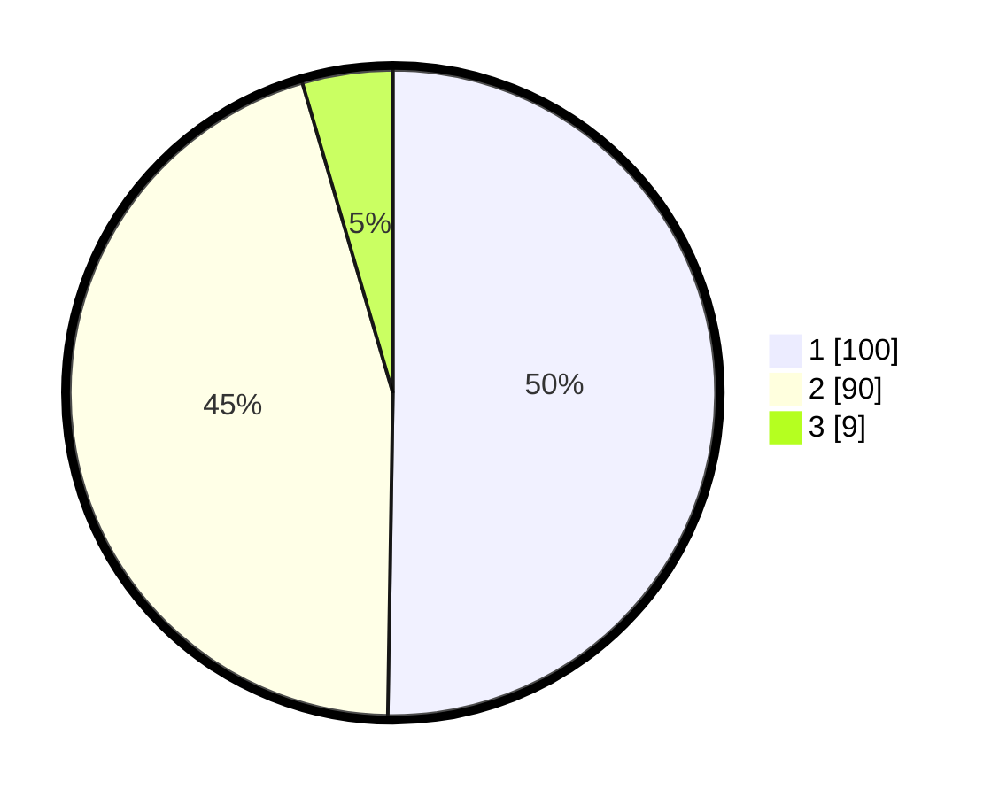

# Hasil

## Grafik

## Tabel

| No. | Nama Paslon    | Suara | Suara (raw) | Persentase |
|:--- |:-------------- | -----:| -----------:| ----------:|
| 1   | ANIES MUHAIMIN | 100   | [100][p-1]  | 50,25      |
| 2   | PRABOWO GIBRAN | 90    | [90][p-2]   | 45,23      |
| 3   | GANJAR MAHFUD  | 9     | [9][p-3]    | 4,52       |

[p-1]: https://github.com/gigit-pemilu/pemilu-2024-16-sumatera-selatan/blob/main/pilpres/hitung-suara/sub/16-sumatera-selatan/sub/07-banyuasin/sub/10-talang-kelapa/sub/1029-azhar-permai/sub/001-tps/sub/paslon-1.txt
[p-2]: https://github.com/gigit-pemilu/pemilu-2024-16-sumatera-selatan/blob/main/pilpres/hitung-suara/sub/16-sumatera-selatan/sub/07-banyuasin/sub/10-talang-kelapa/sub/1029-azhar-permai/sub/001-tps/sub/paslon-2.txt
[p-3]: https://github.com/gigit-pemilu/pemilu-2024-16-sumatera-selatan/blob/main/pilpres/hitung-suara/sub/16-sumatera-selatan/sub/07-banyuasin/sub/10-talang-kelapa/sub/1029-azhar-permai/sub/001-tps/sub/paslon-3.txt

## Foto C Plano

https://sirekap-obj-formc.kpu.go.id/2952/pemilu/ppwp/16/07/10/10/29/1607101029001-20240214-212139--a1579061-b8c0-4757-ae0f-af616d27425c.jpg

https://sirekap-obj-formc.kpu.go.id/2952/pemilu/ppwp/16/07/10/10/29/1607101029001-20240214-212328--a0845b51-dbae-4914-b618-b15b5fec1b0a.jpg

https://sirekap-obj-formc.kpu.go.id/2952/pemilu/ppwp/16/07/10/10/29/1607101029001-20240214-213406--cc45dc34-eaba-4777-b87f-009dcb15a5e6.jpg

## Metadata

| Key        | Value               |
| ---------- | ------------------- |
| Time Stamp | 2024-02-15 16:00:26 |

