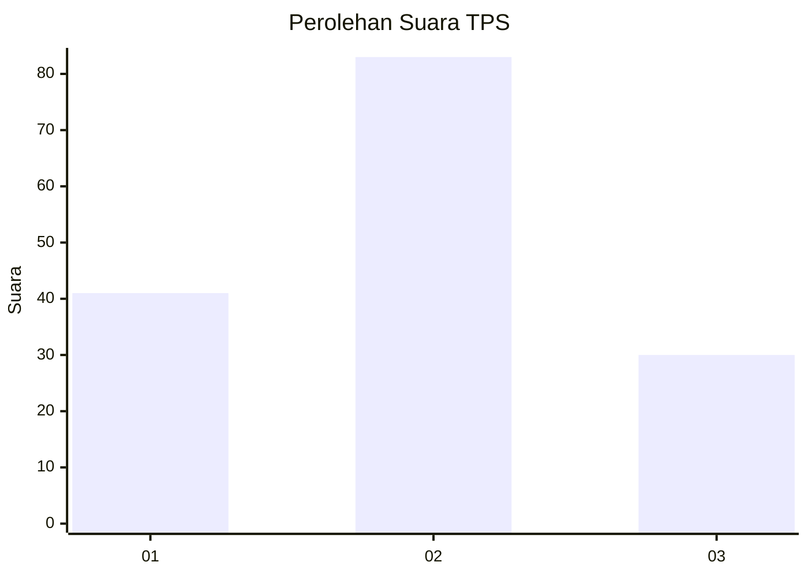
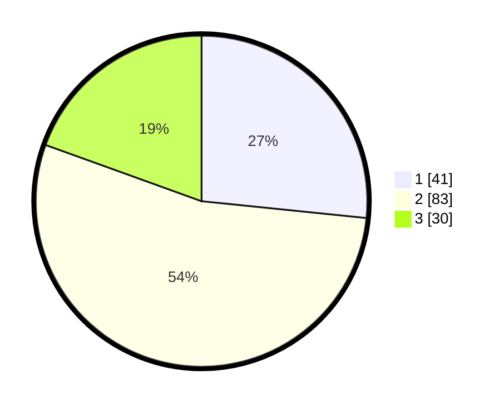

# Hasil

## Grafik

## Tabel

| No. | Nama Paslon    | Suara | Suara (raw) | Persentase |
|:--- |:-------------- | -----:| -----------:| ----------:|
| 1   | ANIES MUHAIMIN | 41    | [41][p-1]   | 26,62      |
| 2   | PRABOWO GIBRAN | 83    | [83][p-2]   | 53,90      |
| 3   | GANJAR MAHFUD  | 30    | [30][p-3]   | 19,48      |

[p-1]: https://github.com/gigit-pemilu/pemilu-2024-16-sumatera-selatan/blob/main/pilpres/hitung-suara/sub/16-sumatera-selatan/sub/07-banyuasin/sub/10-talang-kelapa/sub/1029-azhar-permai/sub/005-tps/sub/paslon-1.txt
[p-2]: https://github.com/gigit-pemilu/pemilu-2024-16-sumatera-selatan/blob/main/pilpres/hitung-suara/sub/16-sumatera-selatan/sub/07-banyuasin/sub/10-talang-kelapa/sub/1029-azhar-permai/sub/005-tps/sub/paslon-2.txt
[p-3]: https://github.com/gigit-pemilu/pemilu-2024-16-sumatera-selatan/blob/main/pilpres/hitung-suara/sub/16-sumatera-selatan/sub/07-banyuasin/sub/10-talang-kelapa/sub/1029-azhar-permai/sub/005-tps/sub/paslon-3.txt

## Foto C Plano

https://sirekap-obj-formc.kpu.go.id/d814/pemilu/ppwp/16/07/10/10/29/1607101029005-20240216-103542--e29758d0-e1ef-41c2-baeb-3b4efe87bdc3.jpg

https://sirekap-obj-formc.kpu.go.id/d814/pemilu/ppwp/16/07/10/10/29/1607101029005-20240215-202911--cb6525a8-99ca-4f85-a17a-bed6b94c17ad.jpg

https://sirekap-obj-formc.kpu.go.id/d814/pemilu/ppwp/16/07/10/10/29/1607101029005-20240215-203430--fb44df68-c930-4043-92ae-2c5e0915a476.jpg

## Metadata

| Key        | Value               |
| ---------- | ------------------- |
| Time Stamp | 2024-02-16 11:00:29 |

