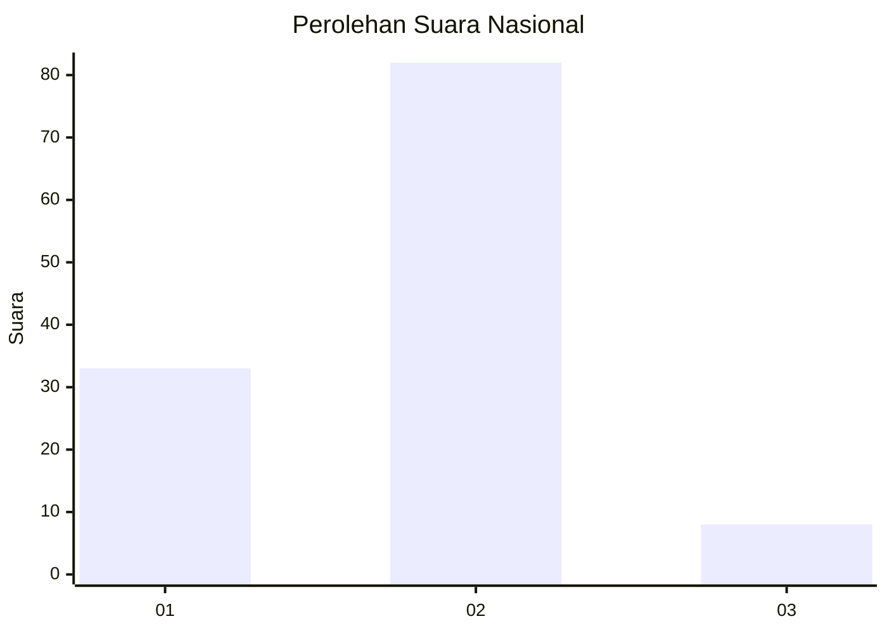
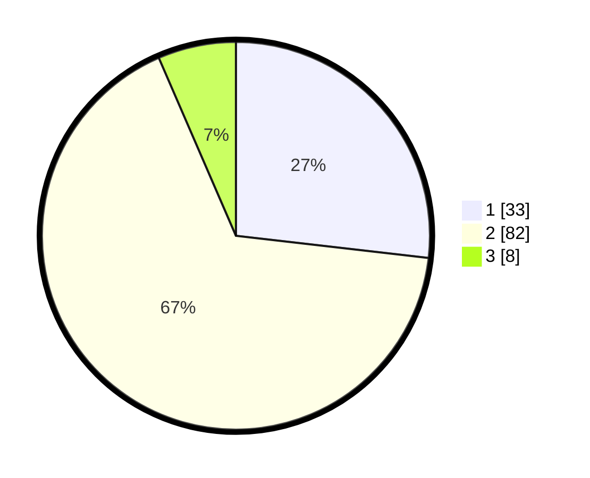

# Hasil

## Grafik

## Tabel

| No. | Nama Paslon    | Suara | Suara (raw) | Persentase |
|:--- |:-------------- | -----:| -----------:| ----------:|
| 1   | ANIES MUHAIMIN | 33    | [33][p-1]   | 26,83      |
| 2   | PRABOWO GIBRAN | 82    | [82][p-2]   | 66,67      |
| 3   | GANJAR MAHFUD  | 8     | [8][p-3]    | 6,50       |

[p-1]: https://github.com/gigit-pemilu/pemilu-2024/blob/main/pilpres/hitung-suara/sub/16-sumatera-selatan/sub/07-banyuasin/sub/10-talang-kelapa/sub/1029-azhar-permai/sub/023-tps/sub/paslon-1.txt
[p-2]: https://github.com/gigit-pemilu/pemilu-2024/blob/main/pilpres/hitung-suara/sub/16-sumatera-selatan/sub/07-banyuasin/sub/10-talang-kelapa/sub/1029-azhar-permai/sub/023-tps/sub/paslon-2.txt
[p-3]: https://github.com/gigit-pemilu/pemilu-2024/blob/main/pilpres/hitung-suara/sub/16-sumatera-selatan/sub/07-banyuasin/sub/10-talang-kelapa/sub/1029-azhar-permai/sub/023-tps/sub/paslon-3.txt

## Foto C Plano

https://sirekap-obj-formc.kpu.go.id/c1d2/pemilu/ppwp/16/07/10/10/29/1607101029023-20240215-005704--6bc39075-6596-4c19-847d-31904fb4a203.jpg

https://sirekap-obj-formc.kpu.go.id/c1d2/pemilu/ppwp/16/07/10/10/29/1607101029023-20240215-005608--5cc1bcb1-0f61-4e74-b088-a03e3c064150.jpg

https://sirekap-obj-formc.kpu.go.id/c1d2/pemilu/ppwp/16/07/10/10/29/1607101029023-20240215-005800--56aef0f0-550e-485a-8ee8-5db333061959.jpg

## Metadata

| Key        | Value               |
| ---------- | ------------------- |
| Time Stamp | 2024-02-15 21:30:27 |

