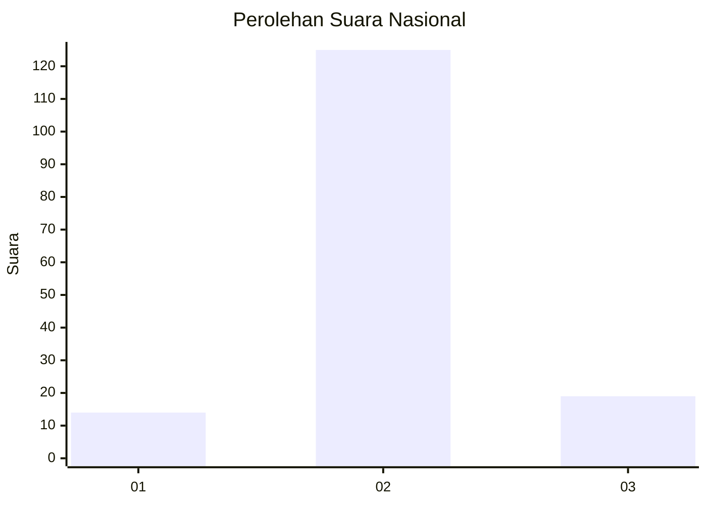
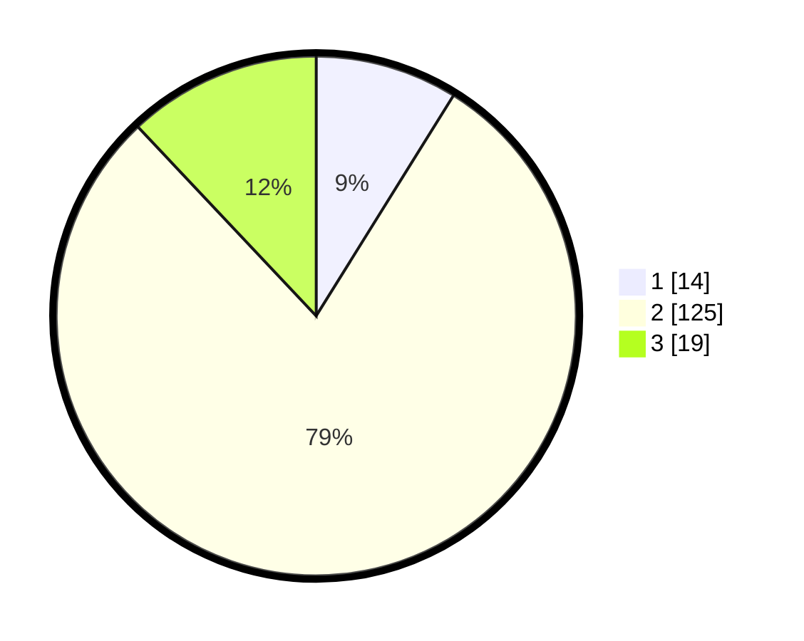

# Hasil

## Grafik

## Tabel

| No. | Nama Paslon    | Suara | Suara (raw) | Persentase |
|:--- |:-------------- | -----:| -----------:| ----------:|
| 1   | ANIES MUHAIMIN | 14    | [14][p-1]   | 8,86       |
| 2   | PRABOWO GIBRAN | 125   | [125][p-2]  | 79,11      |
| 3   | GANJAR MAHFUD  | 19    | [19][p-3]   | 12,03      |

[p-1]: https://github.com/gigit-pemilu/pemilu-2024/blob/main/pilpres/hitung-suara/sub/16-sumatera-selatan/sub/07-banyuasin/sub/10-talang-kelapa/sub/2001-sungai-rengit/sub/005-tps/sub/paslon-1.txt
[p-2]: https://github.com/gigit-pemilu/pemilu-2024/blob/main/pilpres/hitung-suara/sub/16-sumatera-selatan/sub/07-banyuasin/sub/10-talang-kelapa/sub/2001-sungai-rengit/sub/005-tps/sub/paslon-2.txt
[p-3]: https://github.com/gigit-pemilu/pemilu-2024/blob/main/pilpres/hitung-suara/sub/16-sumatera-selatan/sub/07-banyuasin/sub/10-talang-kelapa/sub/2001-sungai-rengit/sub/005-tps/sub/paslon-3.txt

## Foto C Plano

https://sirekap-obj-formc.kpu.go.id/ae24/pemilu/ppwp/16/07/10/20/01/1607102001005-20240214-224903--cc1ead13-c331-4d9f-b22e-a81704b74f7b.jpg

https://sirekap-obj-formc.kpu.go.id/ae24/pemilu/ppwp/16/07/10/20/01/1607102001005-20240226-221108--d3546f4f-86c2-456a-9071-a37c93a6e59d.jpg

https://sirekap-obj-formc.kpu.go.id/ae24/pemilu/ppwp/16/07/10/20/01/1607102001005-20240226-221312--7829987c-0a05-440c-91a5-41c5a1e19ba6.jpg

## Metadata

| Key        | Value               |
| ---------- | ------------------- |
| Time Stamp | 2024-02-26 23:00:00 |

