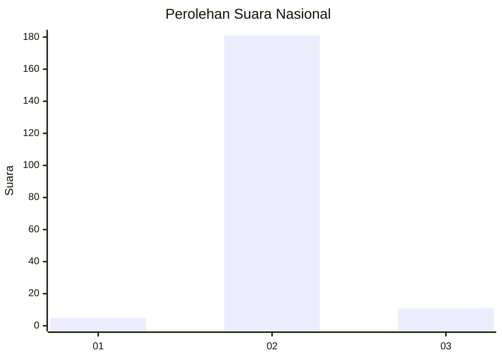
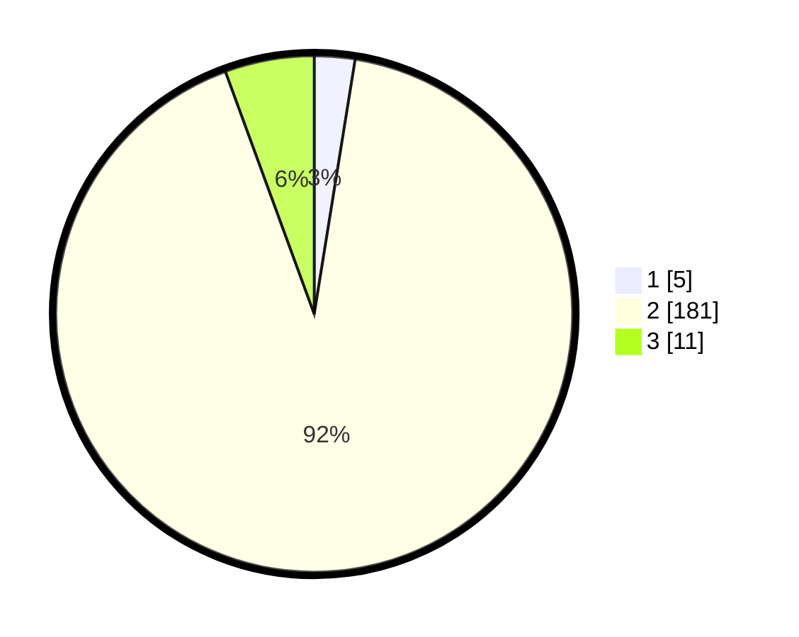

# Hasil

## Grafik

## Tabel

| No. | Nama Paslon    | Suara | Suara (raw) | Persentase |
|:--- |:-------------- | -----:| -----------:| ----------:|
| 1   | ANIES MUHAIMIN | 5     | [5][p-1]    | 2,54       |
| 2   | PRABOWO GIBRAN | 181   | [181][p-2]  | 91,88      |
| 3   | GANJAR MAHFUD  | 11    | [11][p-3]   | 5,58       |

[p-1]: https://github.com/gigit-pemilu/pemilu-2024/blob/main/pilpres/hitung-suara/sub/16-sumatera-selatan/sub/07-banyuasin/sub/10-talang-kelapa/sub/2007-gasing/sub/005-tps/sub/paslon-1.txt
[p-2]: https://github.com/gigit-pemilu/pemilu-2024/blob/main/pilpres/hitung-suara/sub/16-sumatera-selatan/sub/07-banyuasin/sub/10-talang-kelapa/sub/2007-gasing/sub/005-tps/sub/paslon-2.txt
[p-3]: https://github.com/gigit-pemilu/pemilu-2024/blob/main/pilpres/hitung-suara/sub/16-sumatera-selatan/sub/07-banyuasin/sub/10-talang-kelapa/sub/2007-gasing/sub/005-tps/sub/paslon-3.txt

## Foto C Plano

https://sirekap-obj-formc.kpu.go.id/a69e/pemilu/ppwp/16/07/10/20/07/1607102007005-20240223-214238--3ba0a5c9-ab63-4ca6-beb2-a244eb652843.jpg

https://sirekap-obj-formc.kpu.go.id/a69e/pemilu/ppwp/16/07/10/20/07/1607102007005-20240223-215430--e42a3e58-f0bc-461a-a056-341333bacea3.jpg

https://sirekap-obj-formc.kpu.go.id/a69e/pemilu/ppwp/16/07/10/20/07/1607102007005-20240223-214724--f56e3a08-d2bd-4d3b-84e4-f0ece732516f.jpg

## Metadata

| Key        | Value               |
| ---------- | ------------------- |
| Time Stamp | 2024-02-25 14:00:00 |

