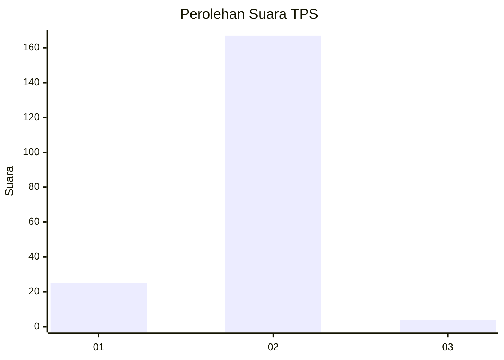
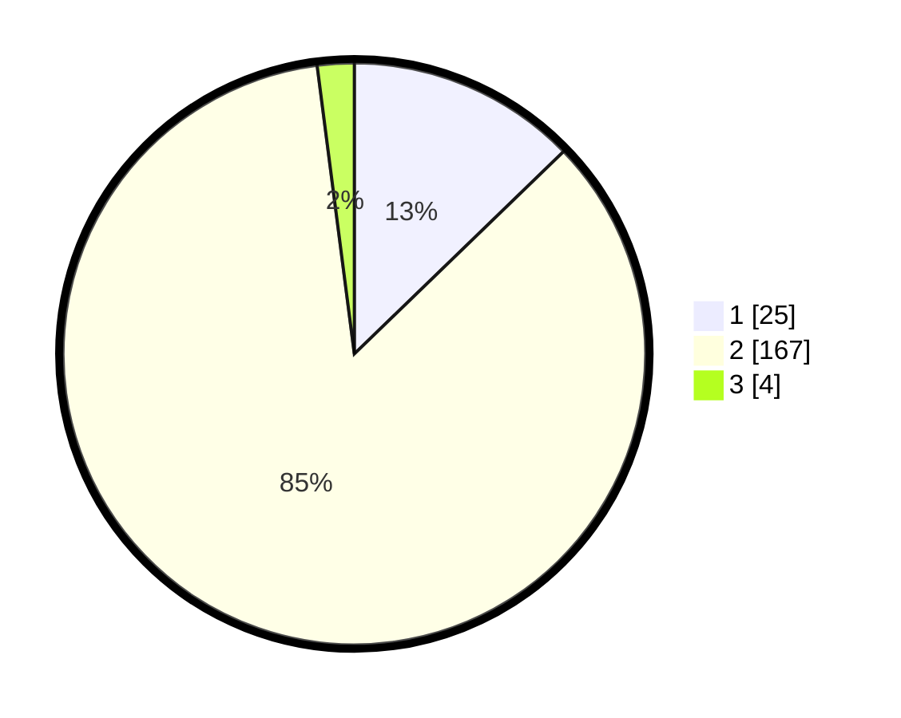

# Hasil

## Grafik

## Tabel

| No. | Nama Paslon    | Suara | Suara (raw) | Persentase |
|:--- |:-------------- | -----:| -----------:| ----------:|
| 1   | ANIES MUHAIMIN | 25    | [25][p-1]   | 12,76      |
| 2   | PRABOWO GIBRAN | 167   | [167][p-2]  | 85,20      |
| 3   | GANJAR MAHFUD  | 4     | [4][p-3]    | 2,04       |

[p-1]: https://github.com/gigit-pemilu/pemilu-2024-16-sumatera-selatan/blob/main/pilpres/hitung-suara/sub/16-sumatera-selatan/sub/07-banyuasin/sub/11-rantau-bayur/sub/2002-tanjung-pasir/sub/002-tps/sub/paslon-1.txt
[p-2]: https://github.com/gigit-pemilu/pemilu-2024-16-sumatera-selatan/blob/main/pilpres/hitung-suara/sub/16-sumatera-selatan/sub/07-banyuasin/sub/11-rantau-bayur/sub/2002-tanjung-pasir/sub/002-tps/sub/paslon-2.txt
[p-3]: https://github.com/gigit-pemilu/pemilu-2024-16-sumatera-selatan/blob/main/pilpres/hitung-suara/sub/16-sumatera-selatan/sub/07-banyuasin/sub/11-rantau-bayur/sub/2002-tanjung-pasir/sub/002-tps/sub/paslon-3.txt

## Foto C Plano

https://sirekap-obj-formc.kpu.go.id/bc1a/pemilu/ppwp/16/07/11/20/02/1607112002002-20240215-001200--04fd2316-660a-4336-8cf3-24236d794582.jpg

https://sirekap-obj-formc.kpu.go.id/bc1a/pemilu/ppwp/16/07/11/20/02/1607112002002-20240215-084356--f7027585-02ff-4031-893b-babbd5b2b36d.jpg

https://sirekap-obj-formc.kpu.go.id/bc1a/pemilu/ppwp/16/07/11/20/02/1607112002002-20240215-084936--296e5811-ae33-49b6-a7ec-0bc21f8aa079.jpg

## Metadata

| Key        | Value               |
| ---------- | ------------------- |
| Time Stamp | 2024-02-15 22:40:13 |

