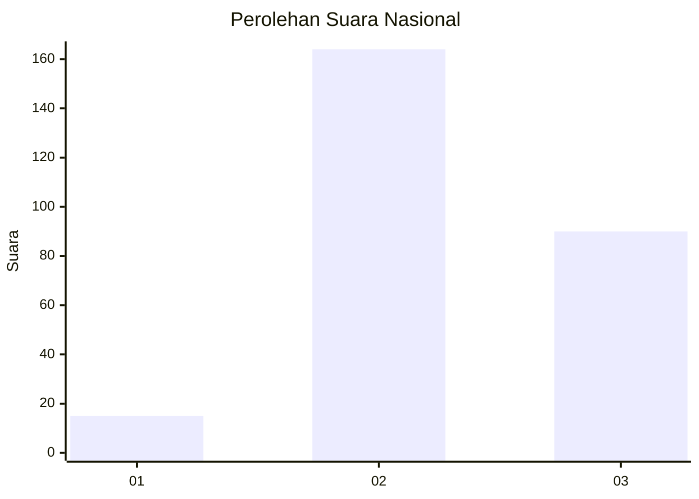
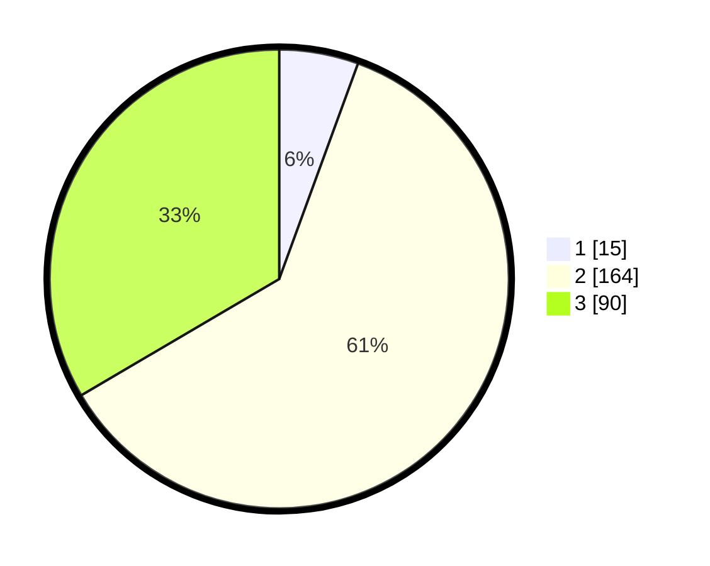

# Hasil

## Grafik

## Tabel

| No. | Nama Paslon    | Suara | Suara (raw) | Persentase |
|:--- |:-------------- | -----:| -----------:| ----------:|
| 1   | ANIES MUHAIMIN | 15    | [15][p-1]   | 5,58       |
| 2   | PRABOWO GIBRAN | 164   | [164][p-2]  | 60,97      |
| 3   | GANJAR MAHFUD  | 90    | [90][p-3]   | 33,46      |

[p-1]: https://github.com/gigit-pemilu/pemilu-2024/blob/main/pilpres/hitung-suara/sub/16-sumatera-selatan/sub/07-banyuasin/sub/11-rantau-bayur/sub/2003-tanjung-tiga/sub/001-tps/sub/paslon-1.txt
[p-2]: https://github.com/gigit-pemilu/pemilu-2024/blob/main/pilpres/hitung-suara/sub/16-sumatera-selatan/sub/07-banyuasin/sub/11-rantau-bayur/sub/2003-tanjung-tiga/sub/001-tps/sub/paslon-2.txt
[p-3]: https://github.com/gigit-pemilu/pemilu-2024/blob/main/pilpres/hitung-suara/sub/16-sumatera-selatan/sub/07-banyuasin/sub/11-rantau-bayur/sub/2003-tanjung-tiga/sub/001-tps/sub/paslon-3.txt

## Foto C Plano

https://sirekap-obj-formc.kpu.go.id/9222/pemilu/ppwp/16/07/11/20/03/1607112003001-20240214-225645--41db621f-2cd6-4192-81ee-5fa28198c7fe.jpg

https://sirekap-obj-formc.kpu.go.id/9222/pemilu/ppwp/16/07/11/20/03/1607112003001-20240215-064459--6c881932-2b5f-46ff-a3ef-206087e7389d.jpg

https://sirekap-obj-formc.kpu.go.id/9222/pemilu/ppwp/16/07/11/20/03/1607112003001-20240214-221021--228eca29-aff2-426e-ba5b-89e730d51274.jpg

## Metadata

| Key        | Value               |
| ---------- | ------------------- |
| Time Stamp | 2024-02-15 15:00:29 |

