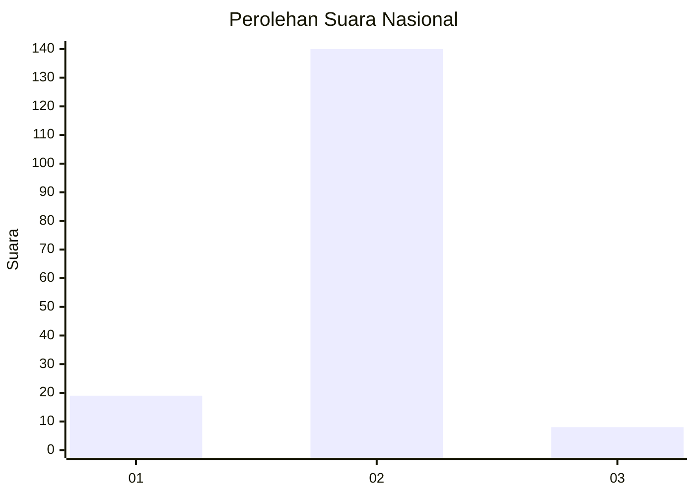
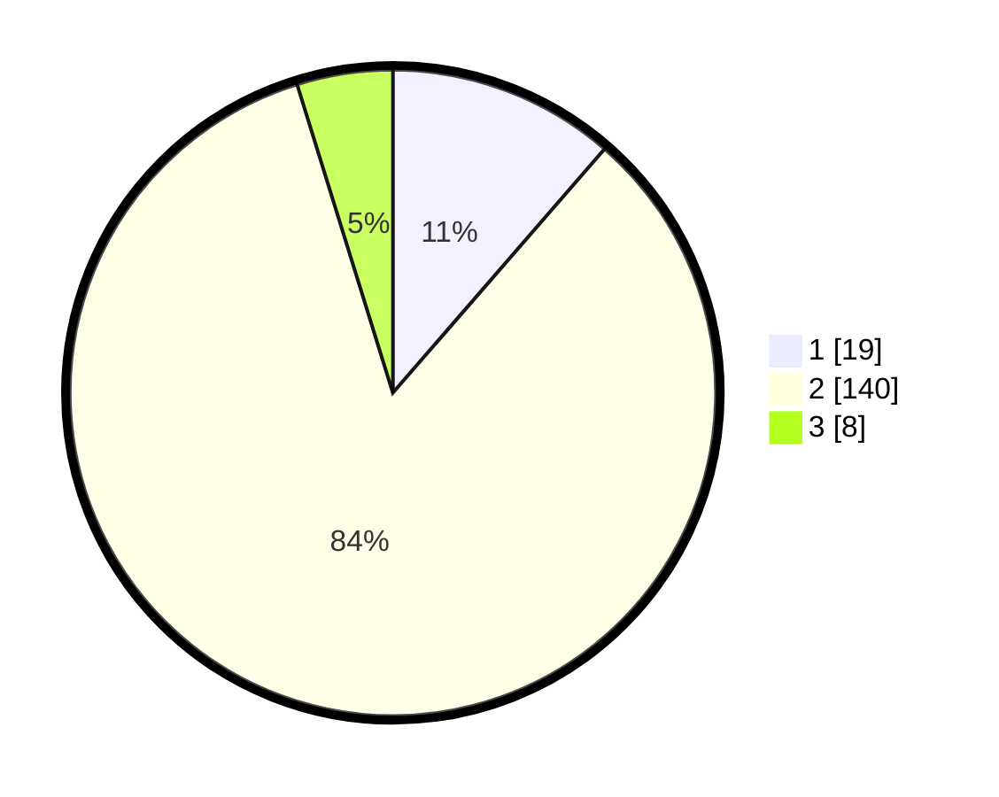

# Hasil

## Grafik

## Tabel

| No. | Nama Paslon    | Suara | Suara (raw) | Persentase |
|:--- |:-------------- | -----:| -----------:| ----------:|
| 1   | ANIES MUHAIMIN | 19    | [19][p-1]   | 11,38      |
| 2   | PRABOWO GIBRAN | 140   | [140][p-2]  | 83,83      |
| 3   | GANJAR MAHFUD  | 8     | [8][p-3]    | 4,79       |

[p-1]: https://github.com/gigit-pemilu/pemilu-2024/blob/main/pilpres/hitung-suara/sub/16-sumatera-selatan/sub/07-banyuasin/sub/11-rantau-bayur/sub/2003-tanjung-tiga/sub/005-tps/sub/paslon-1.txt
[p-2]: https://github.com/gigit-pemilu/pemilu-2024/blob/main/pilpres/hitung-suara/sub/16-sumatera-selatan/sub/07-banyuasin/sub/11-rantau-bayur/sub/2003-tanjung-tiga/sub/005-tps/sub/paslon-2.txt
[p-3]: https://github.com/gigit-pemilu/pemilu-2024/blob/main/pilpres/hitung-suara/sub/16-sumatera-selatan/sub/07-banyuasin/sub/11-rantau-bayur/sub/2003-tanjung-tiga/sub/005-tps/sub/paslon-3.txt

## Foto C Plano

https://sirekap-obj-formc.kpu.go.id/90ce/pemilu/ppwp/16/07/11/20/03/1607112003005-20240215-081110--3194978a-804e-4c40-aa47-dd8701f53489.jpg

https://sirekap-obj-formc.kpu.go.id/90ce/pemilu/ppwp/16/07/11/20/03/1607112003005-20240215-082026--7259cb3c-74a8-4910-bc9e-14dd406e6caf.jpg

https://sirekap-obj-formc.kpu.go.id/90ce/pemilu/ppwp/16/07/11/20/03/1607112003005-20240215-082237--d33d8fcc-c8b0-4766-a143-c6e74c191f5b.jpg

## Metadata

| Key        | Value               |
| ---------- | ------------------- |
| Time Stamp | 2024-02-16 12:51:22 |

