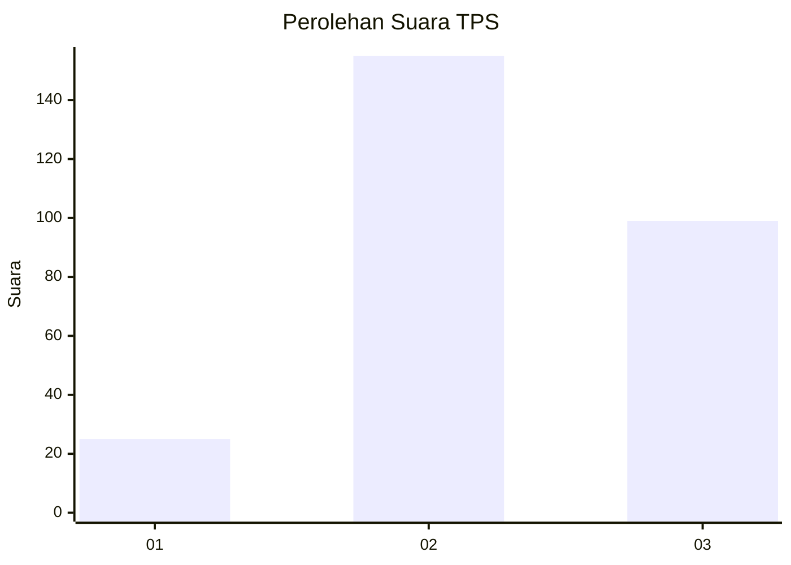
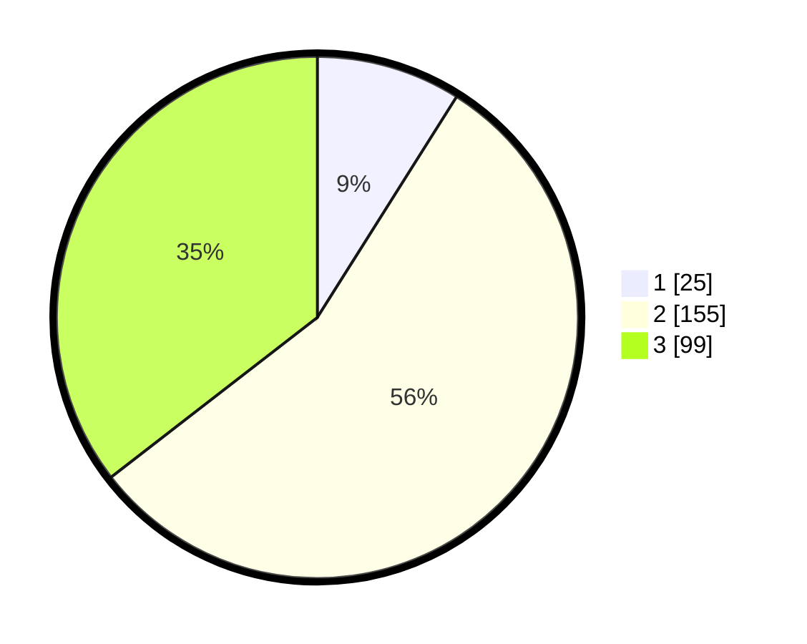

# Hasil

## Grafik

## Tabel

| No. | Nama Paslon    | Suara | Suara (raw) | Persentase |
|:--- |:-------------- | -----:| -----------:| ----------:|
| 1   | ANIES MUHAIMIN | 25    | [25][p-1]   | 8,96       |
| 2   | PRABOWO GIBRAN | 155   | [155][p-2]  | 55,56      |
| 3   | GANJAR MAHFUD  | 99    | [99][p-3]   | 35,48      |

[p-1]: https://github.com/gigit-pemilu/pemilu-2024-16-sumatera-selatan/blob/main/pilpres/hitung-suara/sub/16-sumatera-selatan/sub/07-banyuasin/sub/11-rantau-bayur/sub/2005-pagar-bulan/sub/003-tps/sub/paslon-1.txt
[p-2]: https://github.com/gigit-pemilu/pemilu-2024-16-sumatera-selatan/blob/main/pilpres/hitung-suara/sub/16-sumatera-selatan/sub/07-banyuasin/sub/11-rantau-bayur/sub/2005-pagar-bulan/sub/003-tps/sub/paslon-2.txt
[p-3]: https://github.com/gigit-pemilu/pemilu-2024-16-sumatera-selatan/blob/main/pilpres/hitung-suara/sub/16-sumatera-selatan/sub/07-banyuasin/sub/11-rantau-bayur/sub/2005-pagar-bulan/sub/003-tps/sub/paslon-3.txt

## Foto C Plano

https://sirekap-obj-formc.kpu.go.id/05ff/pemilu/ppwp/16/07/11/20/05/1607112005003-20240215-100555--6277b0da-3f8d-45e3-8840-f8bb95722c56.jpg

https://sirekap-obj-formc.kpu.go.id/05ff/pemilu/ppwp/16/07/11/20/05/1607112005003-20240214-185406--6ae6c334-27ca-404a-a107-779f55115b8e.jpg

https://sirekap-obj-formc.kpu.go.id/05ff/pemilu/ppwp/16/07/11/20/05/1607112005003-20240215-001106--215705cc-5443-4875-95ec-088950b36ec2.jpg

## Metadata

| Key        | Value               |
| ---------- | ------------------- |
| Time Stamp | 2024-02-15 15:00:29 |

