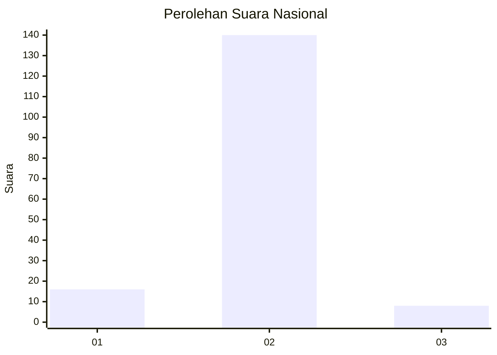
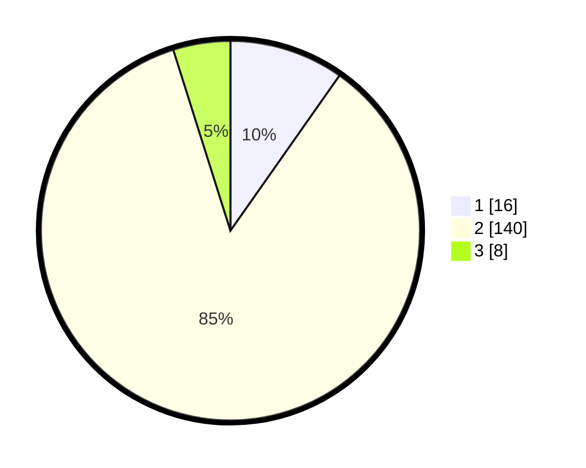

# Hasil

## Grafik

## Tabel

| No. | Nama Paslon    | Suara | Suara (raw) | Persentase |
|:--- |:-------------- | -----:| -----------:| ----------:|
| 1   | ANIES MUHAIMIN | 16    | [16][p-1]   | 9,76       |
| 2   | PRABOWO GIBRAN | 140   | [140][p-2]  | 85,37      |
| 3   | GANJAR MAHFUD  | 8     | [8][p-3]    | 4,88       |

[p-1]: https://github.com/gigit-pemilu/pemilu-2024/blob/main/pilpres/hitung-suara/sub/16-sumatera-selatan/sub/07-banyuasin/sub/11-rantau-bayur/sub/2012-lebung/sub/003-tps/sub/paslon-1.txt
[p-2]: https://github.com/gigit-pemilu/pemilu-2024/blob/main/pilpres/hitung-suara/sub/16-sumatera-selatan/sub/07-banyuasin/sub/11-rantau-bayur/sub/2012-lebung/sub/003-tps/sub/paslon-2.txt
[p-3]: https://github.com/gigit-pemilu/pemilu-2024/blob/main/pilpres/hitung-suara/sub/16-sumatera-selatan/sub/07-banyuasin/sub/11-rantau-bayur/sub/2012-lebung/sub/003-tps/sub/paslon-3.txt

## Foto C Plano

https://sirekap-obj-formc.kpu.go.id/dc58/pemilu/ppwp/16/07/11/20/12/1607112012003-20240215-025117--53ea2e77-fe89-4019-989d-a9acbed3da8d.jpg

https://sirekap-obj-formc.kpu.go.id/dc58/pemilu/ppwp/16/07/11/20/12/1607112012003-20240215-025253--7abaff74-fbe4-4acc-bb12-3cbf55efbaec.jpg

https://sirekap-obj-formc.kpu.go.id/dc58/pemilu/ppwp/16/07/11/20/12/1607112012003-20240215-034052--05b2dc6f-dec9-4fe3-b40a-df7cfcd896c2.jpg

## Metadata

| Key        | Value               |
| ---------- | ------------------- |
| Time Stamp | 2024-02-15 22:30:27 |

