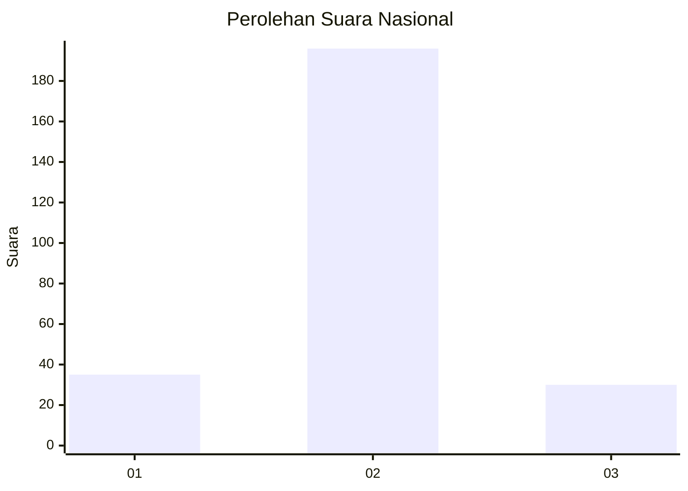
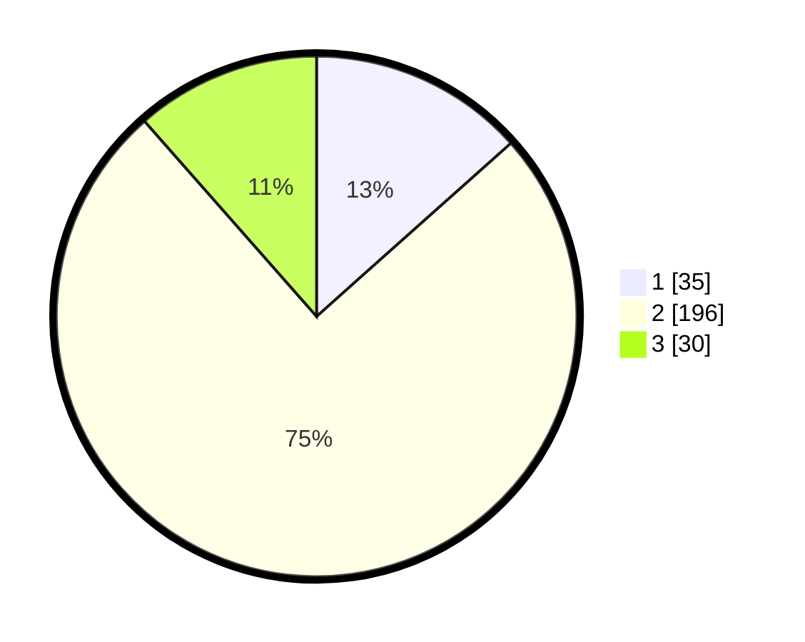

# Hasil

## Grafik

## Tabel

| No. | Nama Paslon    | Suara | Suara (raw) | Persentase |
|:--- |:-------------- | -----:| -----------:| ----------:|
| 1   | ANIES MUHAIMIN | 35    | [35][p-1]   | 13,41      |
| 2   | PRABOWO GIBRAN | 196   | [196][p-2]  | 75,10      |
| 3   | GANJAR MAHFUD  | 30    | [30][p-3]   | 11,49      |

[p-1]: https://github.com/gigit-pemilu/pemilu-2024/blob/main/pilpres/hitung-suara/sub/16-sumatera-selatan/sub/07-banyuasin/sub/11-rantau-bayur/sub/2013-lubuk-rengas/sub/002-tps/sub/paslon-1.txt
[p-2]: https://github.com/gigit-pemilu/pemilu-2024/blob/main/pilpres/hitung-suara/sub/16-sumatera-selatan/sub/07-banyuasin/sub/11-rantau-bayur/sub/2013-lubuk-rengas/sub/002-tps/sub/paslon-2.txt
[p-3]: https://github.com/gigit-pemilu/pemilu-2024/blob/main/pilpres/hitung-suara/sub/16-sumatera-selatan/sub/07-banyuasin/sub/11-rantau-bayur/sub/2013-lubuk-rengas/sub/002-tps/sub/paslon-3.txt

## Foto C Plano

https://sirekap-obj-formc.kpu.go.id/52d9/pemilu/ppwp/16/07/11/20/13/1607112013002-20240216-205035--a8a321a3-2fd0-4202-9eaf-a8af3c3561b9.jpg

https://sirekap-obj-formc.kpu.go.id/52d9/pemilu/ppwp/16/07/11/20/13/1607112013002-20240216-204316--938fbc1d-b999-42b2-b145-648c5c725824.jpg

https://sirekap-obj-formc.kpu.go.id/52d9/pemilu/ppwp/16/07/11/20/13/1607112013002-20240216-182218--ac7f4fb2-739e-4b23-9097-eaab93b9896b.jpg

## Metadata

| Key        | Value               |
| ---------- | ------------------- |
| Time Stamp | 2024-02-16 22:01:00 |

