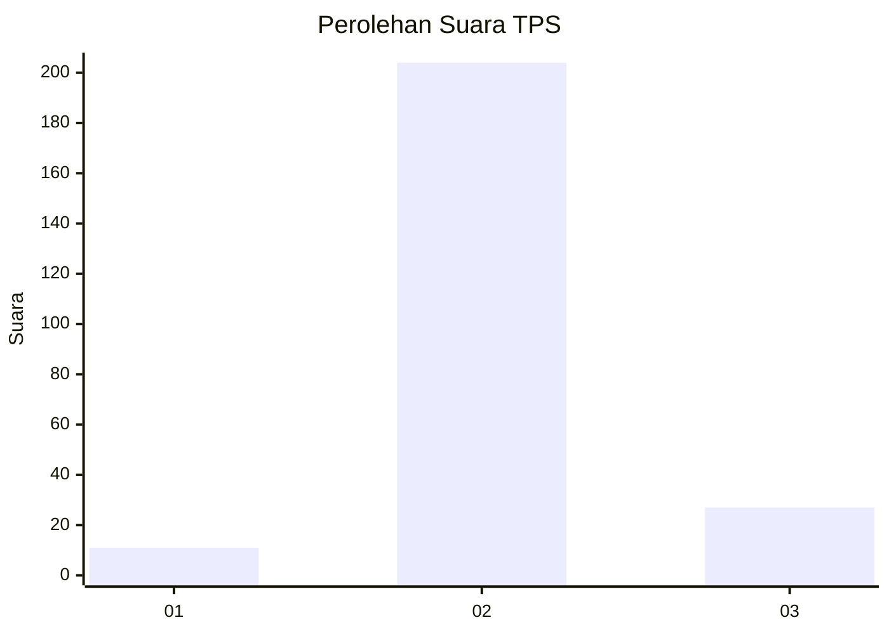
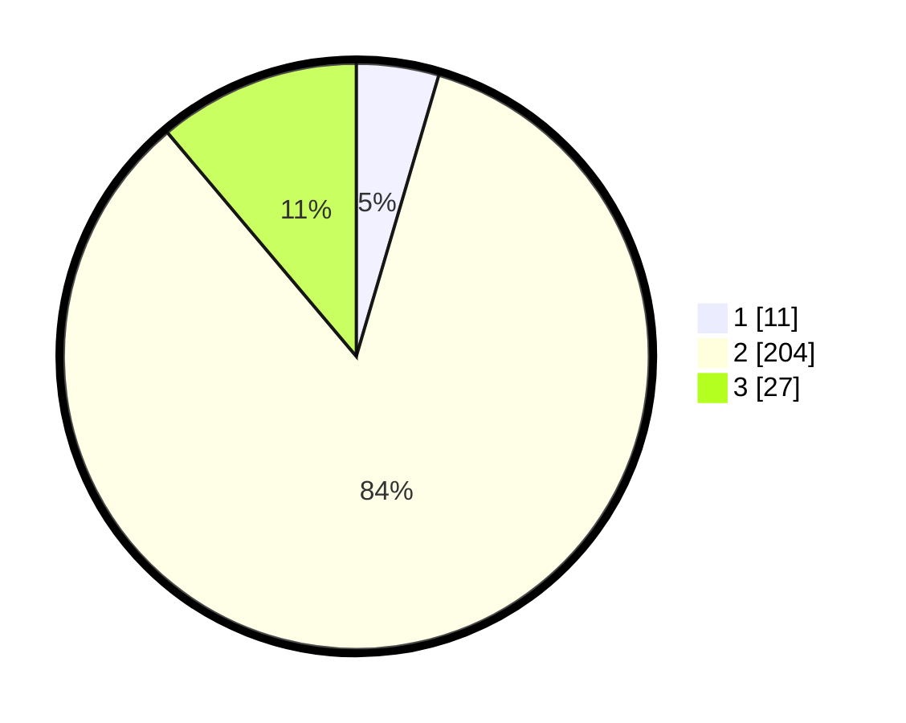

# Hasil

## Grafik

## Tabel

| No. | Nama Paslon    | Suara | Suara (raw) | Persentase |
|:--- |:-------------- | -----:| -----------:| ----------:|
| 1   | ANIES MUHAIMIN | 11    | [11][p-1]   | 4,55       |
| 2   | PRABOWO GIBRAN | 204   | [204][p-2]  | 84,30      |
| 3   | GANJAR MAHFUD  | 27    | [27][p-3]   | 11,16      |

[p-1]: https://github.com/gigit-pemilu/pemilu-2024-16-sumatera-selatan/blob/main/pilpres/hitung-suara/sub/16-sumatera-selatan/sub/07-banyuasin/sub/11-rantau-bayur/sub/2016-talang-kemang/sub/003-tps/sub/paslon-1.txt
[p-2]: https://github.com/gigit-pemilu/pemilu-2024-16-sumatera-selatan/blob/main/pilpres/hitung-suara/sub/16-sumatera-selatan/sub/07-banyuasin/sub/11-rantau-bayur/sub/2016-talang-kemang/sub/003-tps/sub/paslon-2.txt
[p-3]: https://github.com/gigit-pemilu/pemilu-2024-16-sumatera-selatan/blob/main/pilpres/hitung-suara/sub/16-sumatera-selatan/sub/07-banyuasin/sub/11-rantau-bayur/sub/2016-talang-kemang/sub/003-tps/sub/paslon-3.txt

## Foto C Plano

https://sirekap-obj-formc.kpu.go.id/b7fc/pemilu/ppwp/16/07/11/20/16/1607112016003-20240215-200055--2ffab832-1aab-4158-92b8-34ff84da638f.jpg

https://sirekap-obj-formc.kpu.go.id/b7fc/pemilu/ppwp/16/07/11/20/16/1607112016003-20240215-202208--2a7f6eb6-ddd4-4d50-a996-e1076f26e1d6.jpg

https://sirekap-obj-formc.kpu.go.id/b7fc/pemilu/ppwp/16/07/11/20/16/1607112016003-20240215-202241--f2a24057-5cf7-4d3d-819f-83abb893b100.jpg

## Metadata

| Key        | Value               |
| ---------- | ------------------- |
| Time Stamp | 2024-02-16 14:30:33 |

