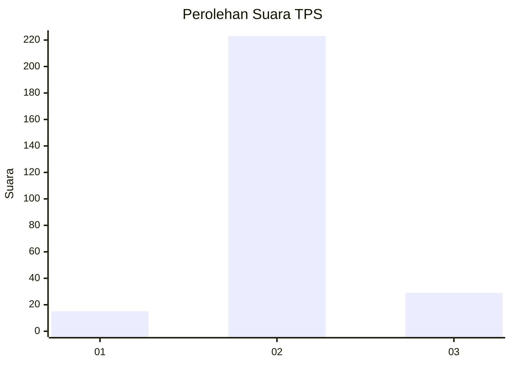
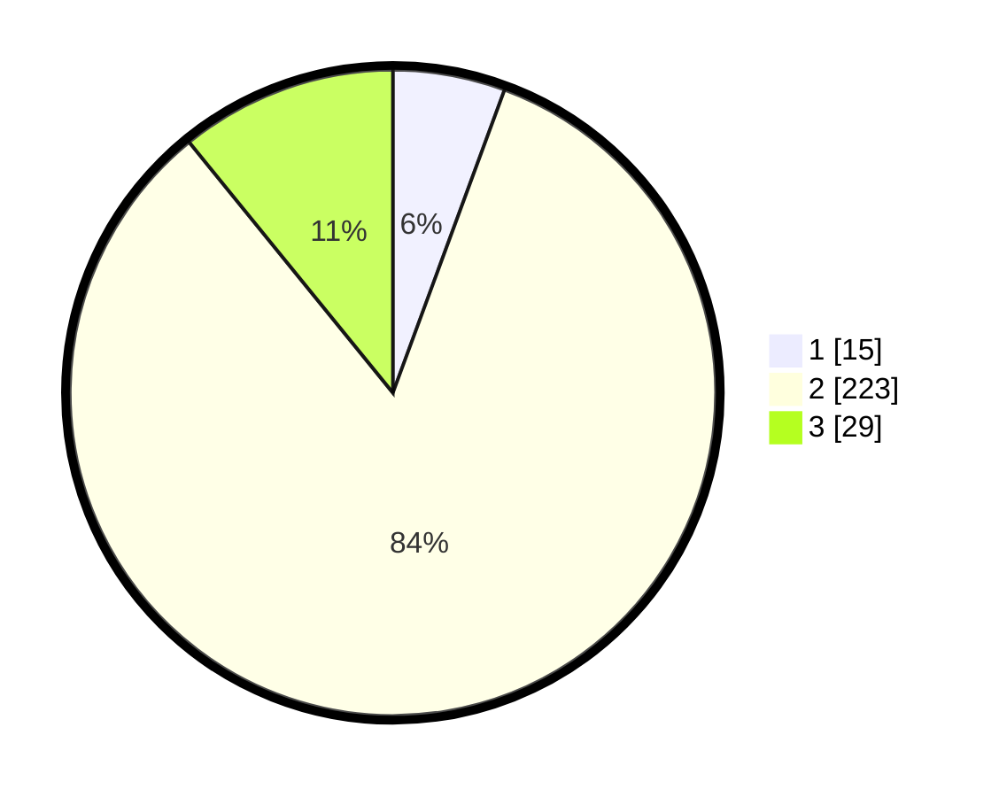

# Hasil

## Grafik

## Tabel

| No. | Nama Paslon    | Suara | Suara (raw) | Persentase |
|:--- |:-------------- | -----:| -----------:| ----------:|
| 1   | ANIES MUHAIMIN | 15    | [15][p-1]   | 5,62       |
| 2   | PRABOWO GIBRAN | 223   | [223][p-2]  | 83,52      |
| 3   | GANJAR MAHFUD  | 29    | [29][p-3]   | 10,86      |

[p-1]: https://github.com/gigit-pemilu/pemilu-2024-16-sumatera-selatan/blob/main/pilpres/hitung-suara/sub/16-sumatera-selatan/sub/07-banyuasin/sub/11-rantau-bayur/sub/2019-sungai-naik/sub/001-tps/sub/paslon-1.txt
[p-2]: https://github.com/gigit-pemilu/pemilu-2024-16-sumatera-selatan/blob/main/pilpres/hitung-suara/sub/16-sumatera-selatan/sub/07-banyuasin/sub/11-rantau-bayur/sub/2019-sungai-naik/sub/001-tps/sub/paslon-2.txt
[p-3]: https://github.com/gigit-pemilu/pemilu-2024-16-sumatera-selatan/blob/main/pilpres/hitung-suara/sub/16-sumatera-selatan/sub/07-banyuasin/sub/11-rantau-bayur/sub/2019-sungai-naik/sub/001-tps/sub/paslon-3.txt

## Foto C Plano

https://sirekap-obj-formc.kpu.go.id/3873/pemilu/ppwp/16/07/11/20/19/1607112019001-20240215-064024--a5c2d881-472e-4a6e-b61c-155a6ad88f5e.jpg

https://sirekap-obj-formc.kpu.go.id/3873/pemilu/ppwp/16/07/11/20/19/1607112019001-20240215-064131--fa24ea43-c4e1-4a1d-b7bc-799b3c86353e.jpg

https://sirekap-obj-formc.kpu.go.id/3873/pemilu/ppwp/16/07/11/20/19/1607112019001-20240215-064213--c9e503a7-f52b-414d-8960-dd351920cdda.jpg

## Metadata

| Key        | Value               |
| ---------- | ------------------- |
| Time Stamp | 2024-02-15 22:30:27 |

