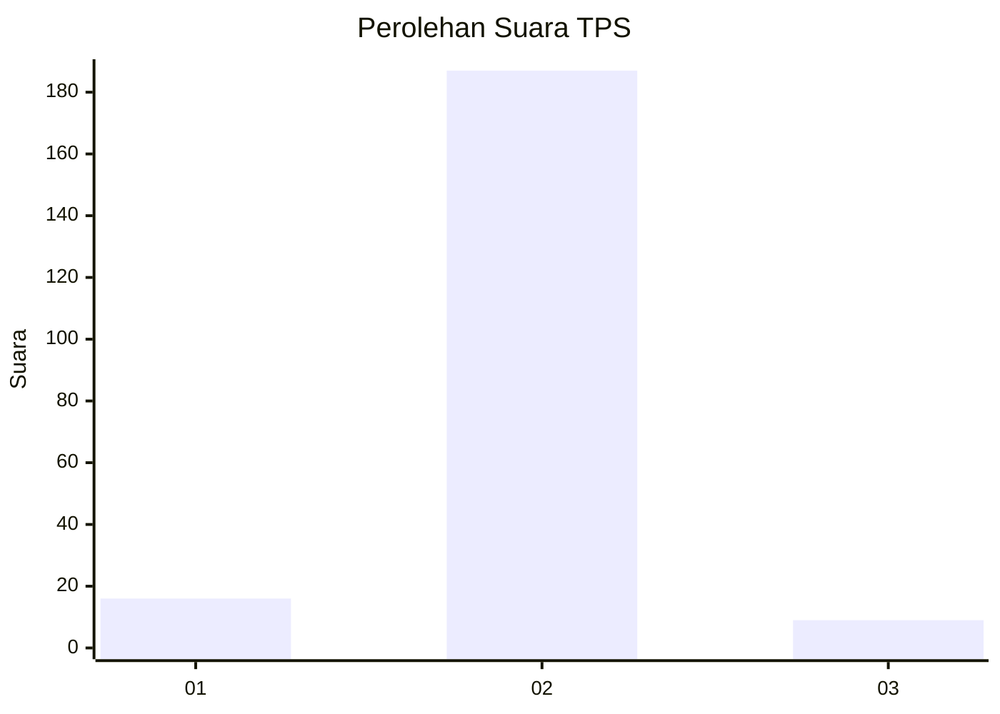
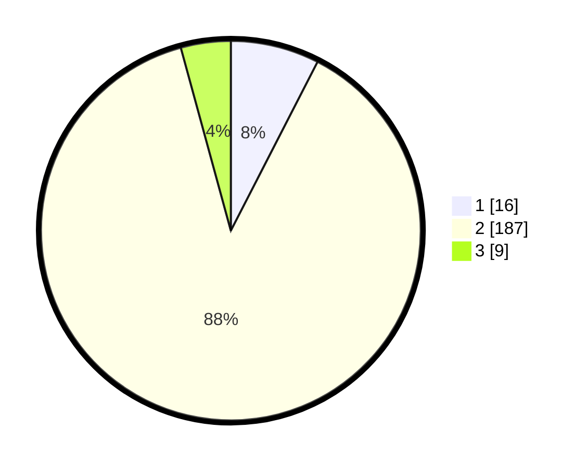

# Hasil

## Grafik

## Tabel

| No. | Nama Paslon    | Suara | Suara (raw) | Persentase |
|:--- |:-------------- | -----:| -----------:| ----------:|
| 1   | ANIES MUHAIMIN | 16    | [16][p-1]   | 7,55       |
| 2   | PRABOWO GIBRAN | 187   | [187][p-2]  | 88,21      |
| 3   | GANJAR MAHFUD  | 9     | [9][p-3]    | 4,25       |

[p-1]: https://github.com/gigit-pemilu/pemilu-2024-16-sumatera-selatan/blob/main/pilpres/hitung-suara/sub/16-sumatera-selatan/sub/07-banyuasin/sub/11-rantau-bayur/sub/2019-sungai-naik/sub/002-tps/sub/paslon-1.txt
[p-2]: https://github.com/gigit-pemilu/pemilu-2024-16-sumatera-selatan/blob/main/pilpres/hitung-suara/sub/16-sumatera-selatan/sub/07-banyuasin/sub/11-rantau-bayur/sub/2019-sungai-naik/sub/002-tps/sub/paslon-2.txt
[p-3]: https://github.com/gigit-pemilu/pemilu-2024-16-sumatera-selatan/blob/main/pilpres/hitung-suara/sub/16-sumatera-selatan/sub/07-banyuasin/sub/11-rantau-bayur/sub/2019-sungai-naik/sub/002-tps/sub/paslon-3.txt

## Foto C Plano

https://sirekap-obj-formc.kpu.go.id/0ba5/pemilu/ppwp/16/07/11/20/19/1607112019002-20240215-110623--a33d8dda-ce2c-491b-a311-83392b2ed410.jpg

https://sirekap-obj-formc.kpu.go.id/0ba5/pemilu/ppwp/16/07/11/20/19/1607112019002-20240215-110811--3ea6230d-9dca-46f1-a79d-fa6ae3b3576c.jpg

https://sirekap-obj-formc.kpu.go.id/0ba5/pemilu/ppwp/16/07/11/20/19/1607112019002-20240215-111034--76bbb502-9aeb-47d8-af34-2b341f9f563f.jpg

## Metadata

| Key        | Value               |
| ---------- | ------------------- |
| Time Stamp | 2024-02-16 12:51:22 |

