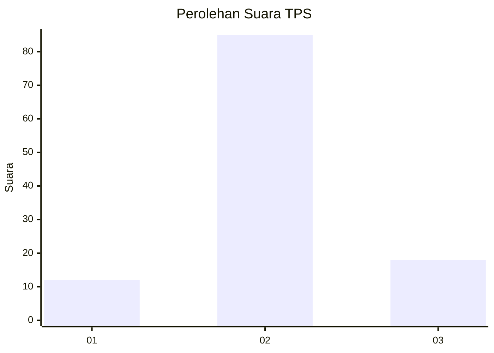

# Hasil

## Grafik

## Tabel

| No. | Nama Paslon    | Suara | Suara (raw) | Persentase |
|:--- |:-------------- | -----:| -----------:| ----------:|
| 1   | ANIES MUHAIMIN | 12    | [12][p-1]   | 10,43      |
| 2   | PRABOWO GIBRAN | 85    | [85][p-2]   | 73,91      |
| 3   | GANJAR MAHFUD  | 18    | [18][p-3]   | 15,65      |

[p-1]: https://github.com/gigit-pemilu/pemilu-2024-16-sumatera-selatan/blob/main/pilpres/hitung-suara/sub/16-sumatera-selatan/sub/07-banyuasin/sub/11-rantau-bayur/sub/2019-sungai-naik/sub/003-tps/sub/paslon-1.txt
[p-2]: https://github.com/gigit-pemilu/pemilu-2024-16-sumatera-selatan/blob/main/pilpres/hitung-suara/sub/16-sumatera-selatan/sub/07-banyuasin/sub/11-rantau-bayur/sub/2019-sungai-naik/sub/003-tps/sub/paslon-2.txt
[p-3]: https://github.com/gigit-pemilu/pemilu-2024-16-sumatera-selatan/blob/main/pilpres/hitung-suara/sub/16-sumatera-selatan/sub/07-banyuasin/sub/11-rantau-bayur/sub/2019-sungai-naik/sub/003-tps/sub/paslon-3.txt

## Foto C Plano

https://sirekap-obj-formc.kpu.go.id/1c5e/pemilu/ppwp/16/07/11/20/19/1607112019003-20240215-110741--0ed8f0fe-c515-4ced-83e4-464b0cbbbb94.jpg

https://sirekap-obj-formc.kpu.go.id/1c5e/pemilu/ppwp/16/07/11/20/19/1607112019003-20240215-113853--48fd2875-49c1-42a9-b85b-445423afa7f4.jpg

https://sirekap-obj-formc.kpu.go.id/1c5e/pemilu/ppwp/16/07/11/20/19/1607112019003-20240215-112706--56e12331-9ad7-49ec-9672-0af2051ca70b.jpg

## Metadata

| Key        | Value               |
| ---------- | ------------------- |
| Time Stamp | 2024-02-16 12:51:22 |

