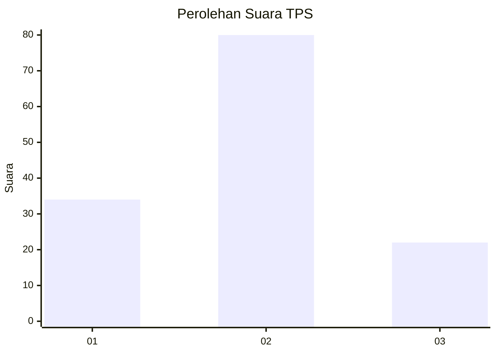
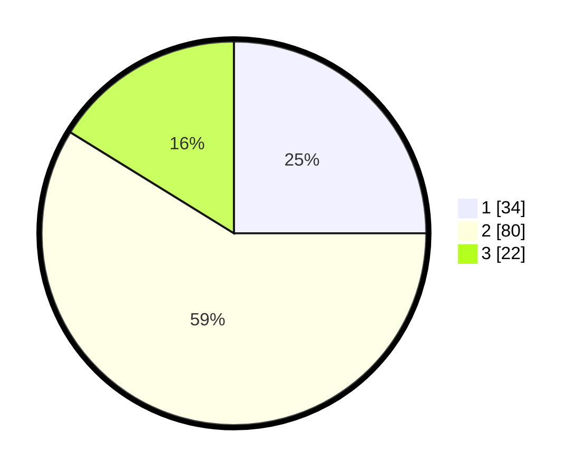

# Hasil

## Grafik

## Tabel

| No. | Nama Paslon    | Suara | Suara (raw) | Persentase |
|:--- |:-------------- | -----:| -----------:| ----------:|
| 1   | ANIES MUHAIMIN | 34    | [34][p-1]   | 25,00      |
| 2   | PRABOWO GIBRAN | 80    | [80][p-2]   | 58,82      |
| 3   | GANJAR MAHFUD  | 22    | [22][p-3]   | 16,18      |

[p-1]: https://github.com/gigit-pemilu/pemilu-2024-16-sumatera-selatan/blob/main/pilpres/hitung-suara/sub/16-sumatera-selatan/sub/07-banyuasin/sub/11-rantau-bayur/sub/2020-sungai-lilin/sub/003-tps/sub/paslon-1.txt
[p-2]: https://github.com/gigit-pemilu/pemilu-2024-16-sumatera-selatan/blob/main/pilpres/hitung-suara/sub/16-sumatera-selatan/sub/07-banyuasin/sub/11-rantau-bayur/sub/2020-sungai-lilin/sub/003-tps/sub/paslon-2.txt
[p-3]: https://github.com/gigit-pemilu/pemilu-2024-16-sumatera-selatan/blob/main/pilpres/hitung-suara/sub/16-sumatera-selatan/sub/07-banyuasin/sub/11-rantau-bayur/sub/2020-sungai-lilin/sub/003-tps/sub/paslon-3.txt

## Foto C Plano

https://sirekap-obj-formc.kpu.go.id/4c19/pemilu/ppwp/16/07/11/20/20/1607112020003-20240214-224045--ea43a1ec-3289-48b7-87d2-b713bf2d7bcd.jpg

https://sirekap-obj-formc.kpu.go.id/4c19/pemilu/ppwp/16/07/11/20/20/1607112020003-20240215-035235--50ba3618-8d0a-449b-a053-e24e9ad739e8.jpg

https://sirekap-obj-formc.kpu.go.id/4c19/pemilu/ppwp/16/07/11/20/20/1607112020003-20240215-035338--c5862e5f-4733-4d95-a893-d77842bd542c.jpg

## Metadata

| Key        | Value               |
| ---------- | ------------------- |
| Time Stamp | 2024-02-15 15:00:29 |

