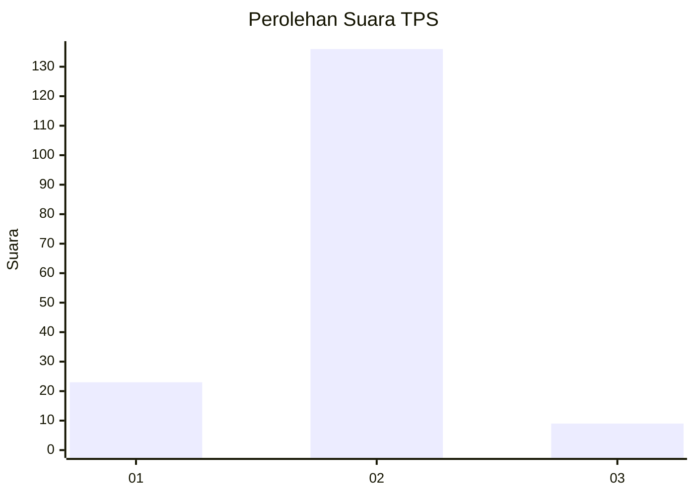
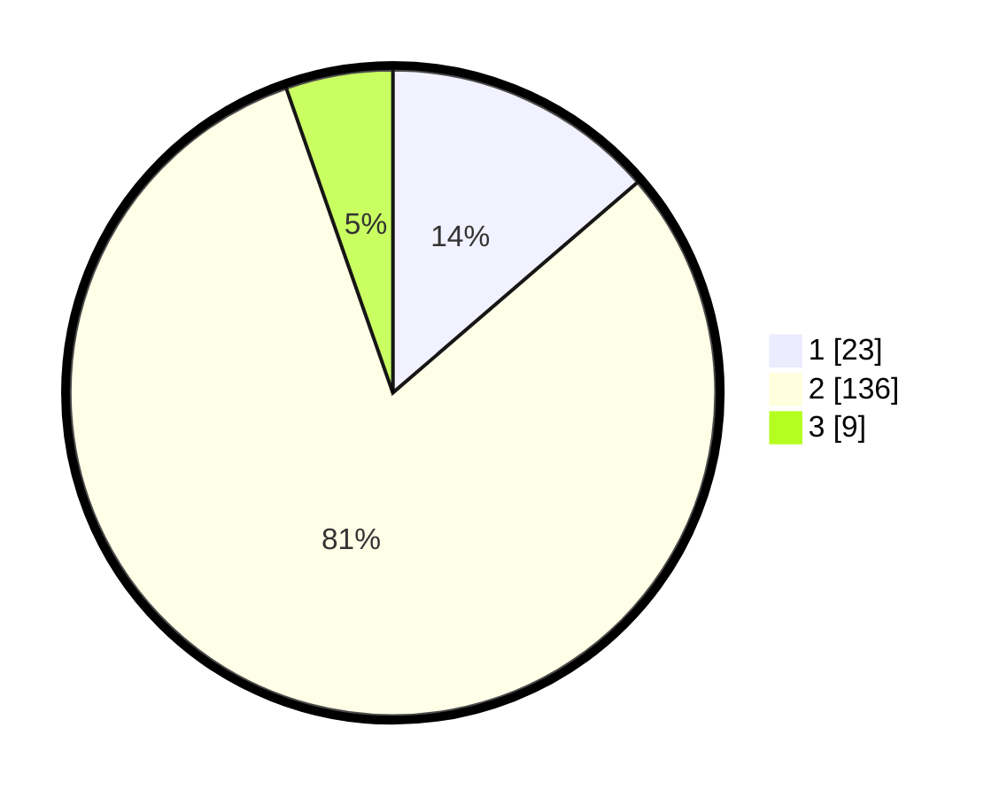

# Hasil

## Grafik

## Tabel

| No. | Nama Paslon    | Suara | Suara (raw) | Persentase |
|:--- |:-------------- | -----:| -----------:| ----------:|
| 1   | ANIES MUHAIMIN | 23    | [23][p-1]   | 13,69      |
| 2   | PRABOWO GIBRAN | 136   | [136][p-2]  | 80,95      |
| 3   | GANJAR MAHFUD  | 9     | [9][p-3]    | 5,36       |

[p-1]: https://github.com/gigit-pemilu/pemilu-2024-16-sumatera-selatan/blob/main/pilpres/hitung-suara/sub/16-sumatera-selatan/sub/07-banyuasin/sub/11-rantau-bayur/sub/2021-sukarela/sub/003-tps/sub/paslon-1.txt
[p-2]: https://github.com/gigit-pemilu/pemilu-2024-16-sumatera-selatan/blob/main/pilpres/hitung-suara/sub/16-sumatera-selatan/sub/07-banyuasin/sub/11-rantau-bayur/sub/2021-sukarela/sub/003-tps/sub/paslon-2.txt
[p-3]: https://github.com/gigit-pemilu/pemilu-2024-16-sumatera-selatan/blob/main/pilpres/hitung-suara/sub/16-sumatera-selatan/sub/07-banyuasin/sub/11-rantau-bayur/sub/2021-sukarela/sub/003-tps/sub/paslon-3.txt

## Foto C Plano

https://sirekap-obj-formc.kpu.go.id/d3b9/pemilu/ppwp/16/07/11/20/21/1607112021003-20240215-004057--9ecb6cb7-1b1a-498a-8e66-e8bb357fb708.jpg

https://sirekap-obj-formc.kpu.go.id/d3b9/pemilu/ppwp/16/07/11/20/21/1607112021003-20240215-004710--e4fbdc42-fb08-4af5-8a53-94838f6bd8fe.jpg

https://sirekap-obj-formc.kpu.go.id/d3b9/pemilu/ppwp/16/07/11/20/21/1607112021003-20240215-004426--7a07d7a5-cc71-4691-8d63-9e8e4af25a95.jpg

## Metadata

| Key        | Value               |
| ---------- | ------------------- |
| Time Stamp | 2024-02-15 12:00:28 |

