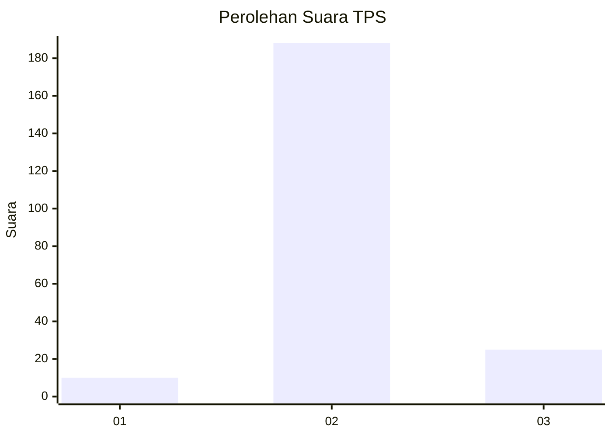
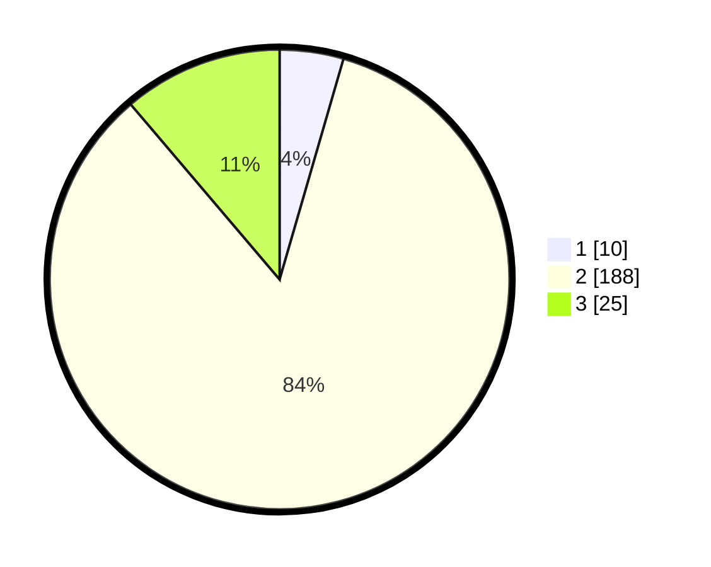

# Hasil

## Grafik

## Tabel

| No. | Nama Paslon    | Suara | Suara (raw) | Persentase |
|:--- |:-------------- | -----:| -----------:| ----------:|
| 1   | ANIES MUHAIMIN | 10    | [10][p-1]   | 4,48       |
| 2   | PRABOWO GIBRAN | 188   | [188][p-2]  | 84,30      |
| 3   | GANJAR MAHFUD  | 25    | [25][p-3]   | 11,21      |

[p-1]: https://github.com/gigit-pemilu/pemilu-2024-16-sumatera-selatan/blob/main/pilpres/hitung-suara/sub/16-sumatera-selatan/sub/07-banyuasin/sub/12-tanjung-lago/sub/2001-telang-sari/sub/005-tps/sub/paslon-1.txt
[p-2]: https://github.com/gigit-pemilu/pemilu-2024-16-sumatera-selatan/blob/main/pilpres/hitung-suara/sub/16-sumatera-selatan/sub/07-banyuasin/sub/12-tanjung-lago/sub/2001-telang-sari/sub/005-tps/sub/paslon-2.txt
[p-3]: https://github.com/gigit-pemilu/pemilu-2024-16-sumatera-selatan/blob/main/pilpres/hitung-suara/sub/16-sumatera-selatan/sub/07-banyuasin/sub/12-tanjung-lago/sub/2001-telang-sari/sub/005-tps/sub/paslon-3.txt

## Foto C Plano

https://sirekap-obj-formc.kpu.go.id/9014/pemilu/ppwp/16/07/12/20/01/1607122001005-20240215-105701--d02f2685-f597-4ae7-95f9-38b130636130.jpg

https://sirekap-obj-formc.kpu.go.id/9014/pemilu/ppwp/16/07/12/20/01/1607122001005-20240215-105904--86a4b806-feb3-45ab-9c7f-8ce7e864f038.jpg

https://sirekap-obj-formc.kpu.go.id/9014/pemilu/ppwp/16/07/12/20/01/1607122001005-20240215-110021--983ad18b-6bea-45b1-aeba-e0fb5d3611f4.jpg

## Metadata

| Key        | Value               |
| ---------- | ------------------- |
| Time Stamp | 2024-02-15 18:00:26 |

