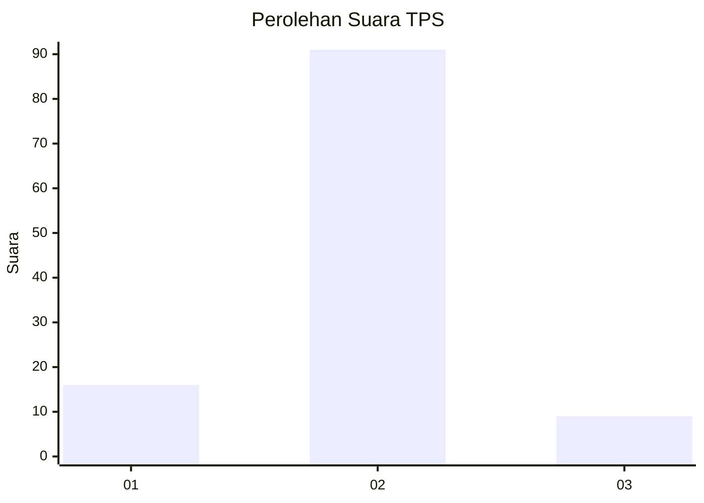
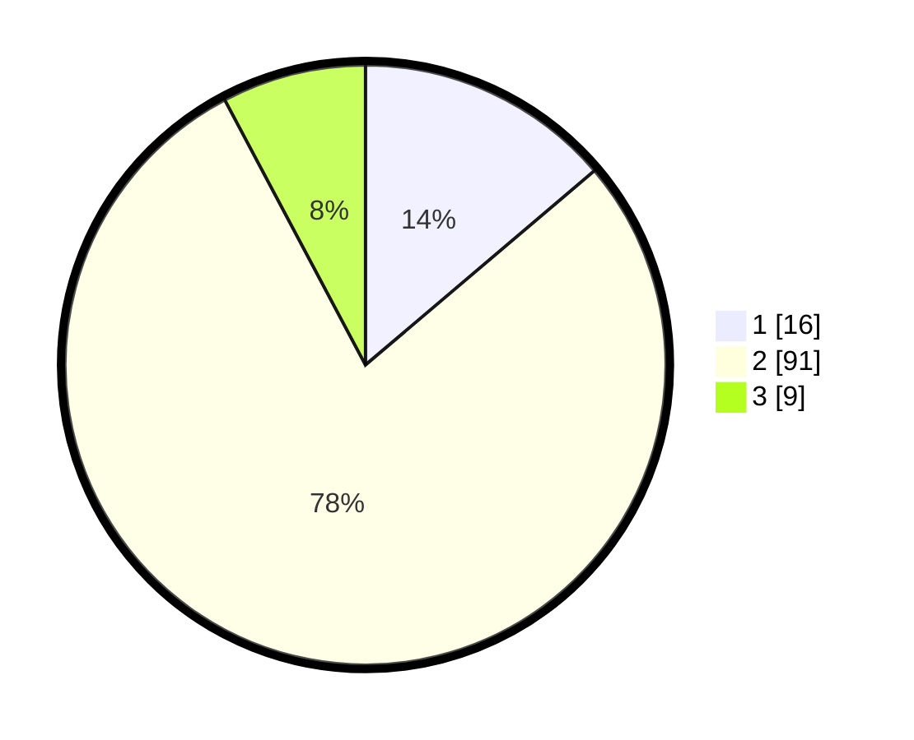

# Hasil

## Grafik

## Tabel

| No. | Nama Paslon    | Suara | Suara (raw) | Persentase |
|:--- |:-------------- | -----:| -----------:| ----------:|
| 1   | ANIES MUHAIMIN | 16    | [16][p-1]   | 13,79      |
| 2   | PRABOWO GIBRAN | 91    | [91][p-2]   | 78,45      |
| 3   | GANJAR MAHFUD  | 9     | [9][p-3]    | 7,76       |

[p-1]: https://github.com/gigit-pemilu/pemilu-2024-16-sumatera-selatan/blob/main/pilpres/hitung-suara/sub/16-sumatera-selatan/sub/07-banyuasin/sub/12-tanjung-lago/sub/2007-kuala-puntian/sub/004-tps/sub/paslon-1.txt
[p-2]: https://github.com/gigit-pemilu/pemilu-2024-16-sumatera-selatan/blob/main/pilpres/hitung-suara/sub/16-sumatera-selatan/sub/07-banyuasin/sub/12-tanjung-lago/sub/2007-kuala-puntian/sub/004-tps/sub/paslon-2.txt
[p-3]: https://github.com/gigit-pemilu/pemilu-2024-16-sumatera-selatan/blob/main/pilpres/hitung-suara/sub/16-sumatera-selatan/sub/07-banyuasin/sub/12-tanjung-lago/sub/2007-kuala-puntian/sub/004-tps/sub/paslon-3.txt

## Foto C Plano

https://sirekap-obj-formc.kpu.go.id/9794/pemilu/ppwp/16/07/12/20/07/1607122007004-20240214-221458--8f21c4cd-369c-4563-a072-82ab481253a3.jpg

https://sirekap-obj-formc.kpu.go.id/9794/pemilu/ppwp/16/07/12/20/07/1607122007004-20240214-221820--f1a27cb5-fa6f-46f1-9a1d-7c8383b17dbb.jpg

https://sirekap-obj-formc.kpu.go.id/9794/pemilu/ppwp/16/07/12/20/07/1607122007004-20240216-144834--18a78004-8ad2-4b7e-a6cc-59eb39d0c860.jpg

## Metadata

| Key        | Value               |
| ---------- | ------------------- |
| Time Stamp | 2024-02-16 16:25:10 |

## DATA PEMILIH TETAP

Jumlah pemilih dalam DPT: **214**.
 * L: **114**.
 * P: **100**.

## DATA PENGGUNA HAK PILIH

Jumlah pengguna hak pilih dalam DPT: **91**.
 * L: **45**.
 * P: **46**.

Jumlah pengguna hak pilih dalam DPTb: **9**.
 * L: **9**.
 * P: **0**.

Jumlah pengguna hak pilih dalam DPK: **19**.
 * L: **16**.
 * P: **3**.

Jumlah pengguna hak pilih: **119**.
 * L: **70**.
 * P: **49**.

## JUMLAH SUARA SAH DAN TIDAK SAH

JUMLAH SELURUH SUARA SAH: **116**.

JUMLAH SUARA TIDAK SAH: **3**.

JUMLAH SELURUH SUARA SAH DAN SUARA TIDAK SAH: **119**.

