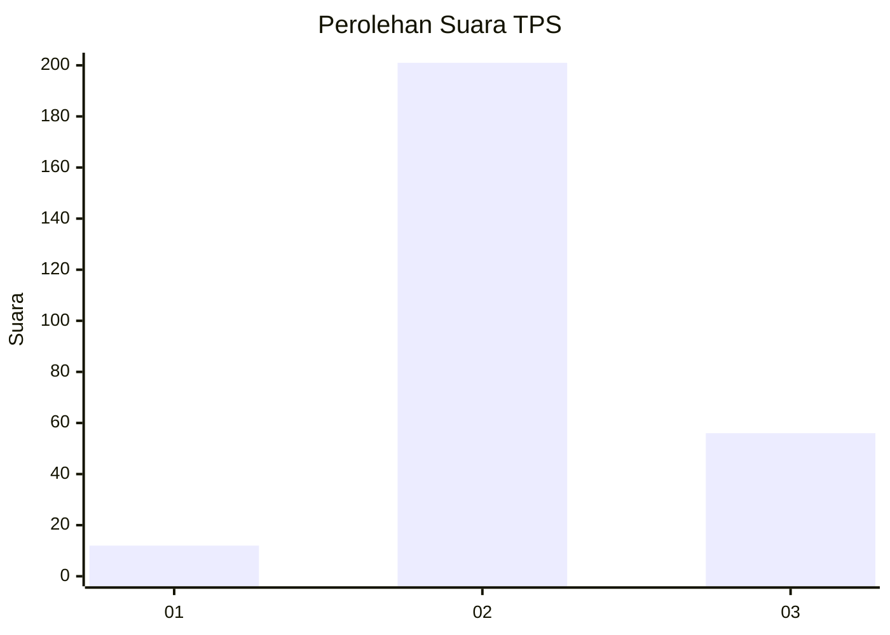

# Hasil

## Grafik

## Tabel

| No. | Nama Paslon    | Suara | Suara (raw) | Persentase |
|:--- |:-------------- | -----:| -----------:| ----------:|
| 1   | ANIES MUHAIMIN | 12    | [12][p-1]   | 4,46       |
| 2   | PRABOWO GIBRAN | 201   | [201][p-2]  | 74,72      |
| 3   | GANJAR MAHFUD  | 56    | [56][p-3]   | 20,82      |

[p-1]: https://github.com/gigit-pemilu/pemilu-2024-16-sumatera-selatan/blob/main/pilpres/hitung-suara/sub/16-sumatera-selatan/sub/07-banyuasin/sub/12-tanjung-lago/sub/2008-sukatani/sub/003-tps/sub/paslon-1.txt
[p-2]: https://github.com/gigit-pemilu/pemilu-2024-16-sumatera-selatan/blob/main/pilpres/hitung-suara/sub/16-sumatera-selatan/sub/07-banyuasin/sub/12-tanjung-lago/sub/2008-sukatani/sub/003-tps/sub/paslon-2.txt
[p-3]: https://github.com/gigit-pemilu/pemilu-2024-16-sumatera-selatan/blob/main/pilpres/hitung-suara/sub/16-sumatera-selatan/sub/07-banyuasin/sub/12-tanjung-lago/sub/2008-sukatani/sub/003-tps/sub/paslon-3.txt

## Foto C Plano

https://sirekap-obj-formc.kpu.go.id/d29b/pemilu/ppwp/16/07/12/20/08/1607122008003-20240215-032104--ed6a8aa1-75e1-405f-b092-5a5e97772b66.jpg

https://sirekap-obj-formc.kpu.go.id/d29b/pemilu/ppwp/16/07/12/20/08/1607122008003-20240215-032250--2ecdddb6-0091-4646-8323-ff7e60e570db.jpg

https://sirekap-obj-formc.kpu.go.id/d29b/pemilu/ppwp/16/07/12/20/08/1607122008003-20240215-032441--8fb1651a-ad71-4011-b50e-3bd6c89986fd.jpg

## Metadata

| Key        | Value               |
| ---------- | ------------------- |
| Time Stamp | 2024-02-15 21:30:27 |

