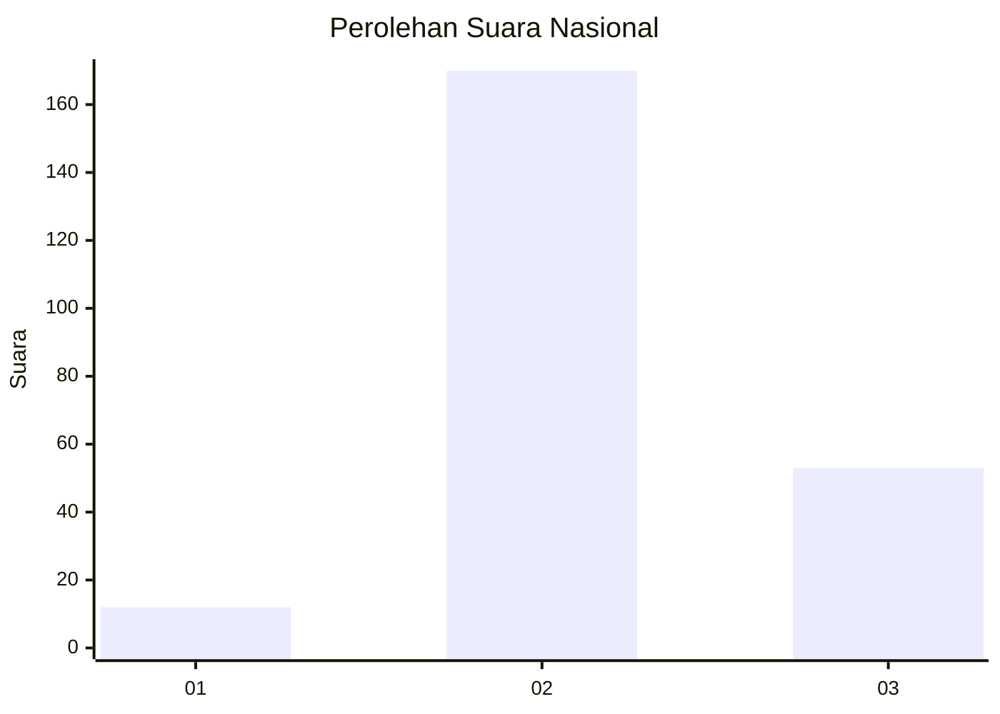
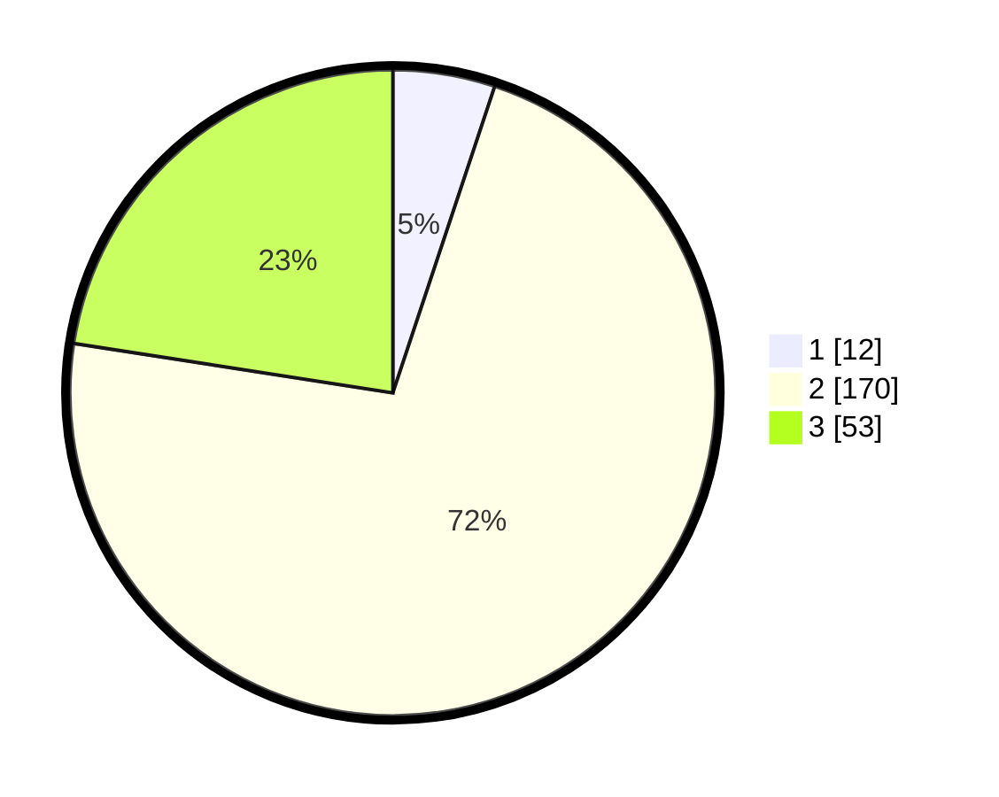

# Hasil

## Grafik

## Tabel

| No. | Nama Paslon    | Suara | Suara (raw) | Persentase |
|:--- |:-------------- | -----:| -----------:| ----------:|
| 1   | ANIES MUHAIMIN | 12    | [12][p-1]   | 5,11       |
| 2   | PRABOWO GIBRAN | 170   | [170][p-2]  | 72,34      |
| 3   | GANJAR MAHFUD  | 53    | [53][p-3]   | 22,55      |

[p-1]: https://github.com/gigit-pemilu/pemilu-2024/blob/main/pilpres/hitung-suara/sub/16-sumatera-selatan/sub/07-banyuasin/sub/13-muara-sugihan/sub/2012-daya-kesuma/sub/002-tps/sub/paslon-1.txt
[p-2]: https://github.com/gigit-pemilu/pemilu-2024/blob/main/pilpres/hitung-suara/sub/16-sumatera-selatan/sub/07-banyuasin/sub/13-muara-sugihan/sub/2012-daya-kesuma/sub/002-tps/sub/paslon-2.txt
[p-3]: https://github.com/gigit-pemilu/pemilu-2024/blob/main/pilpres/hitung-suara/sub/16-sumatera-selatan/sub/07-banyuasin/sub/13-muara-sugihan/sub/2012-daya-kesuma/sub/002-tps/sub/paslon-3.txt

## Foto C Plano

https://sirekap-obj-formc.kpu.go.id/746f/pemilu/ppwp/16/07/13/20/12/1607132012002-20240215-030732--d7da832c-f205-457d-a3b1-271fa44f646b.jpg

https://sirekap-obj-formc.kpu.go.id/746f/pemilu/ppwp/16/07/13/20/12/1607132012002-20240215-031333--af0a13a2-e93f-4b33-8d7a-dc73c14d1bd5.jpg

https://sirekap-obj-formc.kpu.go.id/746f/pemilu/ppwp/16/07/13/20/12/1607132012002-20240215-031457--a9d796ba-64ea-4eac-8a90-cce886c924cd.jpg

## Metadata

| Key        | Value               |
| ---------- | ------------------- |
| Time Stamp | 2024-02-19 06:16:00 |

