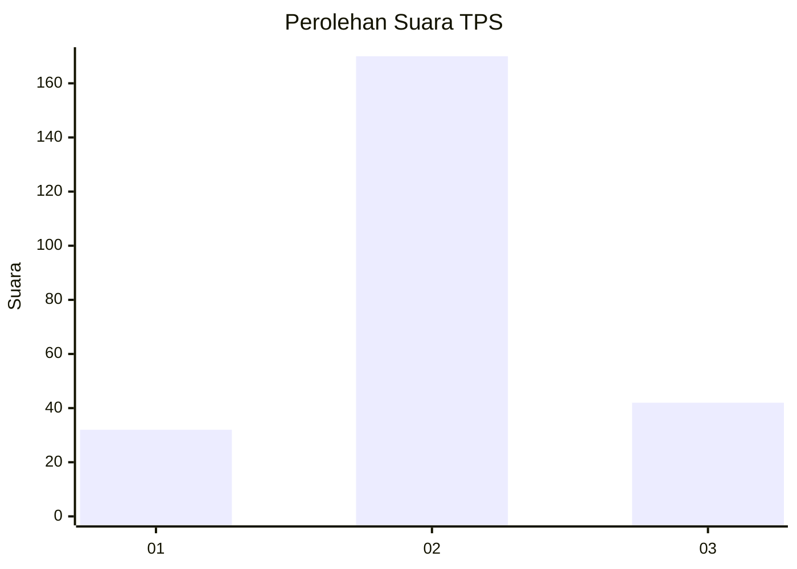
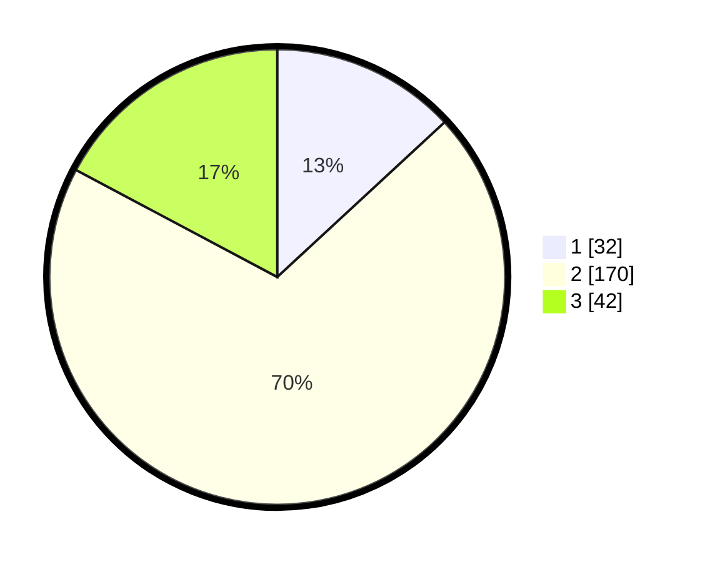

# Hasil

## Grafik

## Tabel

| No. | Nama Paslon    | Suara | Suara (raw) | Persentase |
|:--- |:-------------- | -----:| -----------:| ----------:|
| 1   | ANIES MUHAIMIN | 32    | [32][p-1]   | 13,11      |
| 2   | PRABOWO GIBRAN | 170   | [170][p-2]  | 69,67      |
| 3   | GANJAR MAHFUD  | 42    | [42][p-3]   | 17,21      |

[p-1]: https://github.com/gigit-pemilu/pemilu-2024-16-sumatera-selatan/blob/main/pilpres/hitung-suara/sub/16-sumatera-selatan/sub/07-banyuasin/sub/14-air-salek/sub/2001-air-solok-batu/sub/001-tps/sub/paslon-1.txt
[p-2]: https://github.com/gigit-pemilu/pemilu-2024-16-sumatera-selatan/blob/main/pilpres/hitung-suara/sub/16-sumatera-selatan/sub/07-banyuasin/sub/14-air-salek/sub/2001-air-solok-batu/sub/001-tps/sub/paslon-2.txt
[p-3]: https://github.com/gigit-pemilu/pemilu-2024-16-sumatera-selatan/blob/main/pilpres/hitung-suara/sub/16-sumatera-selatan/sub/07-banyuasin/sub/14-air-salek/sub/2001-air-solok-batu/sub/001-tps/sub/paslon-3.txt

## Foto C Plano

https://sirekap-obj-formc.kpu.go.id/a850/pemilu/ppwp/16/07/14/20/01/1607142001001-20240215-054912--c75698ea-5a16-40df-a4b1-627019b34d93.jpg

https://sirekap-obj-formc.kpu.go.id/a850/pemilu/ppwp/16/07/14/20/01/1607142001001-20240215-055246--bcb0a897-7008-4914-a3fd-cb7cdbef879a.jpg

https://sirekap-obj-formc.kpu.go.id/a850/pemilu/ppwp/16/07/14/20/01/1607142001001-20240215-055604--ce6be76b-28dc-4d98-a4b0-2e0a7fa8f892.jpg

## Metadata

| Key        | Value               |
| ---------- | ------------------- |
| Time Stamp | 2024-02-15 21:01:18 |

