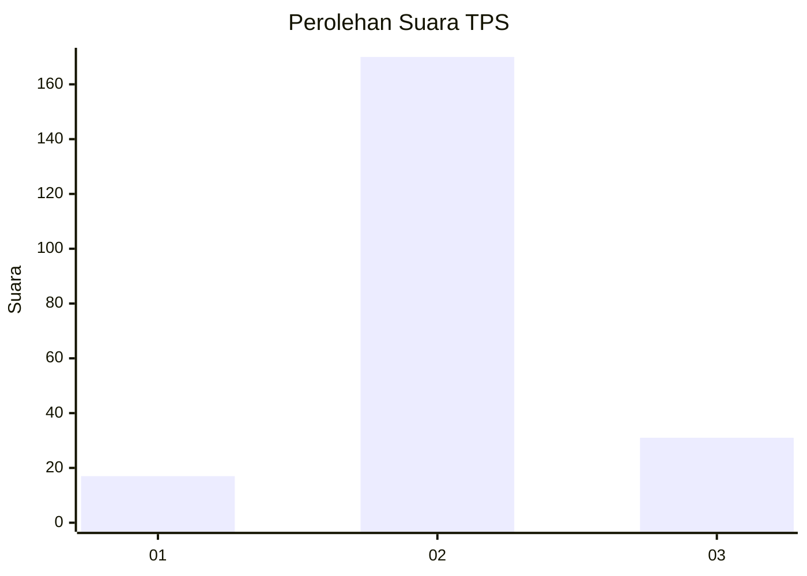

# Hasil

## Grafik

## Tabel

| No. | Nama Paslon    | Suara | Suara (raw) | Persentase |
|:--- |:-------------- | -----:| -----------:| ----------:|
| 1   | ANIES MUHAIMIN | 17    | [17][p-1]   | 7,80       |
| 2   | PRABOWO GIBRAN | 170   | [170][p-2]  | 77,98      |
| 3   | GANJAR MAHFUD  | 31    | [31][p-3]   | 14,22      |

[p-1]: https://github.com/gigit-pemilu/pemilu-2024-16-sumatera-selatan/blob/main/pilpres/hitung-suara/sub/16-sumatera-selatan/sub/07-banyuasin/sub/14-air-salek/sub/2002-sri-mulyo/sub/001-tps/sub/paslon-1.txt
[p-2]: https://github.com/gigit-pemilu/pemilu-2024-16-sumatera-selatan/blob/main/pilpres/hitung-suara/sub/16-sumatera-selatan/sub/07-banyuasin/sub/14-air-salek/sub/2002-sri-mulyo/sub/001-tps/sub/paslon-2.txt
[p-3]: https://github.com/gigit-pemilu/pemilu-2024-16-sumatera-selatan/blob/main/pilpres/hitung-suara/sub/16-sumatera-selatan/sub/07-banyuasin/sub/14-air-salek/sub/2002-sri-mulyo/sub/001-tps/sub/paslon-3.txt

## Foto C Plano

https://sirekap-obj-formc.kpu.go.id/7904/pemilu/ppwp/16/07/14/20/02/1607142002001-20240215-060844--7da54f31-ea9a-40b8-9d5c-2bc606b25845.jpg

https://sirekap-obj-formc.kpu.go.id/7904/pemilu/ppwp/16/07/14/20/02/1607142002001-20240215-061306--e0d23ea2-e26a-41dd-9421-6f001b8e1cc0.jpg

https://sirekap-obj-formc.kpu.go.id/7904/pemilu/ppwp/16/07/14/20/02/1607142002001-20240215-061546--be101b52-3e55-4539-a2da-a19ced561497.jpg

## Metadata

| Key        | Value               |
| ---------- | ------------------- |
| Time Stamp | 2024-02-15 17:00:25 |

