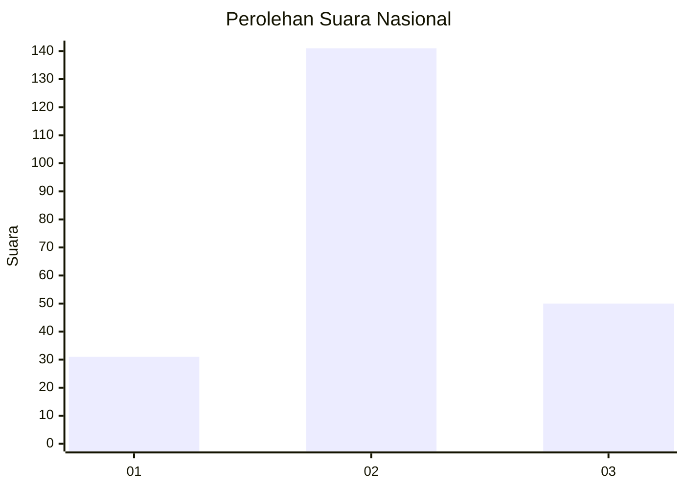
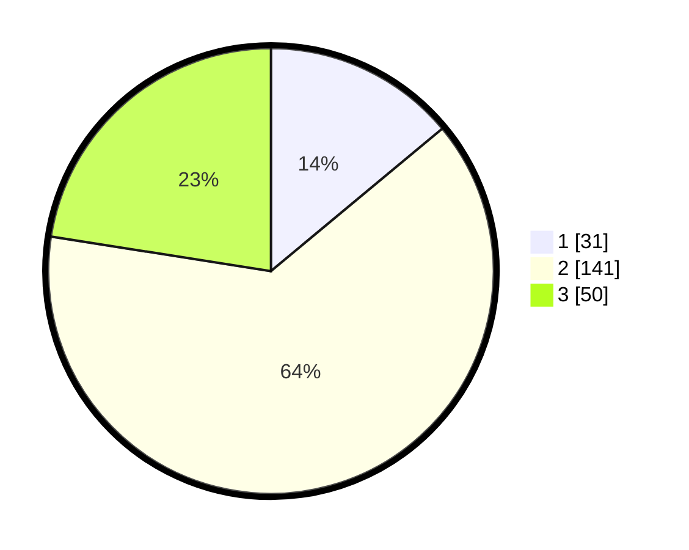

# Hasil

## Grafik

## Tabel

| No. | Nama Paslon    | Suara | Suara (raw) | Persentase |
|:--- |:-------------- | -----:| -----------:| ----------:|
| 1   | ANIES MUHAIMIN | 31    | [31][p-1]   | 13,96      |
| 2   | PRABOWO GIBRAN | 141   | [141][p-2]  | 63,51      |
| 3   | GANJAR MAHFUD  | 50    | [50][p-3]   | 22,52      |

[p-1]: https://github.com/gigit-pemilu/pemilu-2024/blob/main/pilpres/hitung-suara/sub/16-sumatera-selatan/sub/07-banyuasin/sub/14-air-salek/sub/2002-sri-mulyo/sub/002-tps/sub/paslon-1.txt
[p-2]: https://github.com/gigit-pemilu/pemilu-2024/blob/main/pilpres/hitung-suara/sub/16-sumatera-selatan/sub/07-banyuasin/sub/14-air-salek/sub/2002-sri-mulyo/sub/002-tps/sub/paslon-2.txt
[p-3]: https://github.com/gigit-pemilu/pemilu-2024/blob/main/pilpres/hitung-suara/sub/16-sumatera-selatan/sub/07-banyuasin/sub/14-air-salek/sub/2002-sri-mulyo/sub/002-tps/sub/paslon-3.txt

## Foto C Plano

https://sirekap-obj-formc.kpu.go.id/53dc/pemilu/ppwp/16/07/14/20/02/1607142002002-20240215-032752--48189e98-0885-4f87-a334-5c7fc5102063.jpg

https://sirekap-obj-formc.kpu.go.id/53dc/pemilu/ppwp/16/07/14/20/02/1607142002002-20240215-032940--5e262b5a-32c4-4f07-9d39-b86dd670b917.jpg

https://sirekap-obj-formc.kpu.go.id/53dc/pemilu/ppwp/16/07/14/20/02/1607142002002-20240215-033028--bd772f3a-ec79-436f-83af-6fdd156239a4.jpg

## Metadata

| Key        | Value               |
| ---------- | ------------------- |
| Time Stamp | 2024-02-15 17:00:25 |

