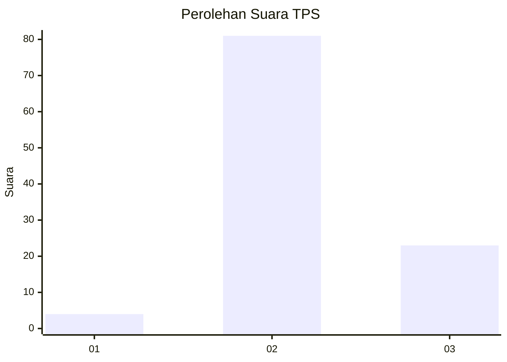

# Hasil

## Grafik

## Tabel

| No. | Nama Paslon    | Suara | Suara (raw) | Persentase |
|:--- |:-------------- | -----:| -----------:| ----------:|
| 1   | ANIES MUHAIMIN | 4     | [4][p-1]    | 3,70       |
| 2   | PRABOWO GIBRAN | 81    | [81][p-2]   | 75,00      |
| 3   | GANJAR MAHFUD  | 23    | [23][p-3]   | 21,30      |

[p-1]: https://github.com/gigit-pemilu/pemilu-2024-16-sumatera-selatan/blob/main/pilpres/hitung-suara/sub/16-sumatera-selatan/sub/07-banyuasin/sub/15-tungkal-ilir/sub/2001-bentayan/sub/002-tps/sub/paslon-1.txt
[p-2]: https://github.com/gigit-pemilu/pemilu-2024-16-sumatera-selatan/blob/main/pilpres/hitung-suara/sub/16-sumatera-selatan/sub/07-banyuasin/sub/15-tungkal-ilir/sub/2001-bentayan/sub/002-tps/sub/paslon-2.txt
[p-3]: https://github.com/gigit-pemilu/pemilu-2024-16-sumatera-selatan/blob/main/pilpres/hitung-suara/sub/16-sumatera-selatan/sub/07-banyuasin/sub/15-tungkal-ilir/sub/2001-bentayan/sub/002-tps/sub/paslon-3.txt

## Foto C Plano

https://sirekap-obj-formc.kpu.go.id/50c3/pemilu/ppwp/16/07/15/20/01/1607152001002-20240218-210244--d6364174-f1de-47b7-b7c2-6e11d32c5275.jpg

https://sirekap-obj-formc.kpu.go.id/50c3/pemilu/ppwp/16/07/15/20/01/1607152001002-20240218-210245--7885ac9b-2dd4-4d19-9fc0-74db68ceaa8c.jpg

https://sirekap-obj-formc.kpu.go.id/50c3/pemilu/ppwp/16/07/15/20/01/1607152001002-20240218-210245--6ca8332c-458a-404d-83ed-190638dc9868.jpg

## Metadata

| Key        | Value               |
| ---------- | ------------------- |
| Time Stamp | 2024-02-24 22:31:28 |

## DATA PEMILIH TETAP

Jumlah pemilih dalam DPT: **149**.
 * L: **81**.
 * P: **68**.

## DATA PENGGUNA HAK PILIH

Jumlah pengguna hak pilih dalam DPT: **111**.
 * L: **67**.
 * P: **44**.

Jumlah pengguna hak pilih dalam DPTb: **0**.
 * L: **0**.
 * P: **0**.

Jumlah pengguna hak pilih dalam DPK: **0**.
 * L: **0**.
 * P: **0**.

Jumlah pengguna hak pilih: **111**.
 * L: **67**.
 * P: **44**.

## JUMLAH SUARA SAH DAN TIDAK SAH

JUMLAH SELURUH SUARA SAH: **108**.

JUMLAH SUARA TIDAK SAH: **3**.

JUMLAH SELURUH SUARA SAH DAN SUARA TIDAK SAH: **111**.

