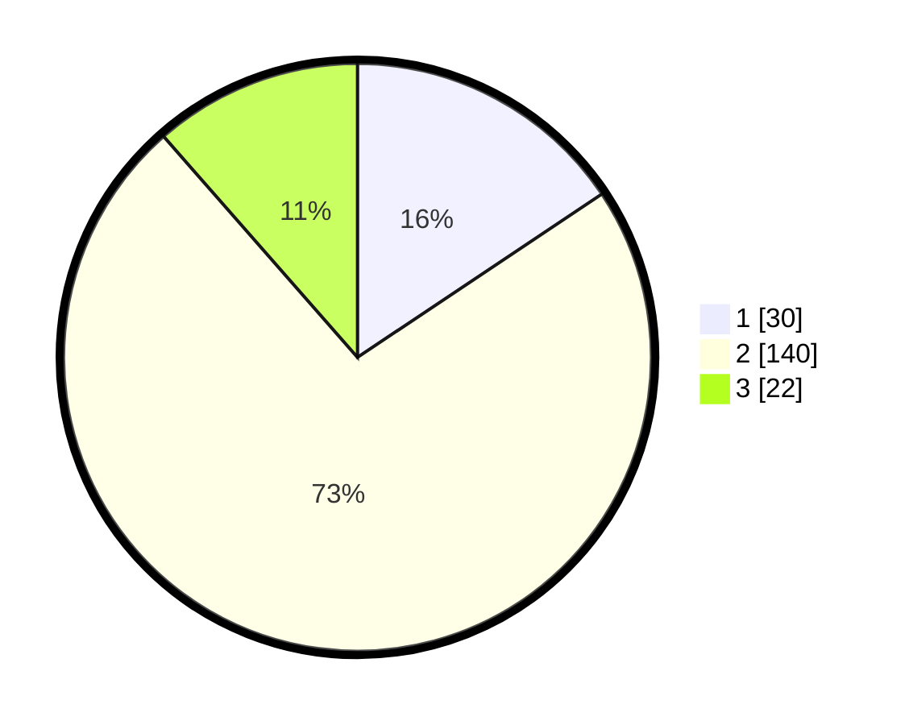

# Hasil

## Grafik

## Tabel

| No. | Nama Paslon    | Suara | Suara (raw) | Persentase |
|:--- |:-------------- | -----:| -----------:| ----------:|
| 1   | ANIES MUHAIMIN | 30    | [30][p-1]   | 15,63      |
| 2   | PRABOWO GIBRAN | 140   | [140][p-2]  | 72,92      |
| 3   | GANJAR MAHFUD  | 22    | [22][p-3]   | 11,46      |

[p-1]: https://github.com/gigit-pemilu/pemilu-2024-16-sumatera-selatan/blob/main/pilpres/hitung-suara/sub/16-sumatera-selatan/sub/07-banyuasin/sub/18-sumber-marga-telang/sub/2001-terusan-dalam/sub/005-tps/sub/paslon-1.txt
[p-2]: https://github.com/gigit-pemilu/pemilu-2024-16-sumatera-selatan/blob/main/pilpres/hitung-suara/sub/16-sumatera-selatan/sub/07-banyuasin/sub/18-sumber-marga-telang/sub/2001-terusan-dalam/sub/005-tps/sub/paslon-2.txt
[p-3]: https://github.com/gigit-pemilu/pemilu-2024-16-sumatera-selatan/blob/main/pilpres/hitung-suara/sub/16-sumatera-selatan/sub/07-banyuasin/sub/18-sumber-marga-telang/sub/2001-terusan-dalam/sub/005-tps/sub/paslon-3.txt

## Foto C Plano

https://sirekap-obj-formc.kpu.go.id/d4cf/pemilu/ppwp/16/07/18/20/01/1607182001005-20240216-112902--125197cb-0cc5-4379-abae-cd91c946b0bc.jpg

https://sirekap-obj-formc.kpu.go.id/d4cf/pemilu/ppwp/16/07/18/20/01/1607182001005-20240216-113217--0458637b-7a09-4a2c-bd52-962499d65df4.jpg

https://sirekap-obj-formc.kpu.go.id/d4cf/pemilu/ppwp/16/07/18/20/01/1607182001005-20240216-152812--23b30bc5-2222-4bc5-b31b-37c579191a34.jpg

## Metadata

| Key        | Value               |
| ---------- | ------------------- |
| Time Stamp | 2024-02-16 16:25:10 |

