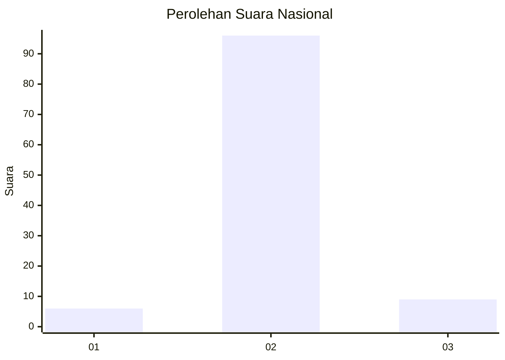
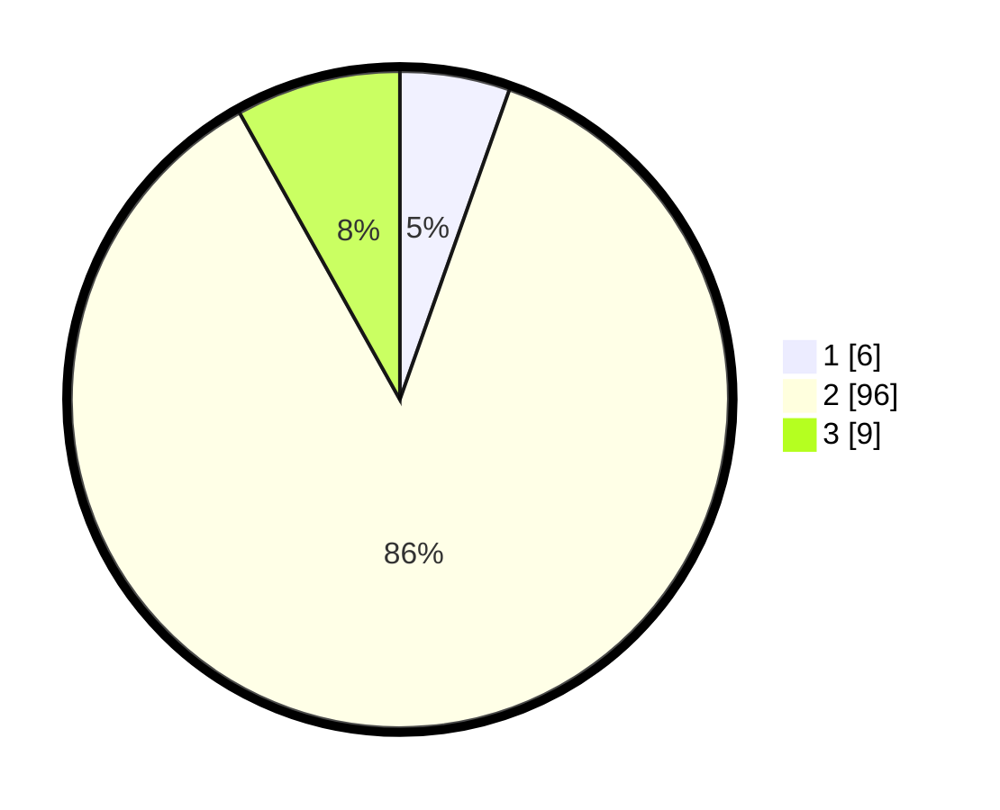

# Hasil

## Grafik

## Tabel

| No. | Nama Paslon    | Suara | Suara (raw) | Persentase |
|:--- |:-------------- | -----:| -----------:| ----------:|
| 1   | ANIES MUHAIMIN | 6     | [6][p-1]    | 5,41       |
| 2   | PRABOWO GIBRAN | 96    | [96][p-2]   | 86,49      |
| 3   | GANJAR MAHFUD  | 9     | [9][p-3]    | 8,11       |

[p-1]: https://github.com/gigit-pemilu/pemilu-2024/blob/main/pilpres/hitung-suara/sub/16-sumatera-selatan/sub/07-banyuasin/sub/18-sumber-marga-telang/sub/2005-sumber-jaya/sub/009-tps/sub/paslon-1.txt
[p-2]: https://github.com/gigit-pemilu/pemilu-2024/blob/main/pilpres/hitung-suara/sub/16-sumatera-selatan/sub/07-banyuasin/sub/18-sumber-marga-telang/sub/2005-sumber-jaya/sub/009-tps/sub/paslon-2.txt
[p-3]: https://github.com/gigit-pemilu/pemilu-2024/blob/main/pilpres/hitung-suara/sub/16-sumatera-selatan/sub/07-banyuasin/sub/18-sumber-marga-telang/sub/2005-sumber-jaya/sub/009-tps/sub/paslon-3.txt

## Foto C Plano

https://sirekap-obj-formc.kpu.go.id/5f88/pemilu/ppwp/16/07/18/20/05/1607182005009-20240215-101706--885d38dc-cdf8-4135-b97b-fabcf60157c1.jpg

https://sirekap-obj-formc.kpu.go.id/5f88/pemilu/ppwp/16/07/18/20/05/1607182005009-20240215-102337--d346fcab-b3e5-45ce-8be6-b9a9e844855c.jpg

https://sirekap-obj-formc.kpu.go.id/5f88/pemilu/ppwp/16/07/18/20/05/1607182005009-20240215-102458--815edb4a-aaea-4c3a-a648-723fd5e57d75.jpg

## Metadata

| Key        | Value               |
| ---------- | ------------------- |
| Time Stamp | 2024-02-15 15:30:25 |

