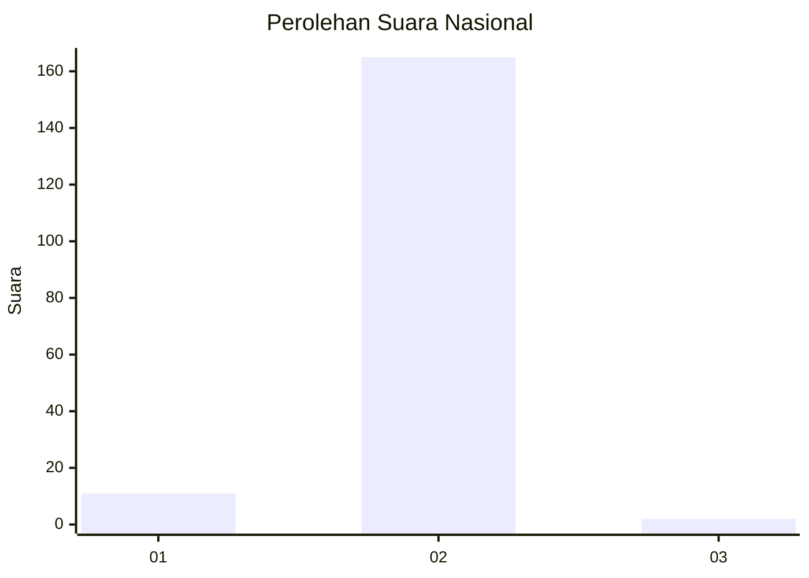
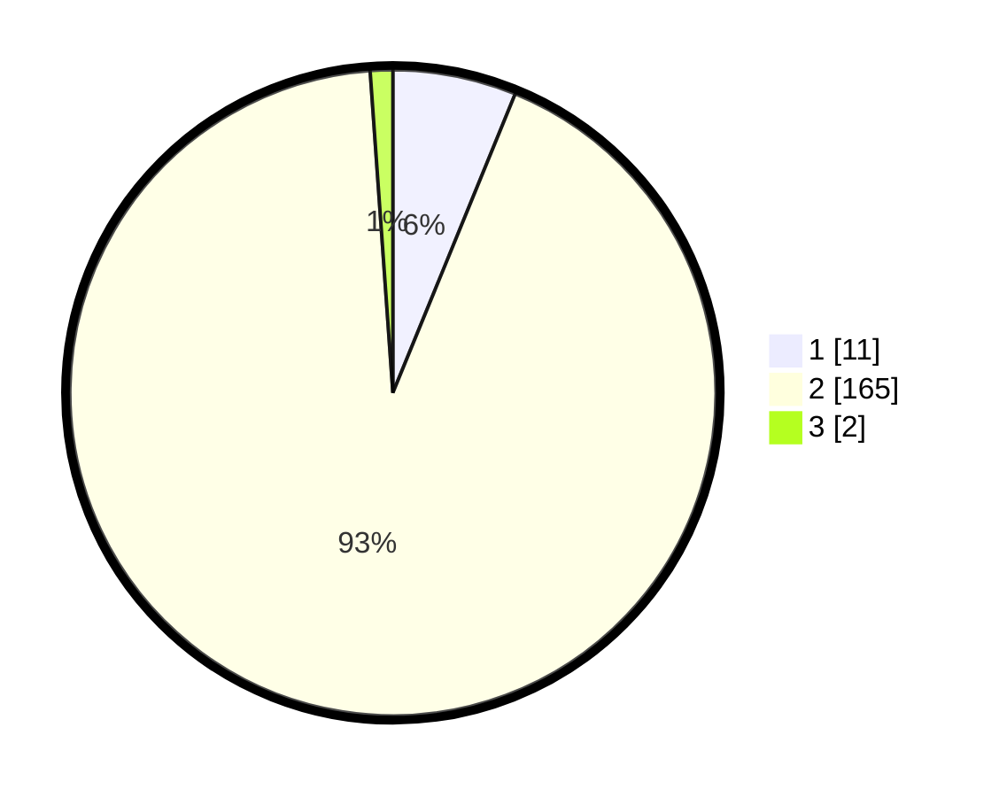

# Hasil

## Grafik

## Tabel

| No. | Nama Paslon    | Suara | Suara (raw) | Persentase |
|:--- |:-------------- | -----:| -----------:| ----------:|
| 1   | ANIES MUHAIMIN | 11    | [11][p-1]   | 6,18       |
| 2   | PRABOWO GIBRAN | 165   | [165][p-2]  | 92,70      |
| 3   | GANJAR MAHFUD  | 2     | [2][p-3]    | 1,12       |

[p-1]: https://github.com/gigit-pemilu/pemilu-2024/blob/main/pilpres/hitung-suara/sub/16-sumatera-selatan/sub/07-banyuasin/sub/19-air-kumbang/sub/2007-sebubus/sub/003-tps/sub/paslon-1.txt
[p-2]: https://github.com/gigit-pemilu/pemilu-2024/blob/main/pilpres/hitung-suara/sub/16-sumatera-selatan/sub/07-banyuasin/sub/19-air-kumbang/sub/2007-sebubus/sub/003-tps/sub/paslon-2.txt
[p-3]: https://github.com/gigit-pemilu/pemilu-2024/blob/main/pilpres/hitung-suara/sub/16-sumatera-selatan/sub/07-banyuasin/sub/19-air-kumbang/sub/2007-sebubus/sub/003-tps/sub/paslon-3.txt

## Foto C Plano

https://sirekap-obj-formc.kpu.go.id/50b3/pemilu/ppwp/16/07/19/20/07/1607192007003-20240214-231811--0772faa0-442f-4afd-8a1f-ab705334fe71.jpg

https://sirekap-obj-formc.kpu.go.id/50b3/pemilu/ppwp/16/07/19/20/07/1607192007003-20240214-231724--d2298f4a-ddaa-4bef-af96-edbca3898def.jpg

https://sirekap-obj-formc.kpu.go.id/50b3/pemilu/ppwp/16/07/19/20/07/1607192007003-20240214-231857--eb946611-67ce-4411-91ad-4379f4ab2220.jpg

## Metadata

| Key        | Value               |
| ---------- | ------------------- |
| Time Stamp | 2024-02-15 16:00:26 |

