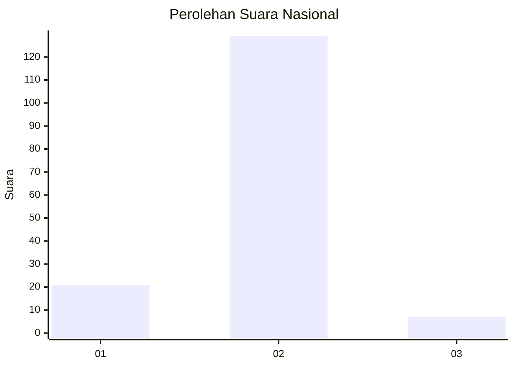
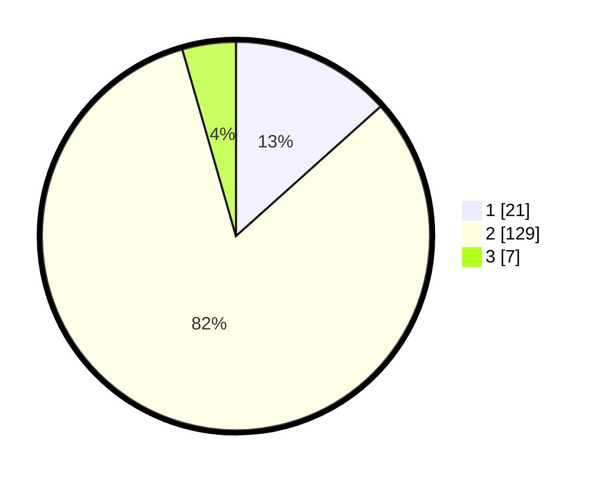

# Hasil

## Grafik

## Tabel

| No. | Nama Paslon    | Suara | Suara (raw) | Persentase |
|:--- |:-------------- | -----:| -----------:| ----------:|
| 1   | ANIES MUHAIMIN | 21    | [21][p-1]   | 13,38      |
| 2   | PRABOWO GIBRAN | 129   | [129][p-2]  | 82,17      |
| 3   | GANJAR MAHFUD  | 7     | [7][p-3]    | 4,46       |

[p-1]: https://github.com/gigit-pemilu/pemilu-2024/blob/main/pilpres/hitung-suara/sub/16-sumatera-selatan/sub/07-banyuasin/sub/21-selat-penuguan/sub/2001-penuguan/sub/001-tps/sub/paslon-1.txt
[p-2]: https://github.com/gigit-pemilu/pemilu-2024/blob/main/pilpres/hitung-suara/sub/16-sumatera-selatan/sub/07-banyuasin/sub/21-selat-penuguan/sub/2001-penuguan/sub/001-tps/sub/paslon-2.txt
[p-3]: https://github.com/gigit-pemilu/pemilu-2024/blob/main/pilpres/hitung-suara/sub/16-sumatera-selatan/sub/07-banyuasin/sub/21-selat-penuguan/sub/2001-penuguan/sub/001-tps/sub/paslon-3.txt

## Foto C Plano

https://sirekap-obj-formc.kpu.go.id/48fd/pemilu/ppwp/16/07/21/20/01/1607212001001-20240218-090253--ca48d989-e795-4966-81d5-bee7eaca8041.jpg

https://sirekap-obj-formc.kpu.go.id/48fd/pemilu/ppwp/16/07/21/20/01/1607212001001-20240215-000316--586f4f3e-dd9a-4f43-99bd-2c0b356638f6.jpg

https://sirekap-obj-formc.kpu.go.id/48fd/pemilu/ppwp/16/07/21/20/01/1607212001001-20240215-000550--f5234ed1-c154-46ac-84a6-e2c935fe4aec.jpg

## Metadata

| Key        | Value               |
| ---------- | ------------------- |
| Time Stamp | 2024-02-19 06:16:00 |

