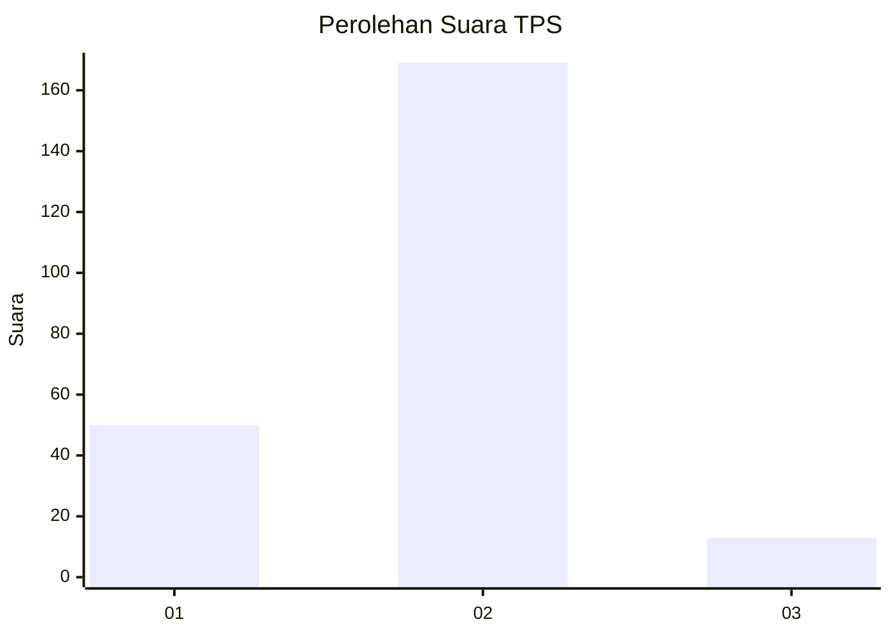
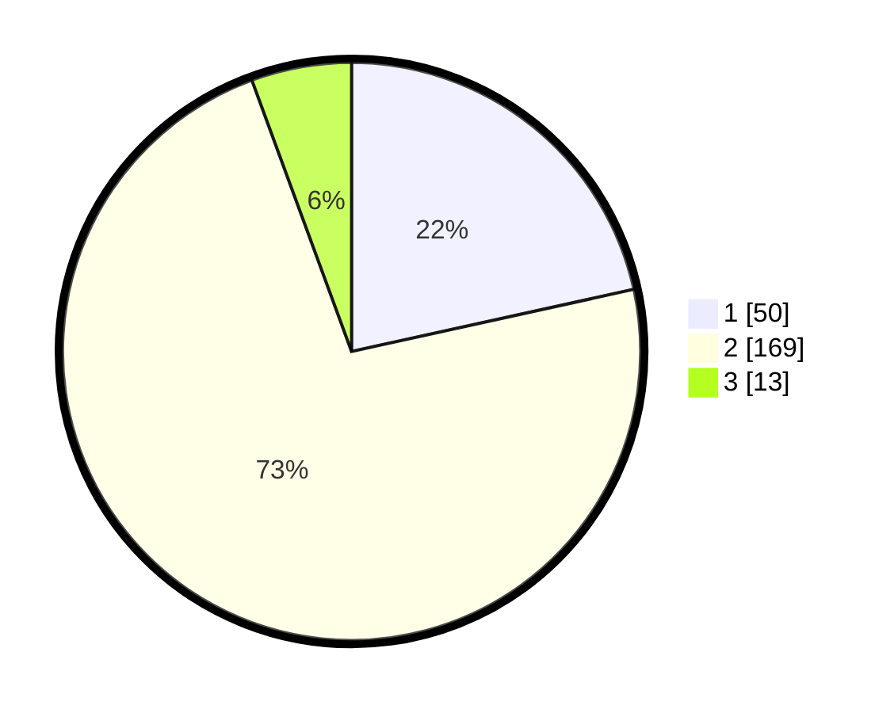

# Hasil

## Grafik

## Tabel

| No. | Nama Paslon    | Suara | Suara (raw) | Persentase |
|:--- |:-------------- | -----:| -----------:| ----------:|
| 1   | ANIES MUHAIMIN | 50    | [50][p-1]   | 21,55      |
| 2   | PRABOWO GIBRAN | 169   | [169][p-2]  | 72,84      |
| 3   | GANJAR MAHFUD  | 13    | [13][p-3]   | 5,60       |

[p-1]: https://github.com/gigit-pemilu/pemilu-2024-16-sumatera-selatan/blob/main/pilpres/hitung-suara/sub/16-sumatera-selatan/sub/08-ogan-komering-ulu-timur/sub/01-martapura/sub/1007-dusun-martapura/sub/003-tps/sub/paslon-1.txt
[p-2]: https://github.com/gigit-pemilu/pemilu-2024-16-sumatera-selatan/blob/main/pilpres/hitung-suara/sub/16-sumatera-selatan/sub/08-ogan-komering-ulu-timur/sub/01-martapura/sub/1007-dusun-martapura/sub/003-tps/sub/paslon-2.txt
[p-3]: https://github.com/gigit-pemilu/pemilu-2024-16-sumatera-selatan/blob/main/pilpres/hitung-suara/sub/16-sumatera-selatan/sub/08-ogan-komering-ulu-timur/sub/01-martapura/sub/1007-dusun-martapura/sub/003-tps/sub/paslon-3.txt

## Foto C Plano

https://sirekap-obj-formc.kpu.go.id/f8ac/pemilu/ppwp/16/08/01/10/07/1608011007003-20240215-012349--9706fda2-d318-4b81-8a94-a47061d377c3.jpg

https://sirekap-obj-formc.kpu.go.id/f8ac/pemilu/ppwp/16/08/01/10/07/1608011007003-20240215-012622--ffba8ee2-ef66-4c2c-bd25-3ea11ca1b59c.jpg

https://sirekap-obj-formc.kpu.go.id/f8ac/pemilu/ppwp/16/08/01/10/07/1608011007003-20240215-012654--4e445603-87df-4b44-bbee-248d31e9c692.jpg

## Metadata

| Key        | Value               |
| ---------- | ------------------- |
| Time Stamp | 2024-02-15 16:00:26 |

