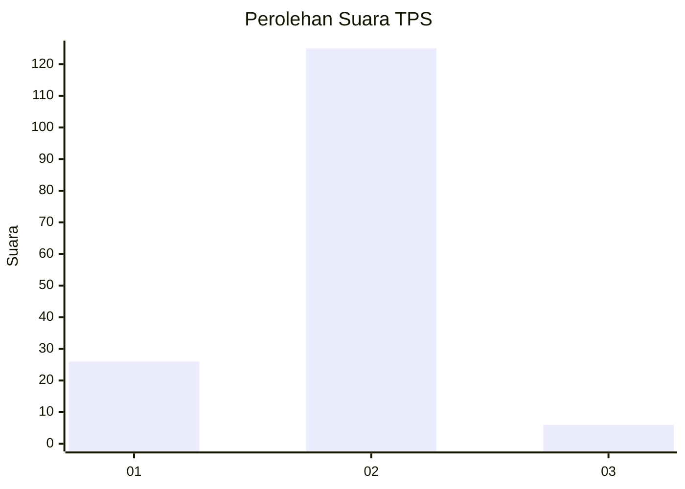
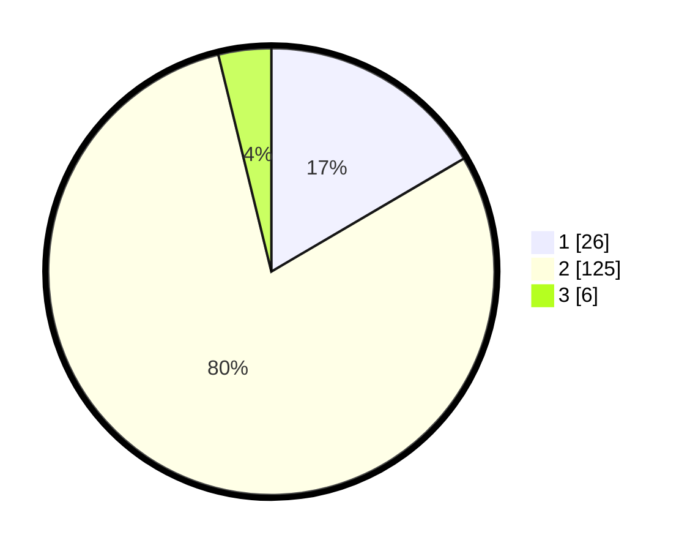

# Hasil

## Grafik

## Tabel

| No. | Nama Paslon    | Suara | Suara (raw) | Persentase |
|:--- |:-------------- | -----:| -----------:| ----------:|
| 1   | ANIES MUHAIMIN | 26    | [26][p-1]   | 16,56      |
| 2   | PRABOWO GIBRAN | 125   | [125][p-2]  | 79,62      |
| 3   | GANJAR MAHFUD  | 6     | [6][p-3]    | 3,82       |

[p-1]: https://github.com/gigit-pemilu/pemilu-2024-16-sumatera-selatan/blob/main/pilpres/hitung-suara/sub/16-sumatera-selatan/sub/08-ogan-komering-ulu-timur/sub/01-martapura/sub/2023-tanjung-kemala-barat/sub/002-tps/sub/paslon-1.txt
[p-2]: https://github.com/gigit-pemilu/pemilu-2024-16-sumatera-selatan/blob/main/pilpres/hitung-suara/sub/16-sumatera-selatan/sub/08-ogan-komering-ulu-timur/sub/01-martapura/sub/2023-tanjung-kemala-barat/sub/002-tps/sub/paslon-2.txt
[p-3]: https://github.com/gigit-pemilu/pemilu-2024-16-sumatera-selatan/blob/main/pilpres/hitung-suara/sub/16-sumatera-selatan/sub/08-ogan-komering-ulu-timur/sub/01-martapura/sub/2023-tanjung-kemala-barat/sub/002-tps/sub/paslon-3.txt

## Foto C Plano

https://sirekap-obj-formc.kpu.go.id/9e55/pemilu/ppwp/16/08/01/20/23/1608012023002-20240214-195355--b27d040a-2d96-432b-b5fc-d174a8209faa.jpg

https://sirekap-obj-formc.kpu.go.id/9e55/pemilu/ppwp/16/08/01/20/23/1608012023002-20240218-123747--8f70db99-3db2-47e3-b8bb-a4bd372c3479.jpg

https://sirekap-obj-formc.kpu.go.id/9e55/pemilu/ppwp/16/08/01/20/23/1608012023002-20240218-114852--55165902-3e9d-486c-8df8-4e7be171cb8a.jpg

## Metadata

| Key        | Value               |
| ---------- | ------------------- |
| Time Stamp | 2024-02-25 12:00:00 |

