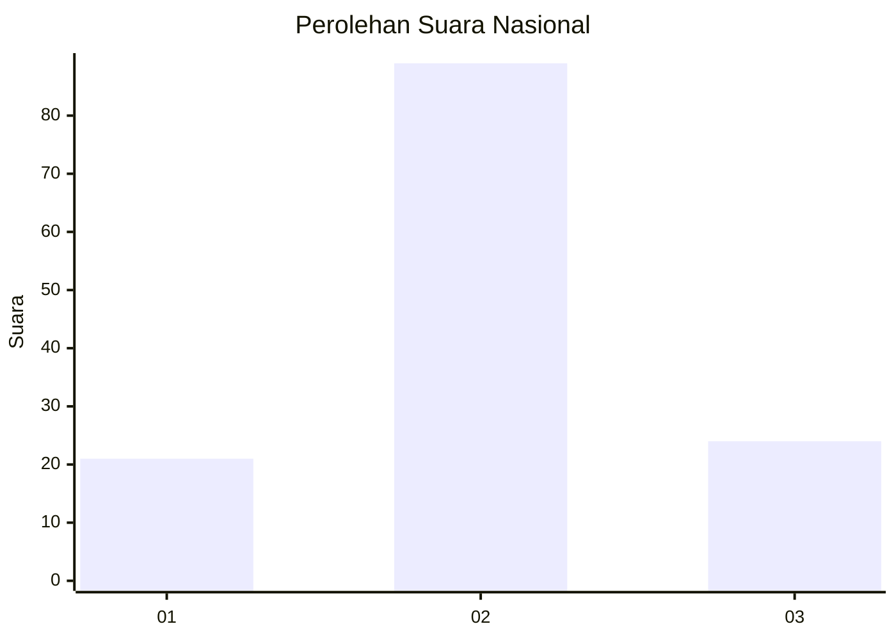
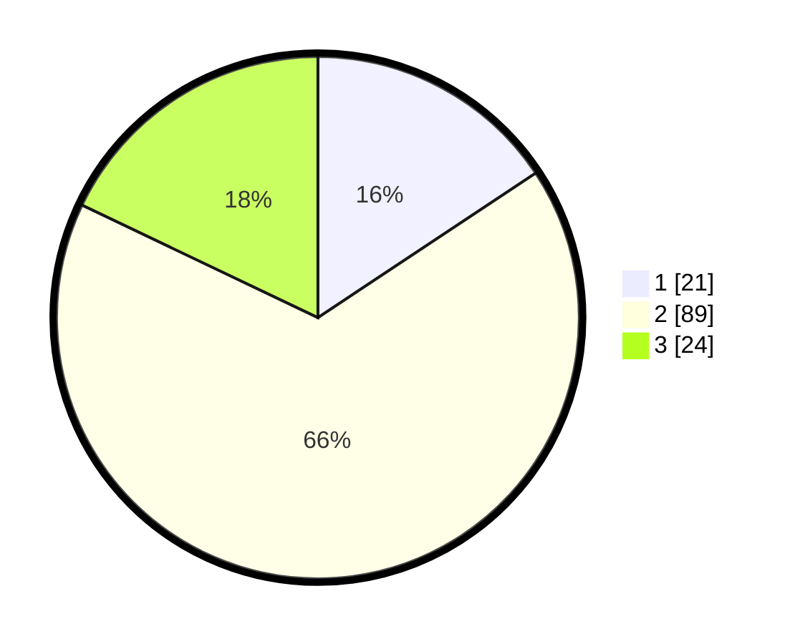

# Hasil

## Grafik

## Tabel

| No. | Nama Paslon    | Suara | Suara (raw) | Persentase |
|:--- |:-------------- | -----:| -----------:| ----------:|
| 1   | ANIES MUHAIMIN | 21    | [21][p-1]   | 15,67      |
| 2   | PRABOWO GIBRAN | 89    | [89][p-2]   | 66,42      |
| 3   | GANJAR MAHFUD  | 24    | [24][p-3]   | 17,91      |

[p-1]: https://github.com/gigit-pemilu/pemilu-2024/blob/main/pilpres/hitung-suara/sub/16-sumatera-selatan/sub/08-ogan-komering-ulu-timur/sub/02-buay-madang/sub/2009-tanjung-bulan/sub/002-tps/sub/paslon-1.txt
[p-2]: https://github.com/gigit-pemilu/pemilu-2024/blob/main/pilpres/hitung-suara/sub/16-sumatera-selatan/sub/08-ogan-komering-ulu-timur/sub/02-buay-madang/sub/2009-tanjung-bulan/sub/002-tps/sub/paslon-2.txt
[p-3]: https://github.com/gigit-pemilu/pemilu-2024/blob/main/pilpres/hitung-suara/sub/16-sumatera-selatan/sub/08-ogan-komering-ulu-timur/sub/02-buay-madang/sub/2009-tanjung-bulan/sub/002-tps/sub/paslon-3.txt

## Foto C Plano

https://sirekap-obj-formc.kpu.go.id/f1a4/pemilu/ppwp/16/08/02/20/09/1608022009002-20240218-230436--e0db35f3-c8dc-4651-932a-5c1db72e14c1.jpg

https://sirekap-obj-formc.kpu.go.id/f1a4/pemilu/ppwp/16/08/02/20/09/1608022009002-20240218-215554--61221ce1-5fd8-45f2-8322-9c1f3eb7c72e.jpg

https://sirekap-obj-formc.kpu.go.id/f1a4/pemilu/ppwp/16/08/02/20/09/1608022009002-20240218-215808--a8efba3e-52d7-4bb3-82a6-a098faccbe4b.jpg

## Metadata

| Key        | Value               |
| ---------- | ------------------- |
| Time Stamp | 2024-02-25 00:00:00 |

