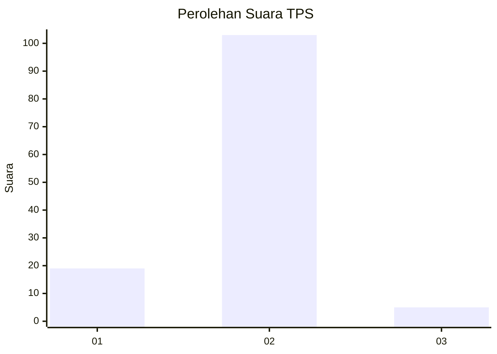
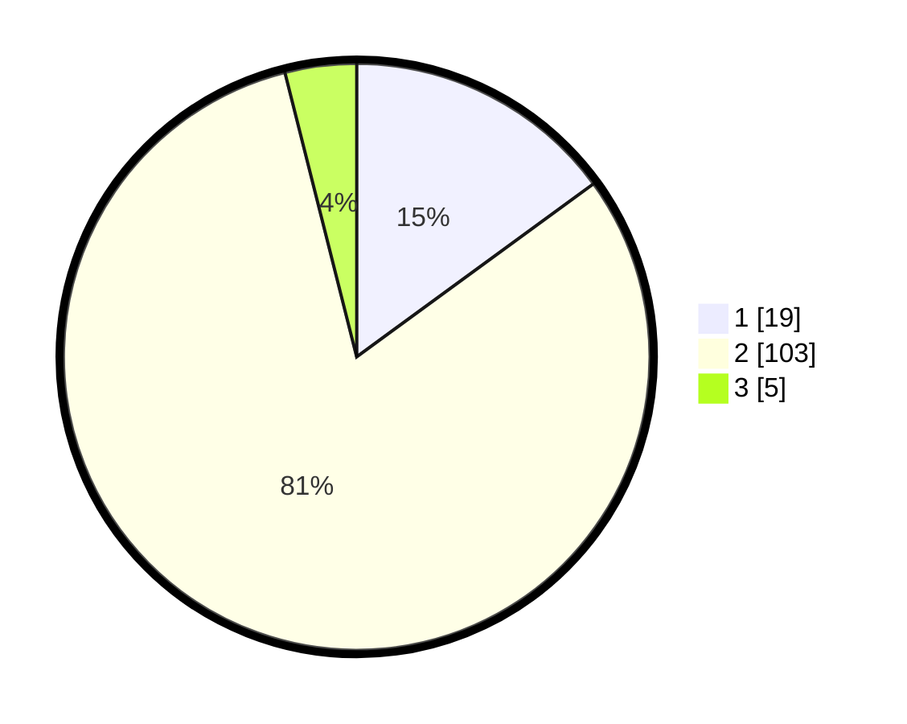

# Hasil

## Grafik

## Tabel

| No. | Nama Paslon    | Suara | Suara (raw) | Persentase |
|:--- |:-------------- | -----:| -----------:| ----------:|
| 1   | ANIES MUHAIMIN | 19    | [19][p-1]   | 14,96      |
| 2   | PRABOWO GIBRAN | 103   | [103][p-2]  | 81,10      |
| 3   | GANJAR MAHFUD  | 5     | [5][p-3]    | 3,94       |

[p-1]: https://github.com/gigit-pemilu/pemilu-2024-16-sumatera-selatan/blob/main/pilpres/hitung-suara/sub/16-sumatera-selatan/sub/08-ogan-komering-ulu-timur/sub/02-buay-madang/sub/2009-tanjung-bulan/sub/004-tps/sub/paslon-1.txt
[p-2]: https://github.com/gigit-pemilu/pemilu-2024-16-sumatera-selatan/blob/main/pilpres/hitung-suara/sub/16-sumatera-selatan/sub/08-ogan-komering-ulu-timur/sub/02-buay-madang/sub/2009-tanjung-bulan/sub/004-tps/sub/paslon-2.txt
[p-3]: https://github.com/gigit-pemilu/pemilu-2024-16-sumatera-selatan/blob/main/pilpres/hitung-suara/sub/16-sumatera-selatan/sub/08-ogan-komering-ulu-timur/sub/02-buay-madang/sub/2009-tanjung-bulan/sub/004-tps/sub/paslon-3.txt

## Foto C Plano

https://sirekap-obj-formc.kpu.go.id/31ef/pemilu/ppwp/16/08/02/20/09/1608022009004-20240218-220905--be8515c7-f331-4d1c-9042-ab3081bf1ad5.jpg

https://sirekap-obj-formc.kpu.go.id/31ef/pemilu/ppwp/16/08/02/20/09/1608022009004-20240218-221007--97fca4a4-2e30-40c6-8241-48a86d64415e.jpg

https://sirekap-obj-formc.kpu.go.id/31ef/pemilu/ppwp/16/08/02/20/09/1608022009004-20240218-221115--106c05ec-8f79-4bf7-881c-971e534ba261.jpg

## Metadata

| Key        | Value               |
| ---------- | ------------------- |
| Time Stamp | 2024-02-25 11:00:00 |

