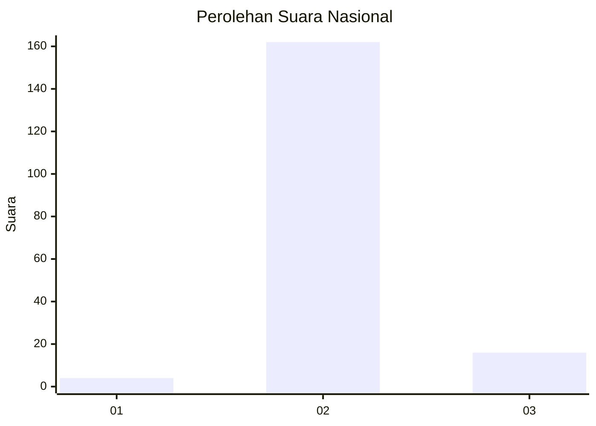
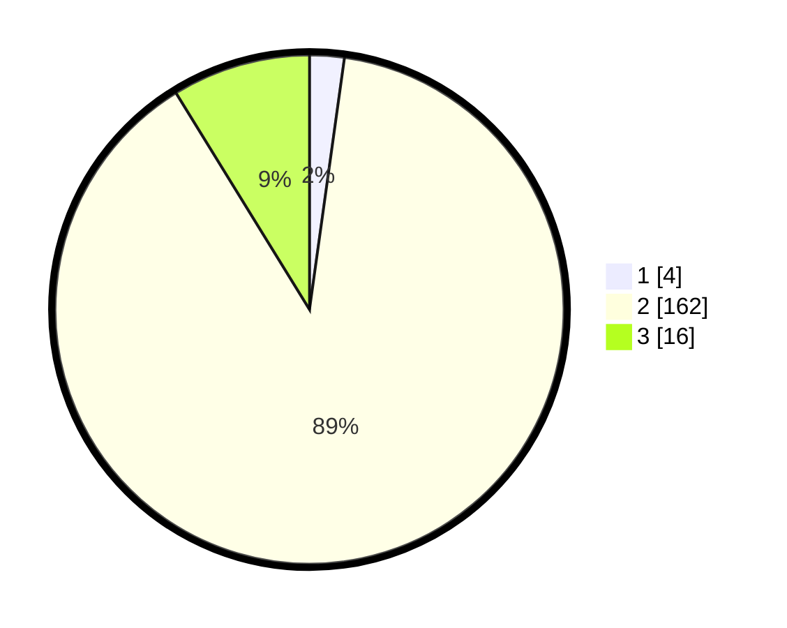

# Hasil

## Grafik

## Tabel

| No. | Nama Paslon    | Suara | Suara (raw) | Persentase |
|:--- |:-------------- | -----:| -----------:| ----------:|
| 1   | ANIES MUHAIMIN | 4     | [4][p-1]    | 2,20       |
| 2   | PRABOWO GIBRAN | 162   | [162][p-2]  | 89,01      |
| 3   | GANJAR MAHFUD  | 16    | [16][p-3]   | 8,79       |

[p-1]: https://github.com/gigit-pemilu/pemilu-2024/blob/main/pilpres/hitung-suara/sub/16-sumatera-selatan/sub/08-ogan-komering-ulu-timur/sub/02-buay-madang/sub/2010-way-halom/sub/002-tps/sub/paslon-1.txt
[p-2]: https://github.com/gigit-pemilu/pemilu-2024/blob/main/pilpres/hitung-suara/sub/16-sumatera-selatan/sub/08-ogan-komering-ulu-timur/sub/02-buay-madang/sub/2010-way-halom/sub/002-tps/sub/paslon-2.txt
[p-3]: https://github.com/gigit-pemilu/pemilu-2024/blob/main/pilpres/hitung-suara/sub/16-sumatera-selatan/sub/08-ogan-komering-ulu-timur/sub/02-buay-madang/sub/2010-way-halom/sub/002-tps/sub/paslon-3.txt

## Foto C Plano

https://sirekap-obj-formc.kpu.go.id/8a4e/pemilu/ppwp/16/08/02/20/10/1608022010002-20240218-161740--b4a6c1af-37e6-440c-804e-33d12d9ae5f3.jpg

https://sirekap-obj-formc.kpu.go.id/8a4e/pemilu/ppwp/16/08/02/20/10/1608022010002-20240218-161912--194c46b7-d9a1-41ef-b1e0-1233d92774d1.jpg

https://sirekap-obj-formc.kpu.go.id/8a4e/pemilu/ppwp/16/08/02/20/10/1608022010002-20240218-162232--bf5b7f65-e340-4b0f-b1df-90773e62afc6.jpg

## Metadata

| Key        | Value               |
| ---------- | ------------------- |
| Time Stamp | 2024-02-25 21:00:00 |

