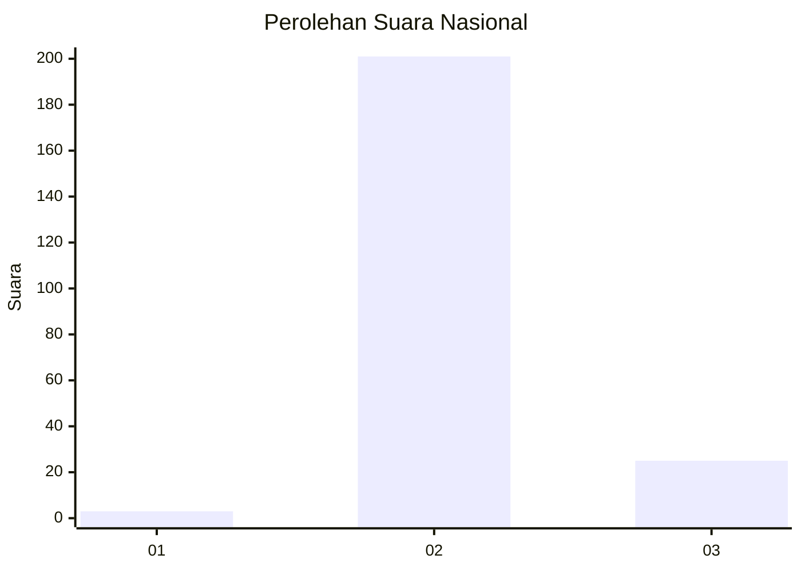
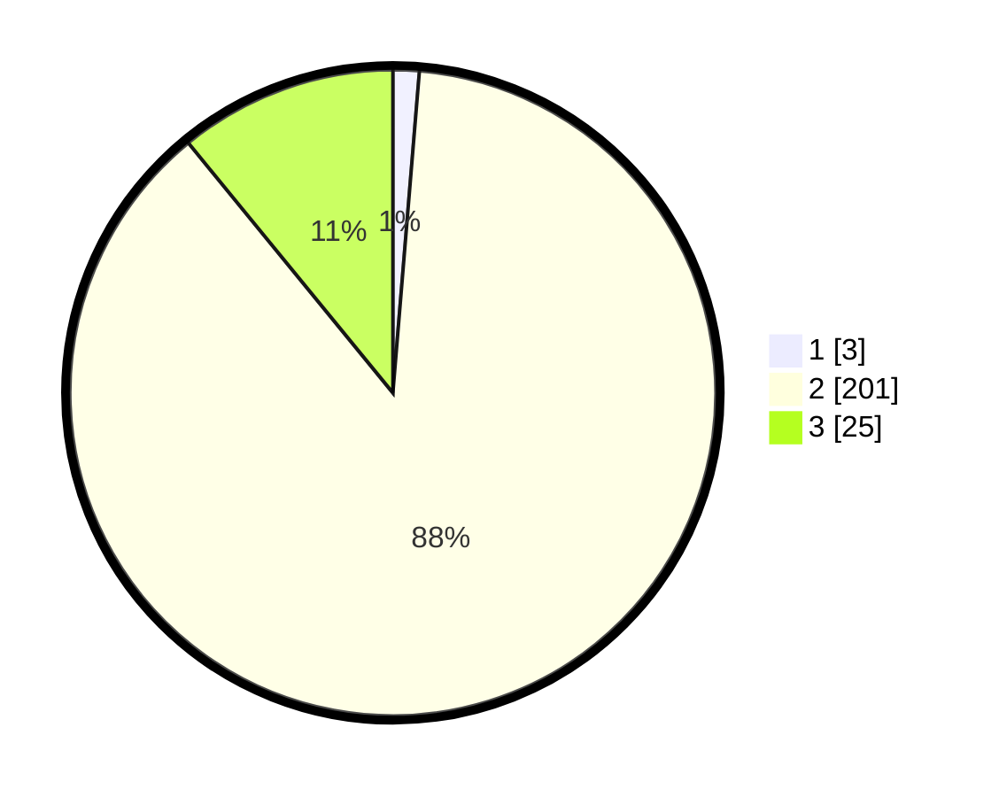

# Hasil

## Grafik

## Tabel

| No. | Nama Paslon    | Suara | Suara (raw) | Persentase |
|:--- |:-------------- | -----:| -----------:| ----------:|
| 1   | ANIES MUHAIMIN | 3     | [3][p-1]    | 1,31       |
| 2   | PRABOWO GIBRAN | 201   | [201][p-2]  | 87,77      |
| 3   | GANJAR MAHFUD  | 25    | [25][p-3]   | 10,92      |

[p-1]: https://github.com/gigit-pemilu/pemilu-2024/blob/main/pilpres/hitung-suara/sub/16-sumatera-selatan/sub/08-ogan-komering-ulu-timur/sub/02-buay-madang/sub/2010-way-halom/sub/003-tps/sub/paslon-1.txt
[p-2]: https://github.com/gigit-pemilu/pemilu-2024/blob/main/pilpres/hitung-suara/sub/16-sumatera-selatan/sub/08-ogan-komering-ulu-timur/sub/02-buay-madang/sub/2010-way-halom/sub/003-tps/sub/paslon-2.txt
[p-3]: https://github.com/gigit-pemilu/pemilu-2024/blob/main/pilpres/hitung-suara/sub/16-sumatera-selatan/sub/08-ogan-komering-ulu-timur/sub/02-buay-madang/sub/2010-way-halom/sub/003-tps/sub/paslon-3.txt

## Foto C Plano

https://sirekap-obj-formc.kpu.go.id/b0c0/pemilu/ppwp/16/08/02/20/10/1608022010003-20240218-164035--4e5d6db9-a5cc-492d-8e94-a09435bb8e92.jpg

https://sirekap-obj-formc.kpu.go.id/b0c0/pemilu/ppwp/16/08/02/20/10/1608022010003-20240218-162826--39470dff-0ce3-4a5f-9741-de03bb27a9b4.jpg

https://sirekap-obj-formc.kpu.go.id/b0c0/pemilu/ppwp/16/08/02/20/10/1608022010003-20240218-164216--20ee1497-7b8f-45db-8584-b4320cad7359.jpg

## Metadata

| Key        | Value               |
| ---------- | ------------------- |
| Time Stamp | 2024-02-25 22:00:00 |

