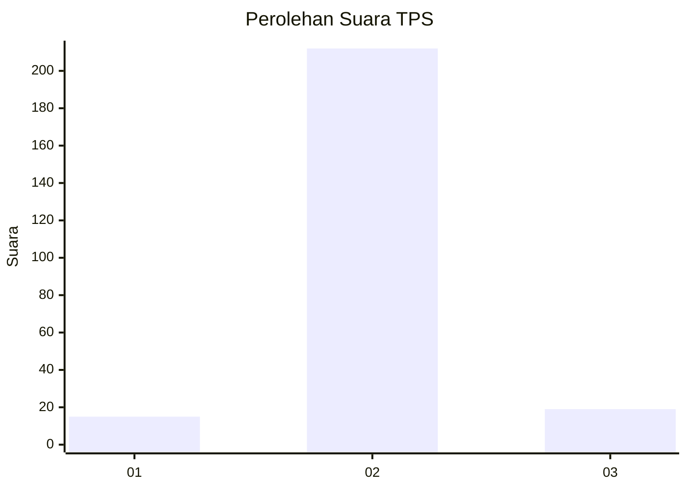
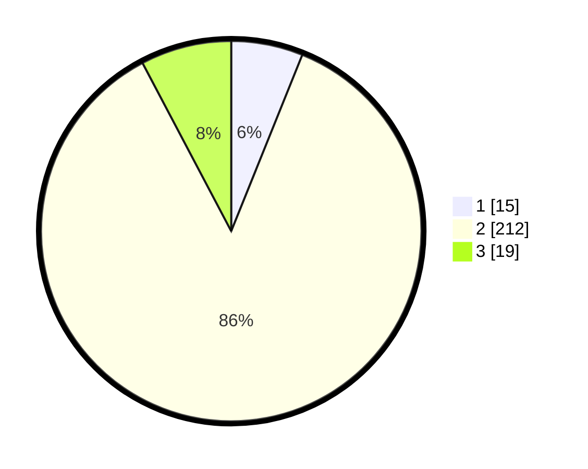

# Hasil

## Grafik

## Tabel

| No. | Nama Paslon    | Suara | Suara (raw) | Persentase |
|:--- |:-------------- | -----:| -----------:| ----------:|
| 1   | ANIES MUHAIMIN | 15    | [15][p-1]   | 6,10       |
| 2   | PRABOWO GIBRAN | 212   | [212][p-2]  | 86,18      |
| 3   | GANJAR MAHFUD  | 19    | [19][p-3]   | 7,72       |

[p-1]: https://github.com/gigit-pemilu/pemilu-2024-16-sumatera-selatan/blob/main/pilpres/hitung-suara/sub/16-sumatera-selatan/sub/08-ogan-komering-ulu-timur/sub/02-buay-madang/sub/2032-kurungan-nyawa-ii/sub/006-tps/sub/paslon-1.txt
[p-2]: https://github.com/gigit-pemilu/pemilu-2024-16-sumatera-selatan/blob/main/pilpres/hitung-suara/sub/16-sumatera-selatan/sub/08-ogan-komering-ulu-timur/sub/02-buay-madang/sub/2032-kurungan-nyawa-ii/sub/006-tps/sub/paslon-2.txt
[p-3]: https://github.com/gigit-pemilu/pemilu-2024-16-sumatera-selatan/blob/main/pilpres/hitung-suara/sub/16-sumatera-selatan/sub/08-ogan-komering-ulu-timur/sub/02-buay-madang/sub/2032-kurungan-nyawa-ii/sub/006-tps/sub/paslon-3.txt

## Foto C Plano

https://sirekap-obj-formc.kpu.go.id/4331/pemilu/ppwp/16/08/02/20/32/1608022032006-20240218-210522--d469b0c2-47c9-49cc-8a02-091c68504cc6.jpg

https://sirekap-obj-formc.kpu.go.id/4331/pemilu/ppwp/16/08/02/20/32/1608022032006-20240218-210620--40414bd6-3088-4a87-ac98-865aec399c96.jpg

https://sirekap-obj-formc.kpu.go.id/4331/pemilu/ppwp/16/08/02/20/32/1608022032006-20240218-210312--933cfc4f-f50c-467c-983b-4fbbd9bd126e.jpg

## Metadata

| Key        | Value               |
| ---------- | ------------------- |
| Time Stamp | 2024-02-25 15:00:00 |

