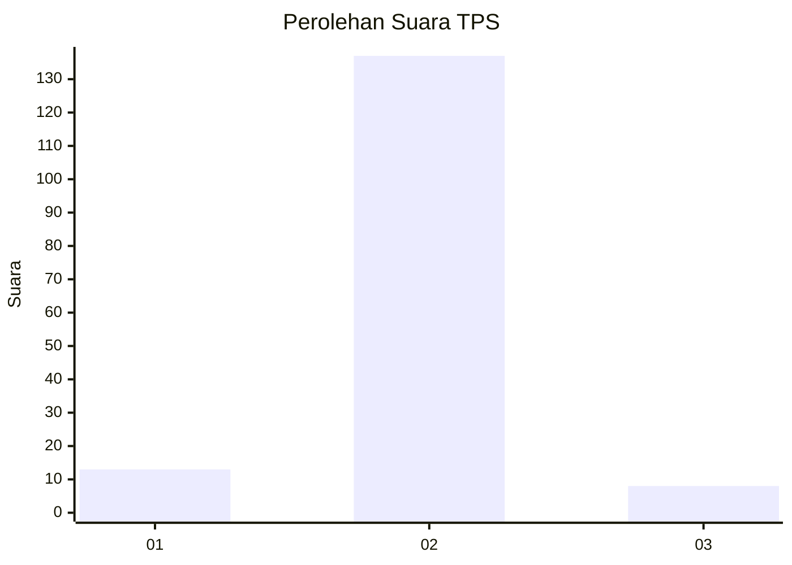
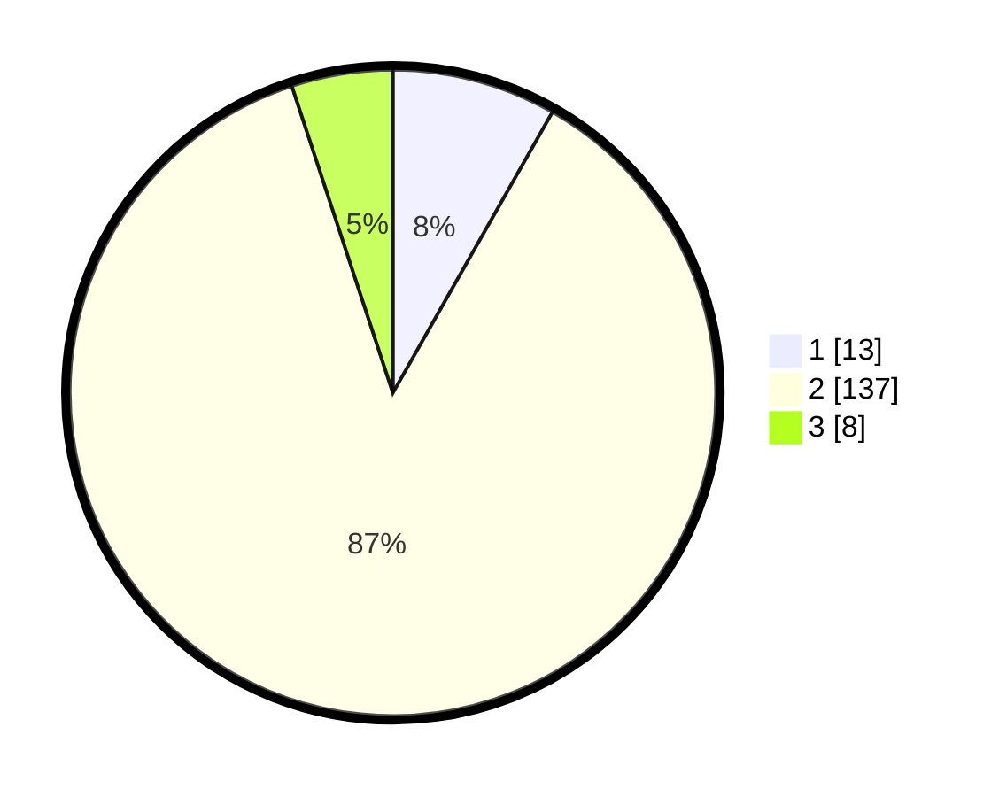

# Hasil

## Grafik

## Tabel

| No. | Nama Paslon    | Suara | Suara (raw) | Persentase |
|:--- |:-------------- | -----:| -----------:| ----------:|
| 1   | ANIES MUHAIMIN | 13    | [13][p-1]   | 8,23       |
| 2   | PRABOWO GIBRAN | 137   | [137][p-2]  | 86,71      |
| 3   | GANJAR MAHFUD  | 8     | [8][p-3]    | 5,06       |

[p-1]: https://github.com/gigit-pemilu/pemilu-2024-16-sumatera-selatan/blob/main/pilpres/hitung-suara/sub/16-sumatera-selatan/sub/08-ogan-komering-ulu-timur/sub/02-buay-madang/sub/2033-kurungan-nyawa-iii/sub/002-tps/sub/paslon-1.txt
[p-2]: https://github.com/gigit-pemilu/pemilu-2024-16-sumatera-selatan/blob/main/pilpres/hitung-suara/sub/16-sumatera-selatan/sub/08-ogan-komering-ulu-timur/sub/02-buay-madang/sub/2033-kurungan-nyawa-iii/sub/002-tps/sub/paslon-2.txt
[p-3]: https://github.com/gigit-pemilu/pemilu-2024-16-sumatera-selatan/blob/main/pilpres/hitung-suara/sub/16-sumatera-selatan/sub/08-ogan-komering-ulu-timur/sub/02-buay-madang/sub/2033-kurungan-nyawa-iii/sub/002-tps/sub/paslon-3.txt

## Foto C Plano

https://sirekap-obj-formc.kpu.go.id/ab46/pemilu/ppwp/16/08/02/20/33/1608022033002-20240218-213648--9a387bb9-9577-47d5-9049-c2ea19c9baae.jpg

https://sirekap-obj-formc.kpu.go.id/ab46/pemilu/ppwp/16/08/02/20/33/1608022033002-20240218-213739--317d7914-d168-4d32-bd9e-8def9134f354.jpg

https://sirekap-obj-formc.kpu.go.id/ab46/pemilu/ppwp/16/08/02/20/33/1608022033002-20240218-213823--b60db81f-0b58-42a8-b042-b0c97e7cc5eb.jpg

## Metadata

| Key        | Value               |
| ---------- | ------------------- |
| Time Stamp | 2024-02-24 22:31:28 |

