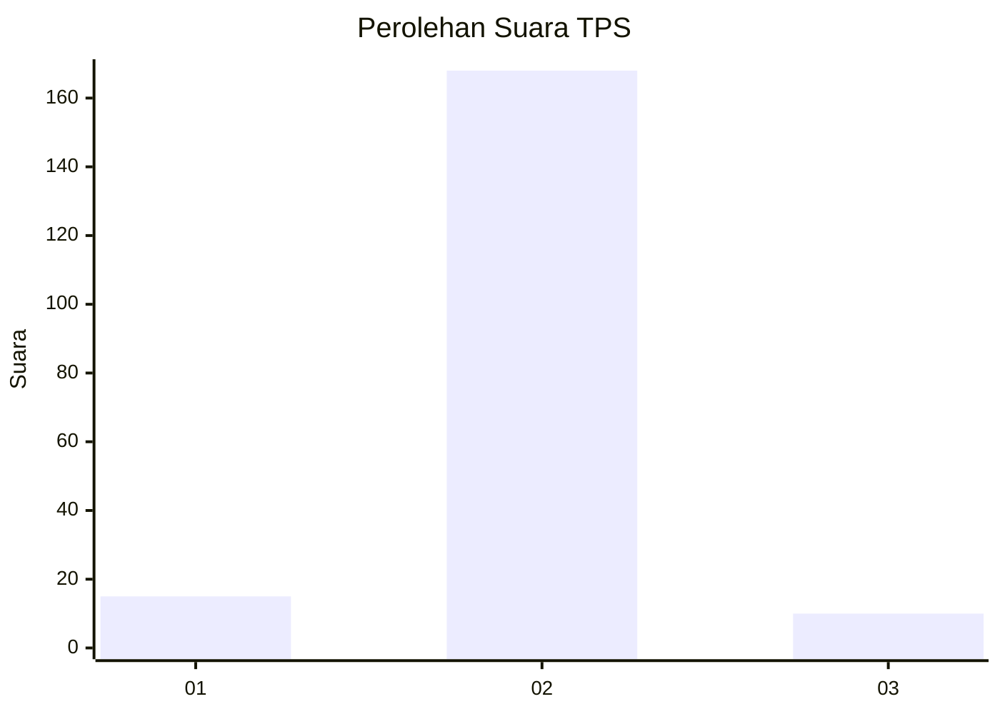
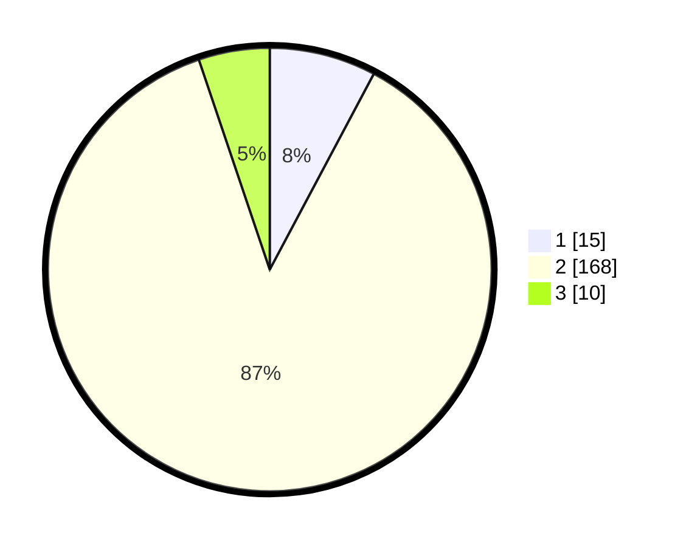

# Hasil

## Grafik

## Tabel

| No. | Nama Paslon    | Suara | Suara (raw) | Persentase |
|:--- |:-------------- | -----:| -----------:| ----------:|
| 1   | ANIES MUHAIMIN | 15    | [15][p-1]   | 7,77       |
| 2   | PRABOWO GIBRAN | 168   | [168][p-2]  | 87,05      |
| 3   | GANJAR MAHFUD  | 10    | [10][p-3]   | 5,18       |

[p-1]: https://github.com/gigit-pemilu/pemilu-2024-16-sumatera-selatan/blob/main/pilpres/hitung-suara/sub/16-sumatera-selatan/sub/08-ogan-komering-ulu-timur/sub/02-buay-madang/sub/2033-kurungan-nyawa-iii/sub/004-tps/sub/paslon-1.txt
[p-2]: https://github.com/gigit-pemilu/pemilu-2024-16-sumatera-selatan/blob/main/pilpres/hitung-suara/sub/16-sumatera-selatan/sub/08-ogan-komering-ulu-timur/sub/02-buay-madang/sub/2033-kurungan-nyawa-iii/sub/004-tps/sub/paslon-2.txt
[p-3]: https://github.com/gigit-pemilu/pemilu-2024-16-sumatera-selatan/blob/main/pilpres/hitung-suara/sub/16-sumatera-selatan/sub/08-ogan-komering-ulu-timur/sub/02-buay-madang/sub/2033-kurungan-nyawa-iii/sub/004-tps/sub/paslon-3.txt

## Foto C Plano

https://sirekap-obj-formc.kpu.go.id/6676/pemilu/ppwp/16/08/02/20/33/1608022033004-20240218-214430--a4f9c6bb-8cc7-4374-949c-4e67e1a73867.jpg

https://sirekap-obj-formc.kpu.go.id/6676/pemilu/ppwp/16/08/02/20/33/1608022033004-20240218-214614--18cf60aa-d76b-4914-b769-e4f1e274faee.jpg

https://sirekap-obj-formc.kpu.go.id/6676/pemilu/ppwp/16/08/02/20/33/1608022033004-20240218-214705--f1e8e7b9-7f45-4a0b-80e6-daa2e2247f28.jpg

## Metadata

| Key        | Value               |
| ---------- | ------------------- |
| Time Stamp | 2024-02-24 22:31:28 |

