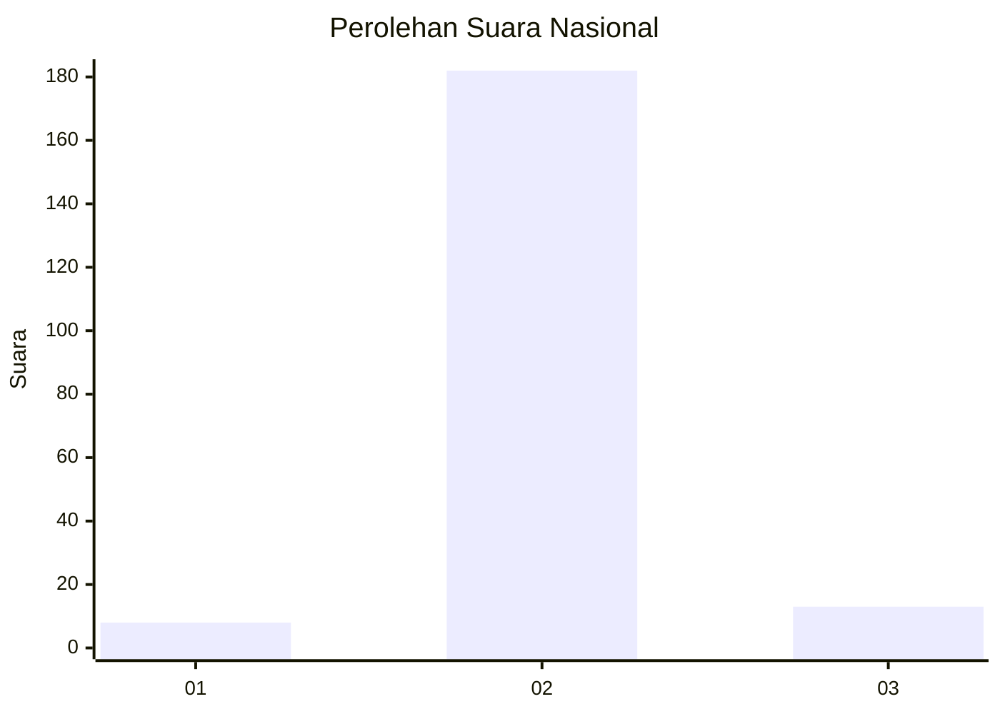
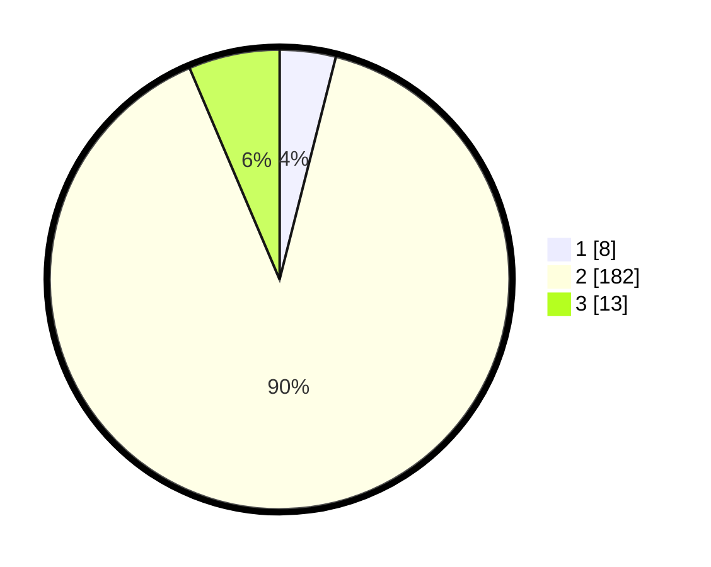

# Hasil

## Grafik

## Tabel

| No. | Nama Paslon    | Suara | Suara (raw) | Persentase |
|:--- |:-------------- | -----:| -----------:| ----------:|
| 1   | ANIES MUHAIMIN | 8     | [8][p-1]    | 3,94       |
| 2   | PRABOWO GIBRAN | 182   | [182][p-2]  | 89,66      |
| 3   | GANJAR MAHFUD  | 13    | [13][p-3]   | 6,40       |

[p-1]: https://github.com/gigit-pemilu/pemilu-2024/blob/main/pilpres/hitung-suara/sub/16-sumatera-selatan/sub/08-ogan-komering-ulu-timur/sub/02-buay-madang/sub/2037-ganjar-agung/sub/002-tps/sub/paslon-1.txt
[p-2]: https://github.com/gigit-pemilu/pemilu-2024/blob/main/pilpres/hitung-suara/sub/16-sumatera-selatan/sub/08-ogan-komering-ulu-timur/sub/02-buay-madang/sub/2037-ganjar-agung/sub/002-tps/sub/paslon-2.txt
[p-3]: https://github.com/gigit-pemilu/pemilu-2024/blob/main/pilpres/hitung-suara/sub/16-sumatera-selatan/sub/08-ogan-komering-ulu-timur/sub/02-buay-madang/sub/2037-ganjar-agung/sub/002-tps/sub/paslon-3.txt

## Foto C Plano

https://sirekap-obj-formc.kpu.go.id/5a7c/pemilu/ppwp/16/08/02/20/37/1608022037002-20240215-020540--5e326a1d-db77-4c94-a00c-458e17aea42a.jpg

https://sirekap-obj-formc.kpu.go.id/5a7c/pemilu/ppwp/16/08/02/20/37/1608022037002-20240215-041206--5aa4116f-8bb3-4dfa-b97b-6e136ce7df00.jpg

https://sirekap-obj-formc.kpu.go.id/5a7c/pemilu/ppwp/16/08/02/20/37/1608022037002-20240215-041311--0ed579da-3c0a-4072-a3b7-6fad415a4e5d.jpg

## Metadata

| Key        | Value               |
| ---------- | ------------------- |
| Time Stamp | 2024-02-15 12:00:28 |

