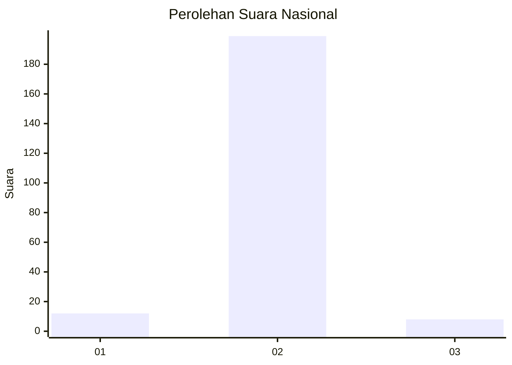
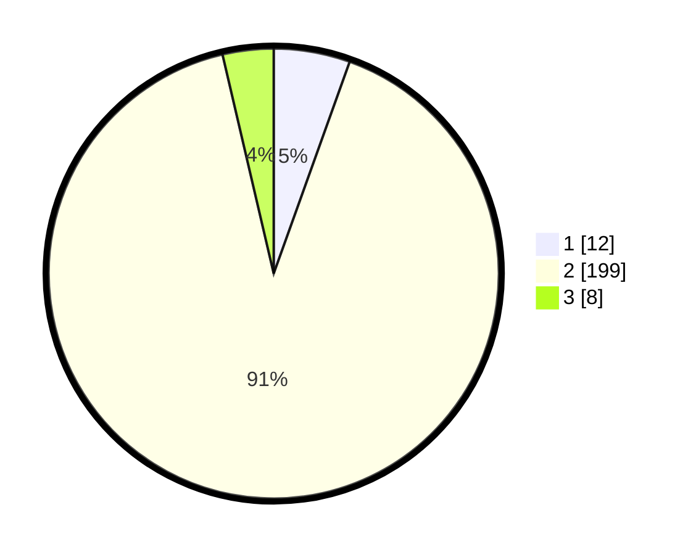

# Hasil

## Grafik

## Tabel

| No. | Nama Paslon    | Suara | Suara (raw) | Persentase |
|:--- |:-------------- | -----:| -----------:| ----------:|
| 1   | ANIES MUHAIMIN | 12    | [12][p-1]   | 5,48       |
| 2   | PRABOWO GIBRAN | 199   | [199][p-2]  | 90,87      |
| 3   | GANJAR MAHFUD  | 8     | [8][p-3]    | 3,65       |

[p-1]: https://github.com/gigit-pemilu/pemilu-2024/blob/main/pilpres/hitung-suara/sub/16-sumatera-selatan/sub/08-ogan-komering-ulu-timur/sub/02-buay-madang/sub/2038-mulyo-agung/sub/003-tps/sub/paslon-1.txt
[p-2]: https://github.com/gigit-pemilu/pemilu-2024/blob/main/pilpres/hitung-suara/sub/16-sumatera-selatan/sub/08-ogan-komering-ulu-timur/sub/02-buay-madang/sub/2038-mulyo-agung/sub/003-tps/sub/paslon-2.txt
[p-3]: https://github.com/gigit-pemilu/pemilu-2024/blob/main/pilpres/hitung-suara/sub/16-sumatera-selatan/sub/08-ogan-komering-ulu-timur/sub/02-buay-madang/sub/2038-mulyo-agung/sub/003-tps/sub/paslon-3.txt

## Foto C Plano

https://sirekap-obj-formc.kpu.go.id/d1f5/pemilu/ppwp/16/08/02/20/38/1608022038003-20240218-195640--806f25c5-0bc2-4343-bbf5-2ef442bdc7e5.jpg

https://sirekap-obj-formc.kpu.go.id/d1f5/pemilu/ppwp/16/08/02/20/38/1608022038003-20240218-195500--db96d396-6441-473a-9f13-6c719f4eb961.jpg

https://sirekap-obj-formc.kpu.go.id/d1f5/pemilu/ppwp/16/08/02/20/38/1608022038003-20240218-200008--c2e825ae-b0aa-40ad-a6b4-0465f6378c8f.jpg

## Metadata

| Key        | Value               |
| ---------- | ------------------- |
| Time Stamp | 2024-02-25 14:00:00 |

