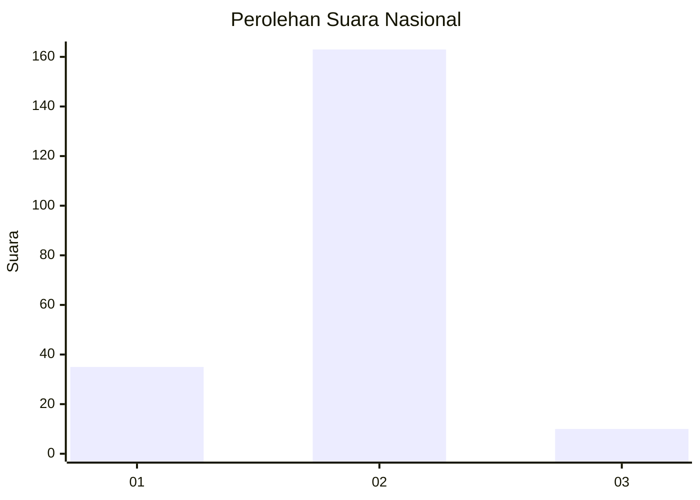
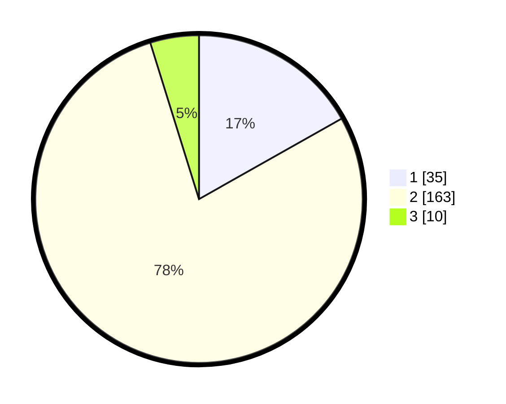

# Hasil

## Grafik

## Tabel

| No. | Nama Paslon    | Suara | Suara (raw) | Persentase |
|:--- |:-------------- | -----:| -----------:| ----------:|
| 1   | ANIES MUHAIMIN | 35    | [35][p-1]   | 16,83      |
| 2   | PRABOWO GIBRAN | 163   | [163][p-2]  | 78,37      |
| 3   | GANJAR MAHFUD  | 10    | [10][p-3]   | 4,81       |

[p-1]: https://github.com/gigit-pemilu/pemilu-2024/blob/main/pilpres/hitung-suara/sub/16-sumatera-selatan/sub/08-ogan-komering-ulu-timur/sub/04-cempaka/sub/2001-gunung-batu/sub/002-tps/sub/paslon-1.txt
[p-2]: https://github.com/gigit-pemilu/pemilu-2024/blob/main/pilpres/hitung-suara/sub/16-sumatera-selatan/sub/08-ogan-komering-ulu-timur/sub/04-cempaka/sub/2001-gunung-batu/sub/002-tps/sub/paslon-2.txt
[p-3]: https://github.com/gigit-pemilu/pemilu-2024/blob/main/pilpres/hitung-suara/sub/16-sumatera-selatan/sub/08-ogan-komering-ulu-timur/sub/04-cempaka/sub/2001-gunung-batu/sub/002-tps/sub/paslon-3.txt

## Foto C Plano

https://sirekap-obj-formc.kpu.go.id/197a/pemilu/ppwp/16/08/04/20/01/1608042001002-20240214-195002--52d13975-39d8-4ef6-abb9-5319903cfac7.jpg

https://sirekap-obj-formc.kpu.go.id/197a/pemilu/ppwp/16/08/04/20/01/1608042001002-20240215-003525--d9c2fc82-f904-4f5c-88a2-8d9db09deb01.jpg

https://sirekap-obj-formc.kpu.go.id/197a/pemilu/ppwp/16/08/04/20/01/1608042001002-20240214-192317--29c1bf8b-68a9-4cbc-b402-2b9a43828fad.jpg

## Metadata

| Key        | Value               |
| ---------- | ------------------- |
| Time Stamp | 2024-02-26 13:00:00 |

