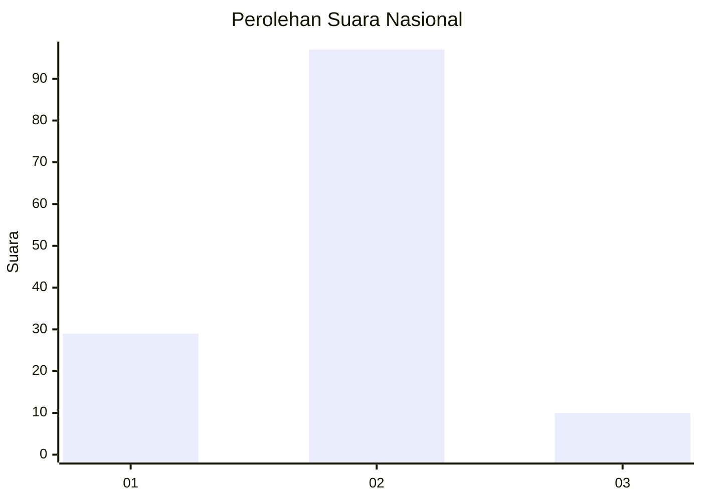

# Hasil

## Grafik

## Tabel

| No. | Nama Paslon    | Suara | Suara (raw) | Persentase |
|:--- |:-------------- | -----:| -----------:| ----------:|
| 1   | ANIES MUHAIMIN | 29    | [29][p-1]   | 21,32      |
| 2   | PRABOWO GIBRAN | 97    | [97][p-2]   | 71,32      |
| 3   | GANJAR MAHFUD  | 10    | [10][p-3]   | 7,35       |

[p-1]: https://github.com/gigit-pemilu/pemilu-2024/blob/main/pilpres/hitung-suara/sub/16-sumatera-selatan/sub/08-ogan-komering-ulu-timur/sub/04-cempaka/sub/2001-gunung-batu/sub/004-tps/sub/paslon-1.txt
[p-2]: https://github.com/gigit-pemilu/pemilu-2024/blob/main/pilpres/hitung-suara/sub/16-sumatera-selatan/sub/08-ogan-komering-ulu-timur/sub/04-cempaka/sub/2001-gunung-batu/sub/004-tps/sub/paslon-2.txt
[p-3]: https://github.com/gigit-pemilu/pemilu-2024/blob/main/pilpres/hitung-suara/sub/16-sumatera-selatan/sub/08-ogan-komering-ulu-timur/sub/04-cempaka/sub/2001-gunung-batu/sub/004-tps/sub/paslon-3.txt

## Foto C Plano

https://sirekap-obj-formc.kpu.go.id/b483/pemilu/ppwp/16/08/04/20/01/1608042001004-20240216-112445--f0d0ea69-d427-4061-812e-224983765e9b.jpg

https://sirekap-obj-formc.kpu.go.id/b483/pemilu/ppwp/16/08/04/20/01/1608042001004-20240218-162211--683c78d1-5c22-4607-90f9-dcbf8a880b45.jpg

https://sirekap-obj-formc.kpu.go.id/b483/pemilu/ppwp/16/08/04/20/01/1608042001004-20240216-113909--e2ef405d-b9a1-41fb-a406-e07daab8acda.jpg

## Metadata

| Key        | Value               |
| ---------- | ------------------- |
| Time Stamp | 2024-02-25 21:00:00 |

