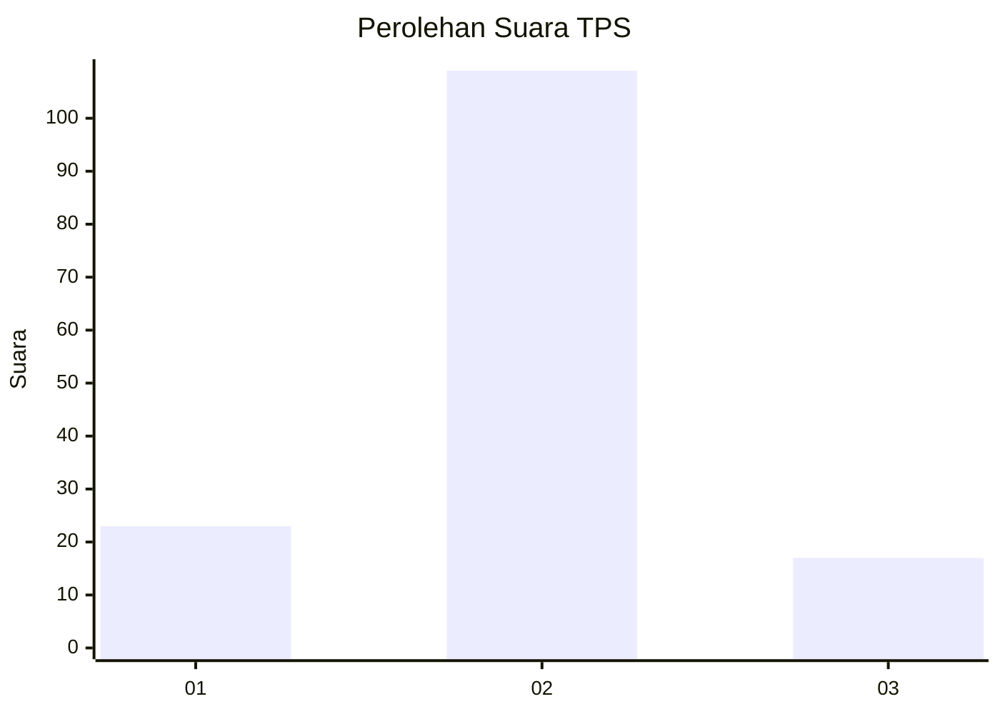
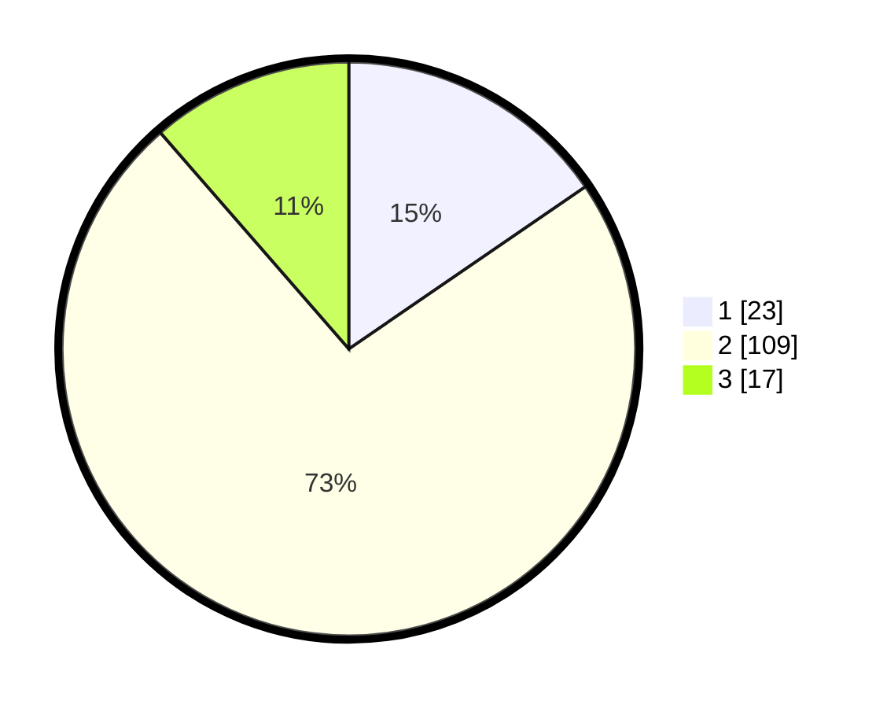

# Hasil

## Grafik

## Tabel

| No. | Nama Paslon    | Suara | Suara (raw) | Persentase |
|:--- |:-------------- | -----:| -----------:| ----------:|
| 1   | ANIES MUHAIMIN | 23    | [23][p-1]   | 15,44      |
| 2   | PRABOWO GIBRAN | 109   | [109][p-2]  | 73,15      |
| 3   | GANJAR MAHFUD  | 17    | [17][p-3]   | 11,41      |

[p-1]: https://github.com/gigit-pemilu/pemilu-2024-16-sumatera-selatan/blob/main/pilpres/hitung-suara/sub/16-sumatera-selatan/sub/08-ogan-komering-ulu-timur/sub/04-cempaka/sub/2001-gunung-batu/sub/007-tps/sub/paslon-1.txt
[p-2]: https://github.com/gigit-pemilu/pemilu-2024-16-sumatera-selatan/blob/main/pilpres/hitung-suara/sub/16-sumatera-selatan/sub/08-ogan-komering-ulu-timur/sub/04-cempaka/sub/2001-gunung-batu/sub/007-tps/sub/paslon-2.txt
[p-3]: https://github.com/gigit-pemilu/pemilu-2024-16-sumatera-selatan/blob/main/pilpres/hitung-suara/sub/16-sumatera-selatan/sub/08-ogan-komering-ulu-timur/sub/04-cempaka/sub/2001-gunung-batu/sub/007-tps/sub/paslon-3.txt

## Foto C Plano

https://sirekap-obj-formc.kpu.go.id/a346/pemilu/ppwp/16/08/04/20/01/1608042001007-20240214-223356--907df1ed-e8a6-4f48-ae7f-ff64415bdf7f.jpg

https://sirekap-obj-formc.kpu.go.id/a346/pemilu/ppwp/16/08/04/20/01/1608042001007-20240214-223458--8bec8936-d274-4d73-abe4-e412c0c92957.jpg

https://sirekap-obj-formc.kpu.go.id/a346/pemilu/ppwp/16/08/04/20/01/1608042001007-20240214-223549--a213740d-162a-410b-aa08-5bb2cb75dd51.jpg

## Metadata

| Key        | Value               |
| ---------- | ------------------- |
| Time Stamp | 2024-02-25 16:00:00 |

