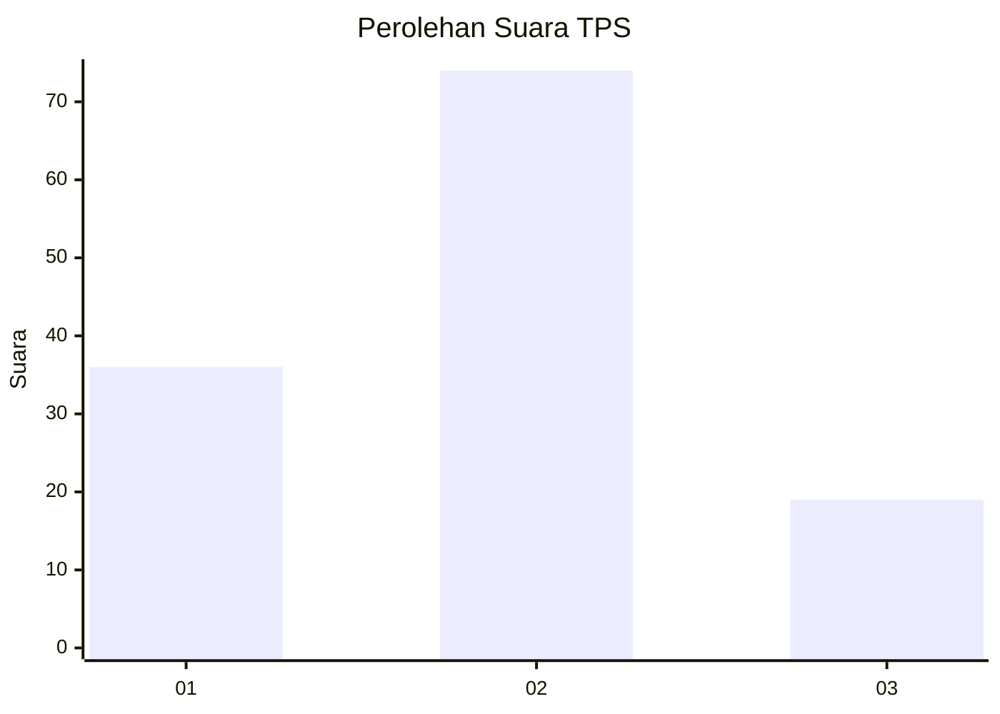
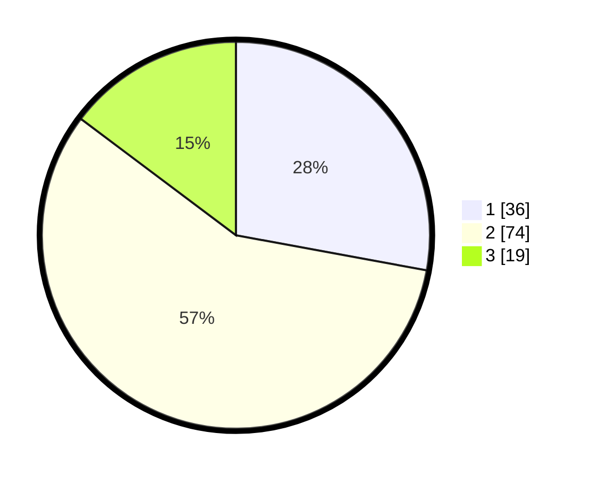

# Hasil

## Grafik

## Tabel

| No. | Nama Paslon    | Suara | Suara (raw) | Persentase |
|:--- |:-------------- | -----:| -----------:| ----------:|
| 1   | ANIES MUHAIMIN | 36    | [36][p-1]   | 27,91      |
| 2   | PRABOWO GIBRAN | 74    | [74][p-2]   | 57,36      |
| 3   | GANJAR MAHFUD  | 19    | [19][p-3]   | 14,73      |

[p-1]: https://github.com/gigit-pemilu/pemilu-2024-16-sumatera-selatan/blob/main/pilpres/hitung-suara/sub/16-sumatera-selatan/sub/08-ogan-komering-ulu-timur/sub/04-cempaka/sub/2015-sukaraja/sub/001-tps/sub/paslon-1.txt
[p-2]: https://github.com/gigit-pemilu/pemilu-2024-16-sumatera-selatan/blob/main/pilpres/hitung-suara/sub/16-sumatera-selatan/sub/08-ogan-komering-ulu-timur/sub/04-cempaka/sub/2015-sukaraja/sub/001-tps/sub/paslon-2.txt
[p-3]: https://github.com/gigit-pemilu/pemilu-2024-16-sumatera-selatan/blob/main/pilpres/hitung-suara/sub/16-sumatera-selatan/sub/08-ogan-komering-ulu-timur/sub/04-cempaka/sub/2015-sukaraja/sub/001-tps/sub/paslon-3.txt

## Foto C Plano

https://sirekap-obj-formc.kpu.go.id/3c3e/pemilu/ppwp/16/08/04/20/15/1608042015001-20240217-123738--c57e3f95-5f44-4c72-8e54-322d17e7d6be.jpg

https://sirekap-obj-formc.kpu.go.id/3c3e/pemilu/ppwp/16/08/04/20/15/1608042015001-20240217-123757--eb23c59d-177e-4b2d-8994-63a27f872370.jpg

https://sirekap-obj-formc.kpu.go.id/3c3e/pemilu/ppwp/16/08/04/20/15/1608042015001-20240217-123813--0614252b-2690-4501-8159-32cf53068cf9.jpg

## Metadata

| Key        | Value               |
| ---------- | ------------------- |
| Time Stamp | 2024-02-25 15:00:00 |

