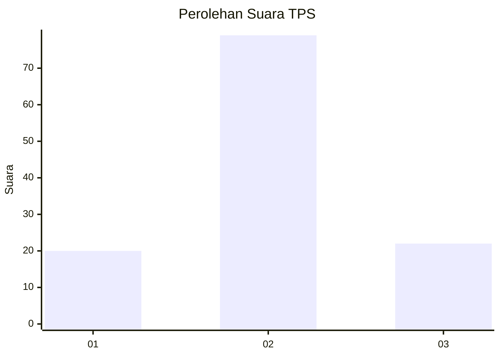
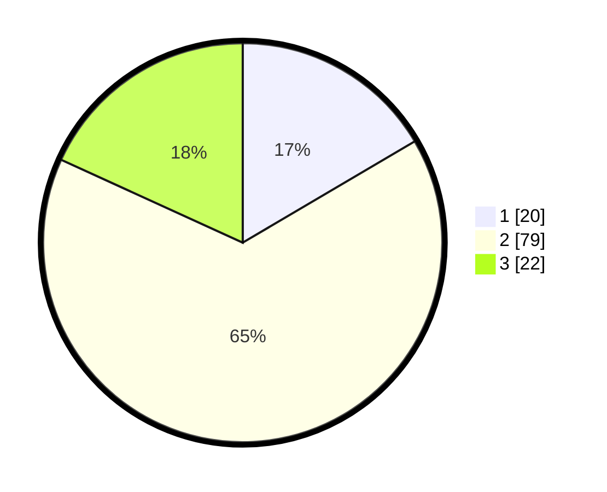

# Hasil

## Grafik

## Tabel

| No. | Nama Paslon    | Suara | Suara (raw) | Persentase |
|:--- |:-------------- | -----:| -----------:| ----------:|
| 1   | ANIES MUHAIMIN | 20    | [20][p-1]   | 16,53      |
| 2   | PRABOWO GIBRAN | 79    | [79][p-2]   | 65,29      |
| 3   | GANJAR MAHFUD  | 22    | [22][p-3]   | 18,18      |

[p-1]: https://github.com/gigit-pemilu/pemilu-2024-16-sumatera-selatan/blob/main/pilpres/hitung-suara/sub/16-sumatera-selatan/sub/08-ogan-komering-ulu-timur/sub/04-cempaka/sub/2015-sukaraja/sub/002-tps/sub/paslon-1.txt
[p-2]: https://github.com/gigit-pemilu/pemilu-2024-16-sumatera-selatan/blob/main/pilpres/hitung-suara/sub/16-sumatera-selatan/sub/08-ogan-komering-ulu-timur/sub/04-cempaka/sub/2015-sukaraja/sub/002-tps/sub/paslon-2.txt
[p-3]: https://github.com/gigit-pemilu/pemilu-2024-16-sumatera-selatan/blob/main/pilpres/hitung-suara/sub/16-sumatera-selatan/sub/08-ogan-komering-ulu-timur/sub/04-cempaka/sub/2015-sukaraja/sub/002-tps/sub/paslon-3.txt

## Foto C Plano

https://sirekap-obj-formc.kpu.go.id/e2f6/pemilu/ppwp/16/08/04/20/15/1608042015002-20240214-203501--67fa8426-4d45-4e49-93b4-14930ce722e6.jpg

https://sirekap-obj-formc.kpu.go.id/e2f6/pemilu/ppwp/16/08/04/20/15/1608042015002-20240214-203726--5c0f81bf-0921-4d8e-ad38-96da80ab8095.jpg

https://sirekap-obj-formc.kpu.go.id/e2f6/pemilu/ppwp/16/08/04/20/15/1608042015002-20240214-203919--c9c3f643-a2ea-4e29-9ebb-a722a29cb392.jpg

## Metadata

| Key        | Value               |
| ---------- | ------------------- |
| Time Stamp | 2024-02-25 16:00:00 |

