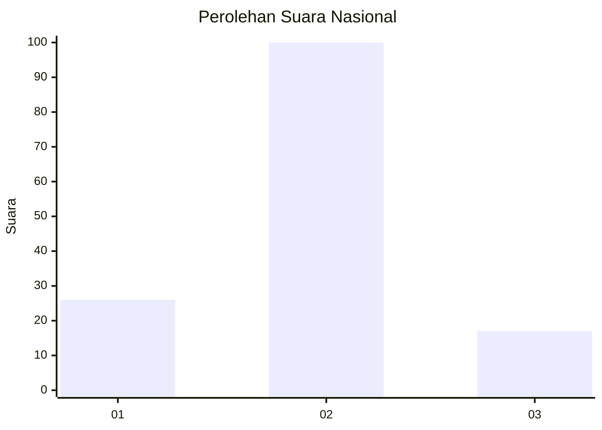
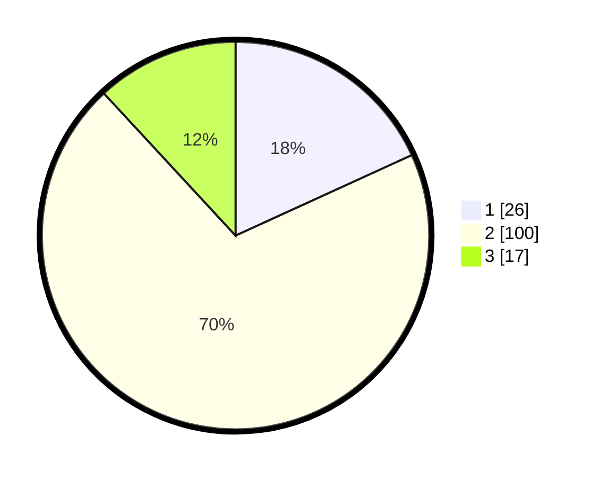

# Hasil

## Grafik

## Tabel

| No. | Nama Paslon    | Suara | Suara (raw) | Persentase |
|:--- |:-------------- | -----:| -----------:| ----------:|
| 1   | ANIES MUHAIMIN | 26    | [26][p-1]   | 18,18      |
| 2   | PRABOWO GIBRAN | 100   | [100][p-2]  | 69,93      |
| 3   | GANJAR MAHFUD  | 17    | [17][p-3]   | 11,89      |

[p-1]: https://github.com/gigit-pemilu/pemilu-2024/blob/main/pilpres/hitung-suara/sub/16-sumatera-selatan/sub/08-ogan-komering-ulu-timur/sub/04-cempaka/sub/2016-cempaka/sub/009-tps/sub/paslon-1.txt
[p-2]: https://github.com/gigit-pemilu/pemilu-2024/blob/main/pilpres/hitung-suara/sub/16-sumatera-selatan/sub/08-ogan-komering-ulu-timur/sub/04-cempaka/sub/2016-cempaka/sub/009-tps/sub/paslon-2.txt
[p-3]: https://github.com/gigit-pemilu/pemilu-2024/blob/main/pilpres/hitung-suara/sub/16-sumatera-selatan/sub/08-ogan-komering-ulu-timur/sub/04-cempaka/sub/2016-cempaka/sub/009-tps/sub/paslon-3.txt

## Foto C Plano

https://sirekap-obj-formc.kpu.go.id/4ec4/pemilu/ppwp/16/08/04/20/16/1608042016009-20240214-185424--2a46e1a5-a030-4458-9cb5-633fee3782bc.jpg

https://sirekap-obj-formc.kpu.go.id/4ec4/pemilu/ppwp/16/08/04/20/16/1608042016009-20240215-005116--e0728a5d-72c4-49a7-8445-ec7c94890923.jpg

https://sirekap-obj-formc.kpu.go.id/4ec4/pemilu/ppwp/16/08/04/20/16/1608042016009-20240215-005412--9d0ccd31-e2e2-49b9-900f-a62a202655b0.jpg

## Metadata

| Key        | Value               |
| ---------- | ------------------- |
| Time Stamp | 2024-02-26 12:00:00 |

